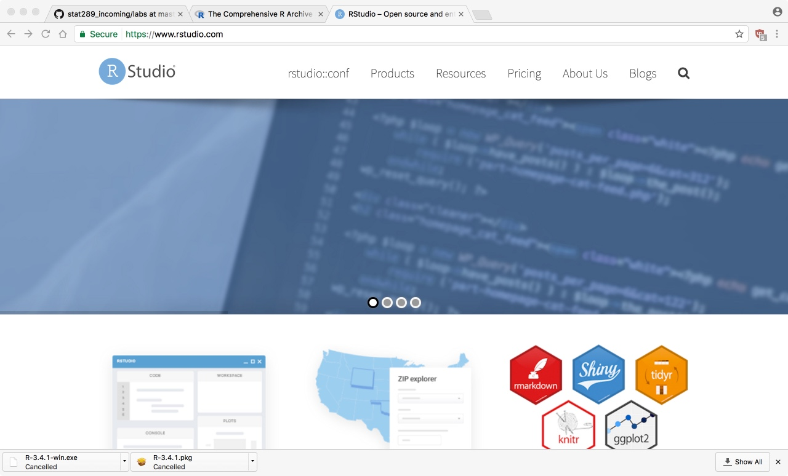
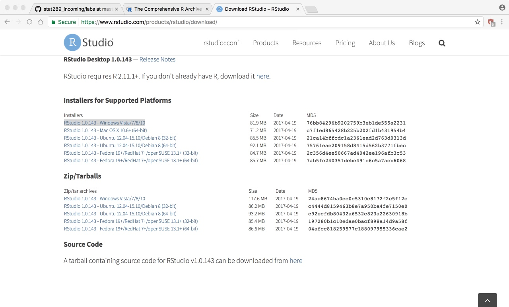
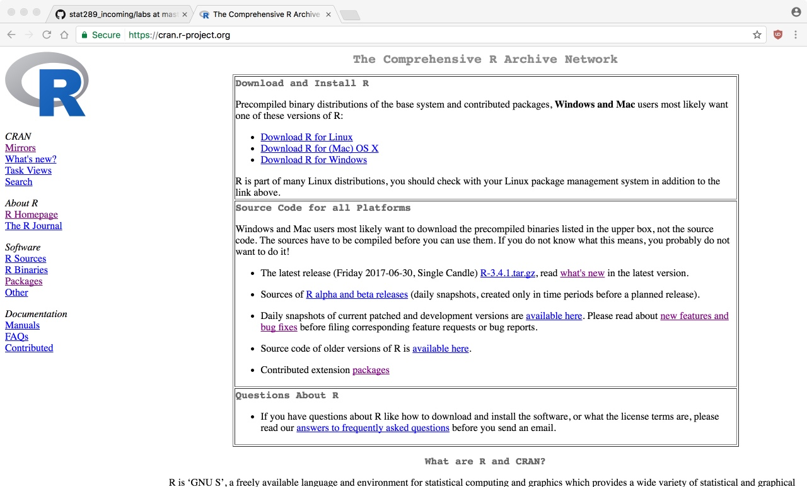

```{r setup, include=FALSE}
knitr::opts_chunk$set(eval = TRUE)
knitr::opts_chunk$set(fig.path = "../assets/2017-08-31-class02/")
knitr::opts_chunk$set(fig.height = 5)
knitr::opts_chunk$set(fig.width = 8.5)
knitr::opts_chunk$set(out.width = "100%")
knitr::opts_chunk$set(dpi = 300)
```

```{r, message = FALSE}
library(readr)
library(ggplot2)
library(dplyr)
library(viridis)
```


### Today

The goal of today is get you set up on your own computer
with GitHub, R, and RStudio.

Hopefully you brought your own machine to work with today
so that you'll have this set up for the remainder of the
semester.

# GitHub

### About GitHub

GitHub is a website that provides a public repository for
code. In the open source software community it has become the
de facto place to store code.

GitHub offers a free tier of its service; the only limitation
is that all of your repositories will be publicly available.

While the site is a commercial enterprise, the underlying
technology, **git**, is completely free and open source.

### Profile

Click on the icon on the upper right hand side of the screen and
select *Settings*.

Fill in the following information:

- Your name (first only is OK)
- A short bio (1-2 sentences)
- Location (either RVA or your hometown)
- A profile picture

Make sure to save the information.

### GitHub Classroom

We'll be using GitHub classrooms for this course. I will send
out a link right now that takes you to the first assignment.

# R and RStudio

### Download R

Next, we need to download the R programming language. To do
this go to [https://cran.r-project.org/](https://cran.r-project.org/)
and select your platform:


### Download R

For macOS, just download R-3.4.1 (or whatever is the most recent):


### Download R

For Windows, first select **base**


### Download R

And then *Download R 3.4.1*


### Install R

One you have the .pkg (macOS) or .exe (Windows) file,
install this on your computer according to the default
settings.

### RStudio

The files we just downloaded are the core R language files
doing all the hard work of processing data. Next, we'll
install a helpful GUI frontend that make calling R easier.

### Download RStudio

Go to [https://www.rstudio.com/](https://www.rstudio.com/).
Click on Products => RStudio.



### Download RStudio

Scroll down to the **DOWNLOAD RSTUDIO DESKTOP** button
and click on it.


### Download RStudio

Scroll down again to the **Installers for Supported Platforms**.
The Windows link gives you an exe:



### Download RStudio

And the macOS link gives a dmg:


### Install RStudio

Now, install R or RStudio as you would any other program. It
should link automatically to the version of R you just
installed.

# Running R Scripts

### Launch RStudio

Go ahead and launch RStudio. You should see a window that looks like
this, as we saw on the class computers last time:


### Open setup.R

Download the file *setup.R* from the course website and save
it somewhere on your computer (perhaps the desktop?)

Select File => Open File and open the *setup.R* that you just
downloaded.

### Open setup.R


### Running setup.R

We now have a fourth panel in RStudio, which contains an editor
for the code:


### Running setup.R

We'll cover more about what types of code happen in the code editor.
For now, notice that there are two types of code lines:

- comment lines starting with `#`, which contain plain text, and are highlighted in green
- code lines, which contain R commands in a specific format

To run a line of code, highlight the line or put your cursor in it
and then hit the **Run** button. The code will run in the Console.

# Lab 02

### Download File

Finally, let's download the lab02.R file from the website (note:
there is no lab01.R)

Open the file in RStudio, add your name, and save it.

### Upload the File

Now, go back to the new GitHub repository you created when you
accepted the GitHub classroom invitation.

We want to add **lab02.R** to this repository. On Chrome you can
drag and drop the file from your computer; otherwise, click on
Upload files and navigate to the file on your computer.

### Commit Changes

Once the file loads, scroll down to the bottom of the page and
select **Commit changes** (Note: changes will be lost otherwise)



### Commit Changes

If you navigate to the labs directory, you'll see the **lab02.R**
file added to the repository. You can see its contents by clicking
on the file.


### For Next Time

Complete the questions in **lab02.R** and upload the completed file to
GitHub (just follow the same steps and make sure you commit the
results).


