
library(readr)
library(ggplot2)
library(dplyr)
library(viridis)


## A Brief History of Statistical Graphics

### Early History

When most people think about statistical graphics, they
assume I am either talking about the purely aesthetic
properties of creating visual representations of data or
a list of specific types of plots (i.e., histograms,
box plots, bar plots). The history of the latter case,
essentially akin to graphic design in general, dates
can be traced back to as early as the 6th century B.C.E.
with the earliest known maps:

The golden age of beautiful, hand-drawn graphics more
closely resembling those of today was centred around
19th Century France. Charles Minard's (1781-1870)
visualization of Napoleon's defeat in Russia is perhaps
the most well-known example of work from this period:

Personally, I am partial to the work of André-Michel Guerry
(1802 - 1866), who made amazingly modern visual arguments
from French census data.

In the 20th Century, this tradition has been carried on
with a plethora of hand designed infographics scattered
across the web and in print media such as this example
on Randall Munroe's *xkcd* web-comic:

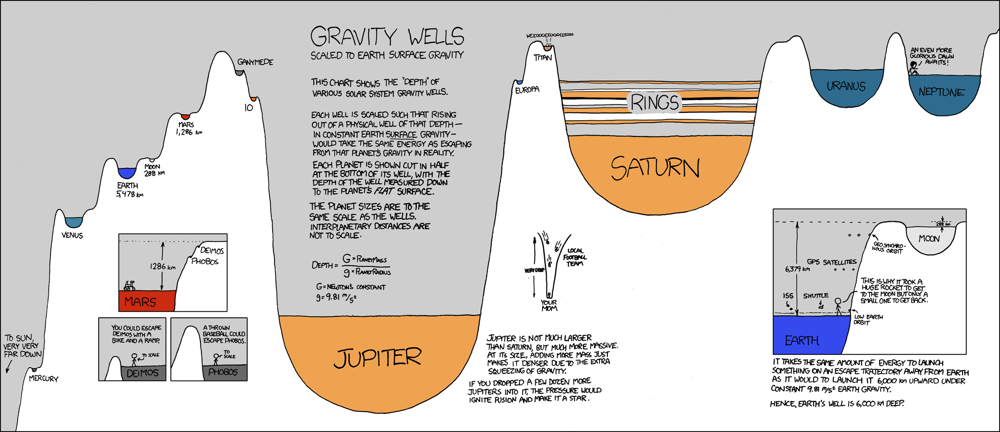

Edward Tufte is likely the most well-known modern figure
in data-based graphical design. He has written a number
of influential books such as *The Visual Display of
Quantitative Information* (1983), *Envisioning Information*
(1990) and *Visual Explanations: Images and Quantities,
Evidence and Narrative* (1997).

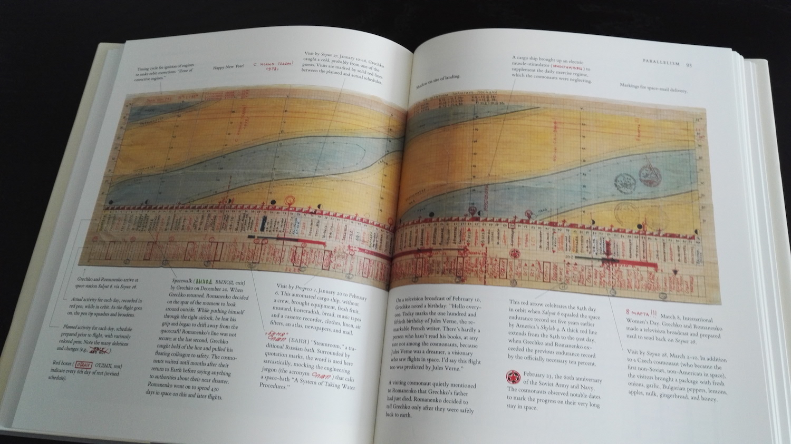

I have all of his (stunningly beautiful) books in my office
if you would ever like to thumb through them.

### Theorizing Graphics

Making visually pleasing graphics is important. Our focus
today, however, is on understanding and theorizing exactly
how graphics encode knowledge about data. The history of
this begins, at least to me, with the work of Jacques Bertin
(1918-2010), a cartographer and philosopher by training.
In his 1967 work *Semiologie Graphique* he argued that:

> Graphic representation constitutes one of the basic sign-systems
> conceived by the human mind for the purposes of storing, understanding,
> and communicating essential information. As a "language" for the eye,
> graphics benefits from the ubiquitous properties of visual perception.
> As a monosemic system, it forms the rational part of the world of images.

To the best of my knowledge, this is the earliest explicit
description of graphics as a form of knowledge and evidence.
Bertin's work was republished in English in 1983 as
*Semiology of graphics: diagrams, networks, maps*:

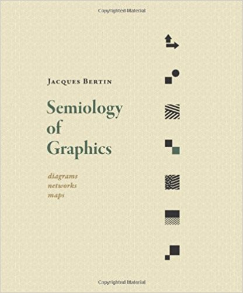

With the translation, Bertin quickly became known by scholars
of statistical graphics. Bill Cleveland, in *Visualizing Data*
(1985), built on Bertin’s work by theorizing a distinction between
graphing, the process of visualizing  raw data, and fitting,
the process of visualizing transformed data and statistical models.

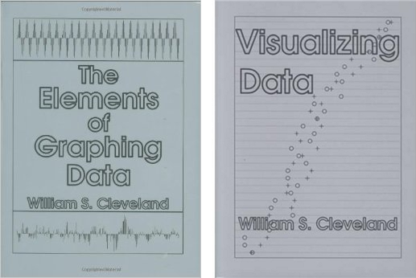

His parallel text, *The Elements of Graphing* (1993),
describes an actual system to implement many of his ideas.

In *The Grammar of Graphics* (1999), Wilkinson extended
Cleveland’s theory by drawing a distinction between the
mathematical abstraction of a graph and the physical
manifestation of a rendered graphic. He then set out
to describe the fundamental units that comprised a
visualization.

Wilkinson constructed a formal language for describing
statistical visualizations by separating out the
mathematical specification of a graphics system from
the aesthetic details of its assembly and display.
Wilkinson named each component of the visualization,
moving from the original data to the output, a layer
in his formal Grammar of Graphics system.

Examples of layers include:

- picking the scale of the plot
- choosing the size of points
- computing summary statistics

Wilkinson’s formal language explicates what assumptions
are being made, where these assumptions are being
made, and how the original data has been modified to
create the output.

Finally, Hadley Wickham implemented and described a
graphical system built on the ideas of Wilkinson in
*ggplot2: Elegant Graphics for Data Analysis* (2009).
His object-oriented system, the **ggplot2** R library,
constructs rules for fitting together a small number
of classes and relationships between them to create an
"almost unlimited world of graphical forms". For Wickham's
interpretation, see the (very readable and open access) paper
["The Layered Grammar of Graphics"](http://vita.had.co.nz/papers/layered-grammar.pdf).
It is the usage of the **gplot2** package that we now turn to.

## Graphics in R: ggplot2

### A Basic Plot

In order to look at graphics, we first need to read in
some data. It has become almost canonical to look at
the cars dataset when doing tutorials of ggplot, so
I will do the same here. We read in the dataset using
the **read_csv** function (more on this another day):


mpg <- read_csv("https://statsmaths.github.io/stat_data/mpg.csv")



## Parsed with column specification:
## cols(
##   manufacturer = col_character(),
##   model = col_character(),
##   displ = col_double(),
##   year = col_integer(),
##   cyl = col_integer(),
##   trans = col_character(),
##   drv = col_character(),
##   cty = col_integer(),
##   hwy = col_integer(),
##   fl = col_character(),
##   class = col_character()
## )



mpg



## # A tibble: 234 x 11
##    manufacturer      model displ  year   cyl      trans   drv   cty   hwy
##           <chr>      <chr> <dbl> <int> <int>      <chr> <chr> <int> <int>
##  1         audi         a4   1.8  1999     4   auto(l5)     f    18    29
##  2         audi         a4   1.8  1999     4 manual(m5)     f    21    29
##  3         audi         a4   2.0  2008     4 manual(m6)     f    20    31
##  4         audi         a4   2.0  2008     4   auto(av)     f    21    30
##  5         audi         a4   2.8  1999     6   auto(l5)     f    16    26
##  6         audi         a4   2.8  1999     6 manual(m5)     f    18    26
##  7         audi         a4   3.1  2008     6   auto(av)     f    18    27
##  8         audi a4 quattro   1.8  1999     4 manual(m5)     4    18    26
##  9         audi a4 quattro   1.8  1999     4   auto(l5)     4    16    25
## 10         audi a4 quattro   2.0  2008     4 manual(m6)     4    20    28
## # ... with 224 more rows, and 2 more variables: fl <chr>, class <chr>


You can see the dataset in RStudio as a table by clicking
on the data in the upper-right-hand corner of the screen.

We will start by plotting the engine size (`displ`) against
the number of miles the car can travel on the highway
with one gallon of fuel (`hwy`). To plot these variables
we use the follow syntax:


ggplot() +
  geom_point(data = mpg, mapping = aes(x = displ, y = hwy))


In ggplot, we use the `+` sign to (literally) add together
layers to create a plot. We can associate to each layer a
dataset and aesthetic mappings. Here we have set the dataset
to `mpg` and described which variables denote the x- and
y-coordinates.

Usually we want to associate the same dataset, x, and y
coordinates to all of the layers. This is done by *inheritance*;
if we set something in one layer, future layers will assume
you want to most recent settings unless you change them. As
such, I would more commonly write our first plot like this:


ggplot(data = mpg, mapping = aes(x = displ, y = hwy)) +
  geom_point()


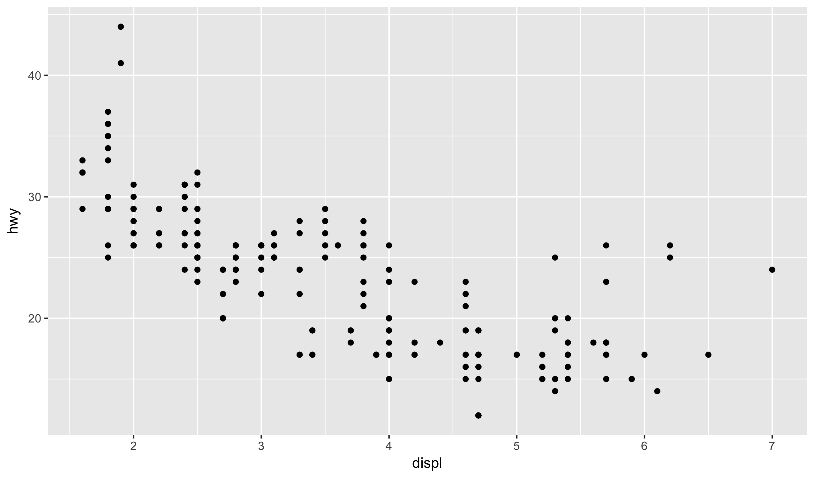

Also, we can omit the explicit function input names as it
is assumed that the first input to `ggplot` is the dataset
and the second is the mapping. Further, the first element of
`aes` is assumed to be x and the second is assumed to be
y. So, we can write the plot in a third way in the following
compact way:


ggplot(mpg, aes(displ, hwy)) +
  geom_point()


In the following sections we will see how to modify and build
on this basic structure to create more complex graphics.

### Geometries

Their are many alternative geometries that we can replace or
add to the `geom_point` layer. My current count has 45 such
geometries in the base installation of **ggplot2**; you will
find that only a small subset are needed for most use cases.

For example, if we want to draw a line rather than points we
could do the following:


ggplot(mpg, aes(displ, hwy)) +
  geom_line()


If we wanted both the lines and the points, we simply add the
layers together:


ggplot(mpg, aes(displ, hwy)) +
  geom_point() +
  geom_line()


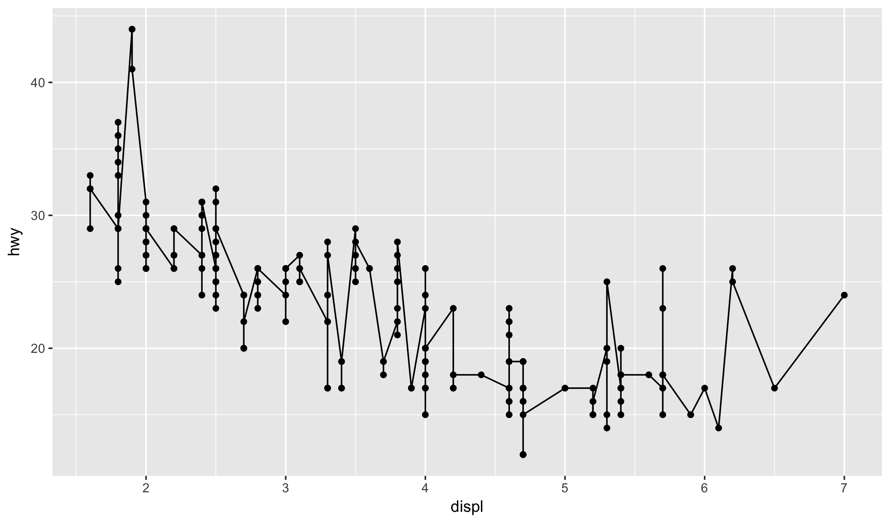

At this point it is easy to forget what is actually going on
under the hood of **ggplot2** via inheritance and implied
positional arguments:


ggplot() +
  geom_point(data = mpg, mapping = aes(x = displ, y = hwy)) +
  geom_line(data = mpg, mapping = aes(x = displ, y = hwy))


The package is smart, but we don't want it to be smarter
than us!

Note that some geometries do not take an y-coordinate (they
will thrown an error if you try). For example, the `geom_bar`
produces a visualization of categorical counts:


ggplot(mpg, aes(class)) +
  geom_bar()


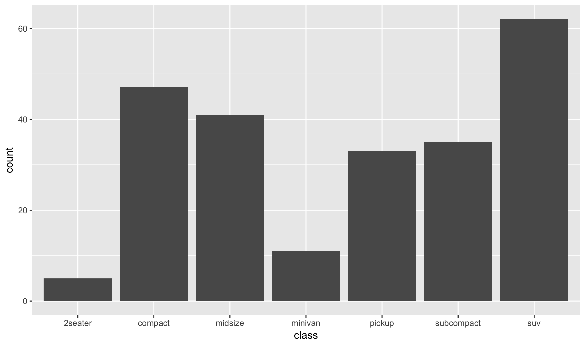

Some other geometries you may find useful:

- `geom_histogram`
- `geom_smooth`
- `geom_boxplot`
- `geom_text`

At the end of class today I will show you how to find a
more complete list.

### Aesthetic Mappings

The minimal mappings needed to create a `geom_point` layer
are the x and y coordinates. There are several other
aesthetics that we can change (along with defaults that
are used when we do not specify them). For the points
geometry they are:

- alpha (the opacity of the points)
- color
- fill
- shape
- size

We can change any of these using the same syntax as
we did with the x and y coordinates. However, we always
have to specify them by name because `aes` does not know
which of them we would want to modify. Also, I always set
these *within* the layer rather than using inheritance
because it is likely that you will not want them to
propagate through the whole plot:


ggplot(mpg, aes(displ, hwy)) +
  geom_point(aes(color = class))


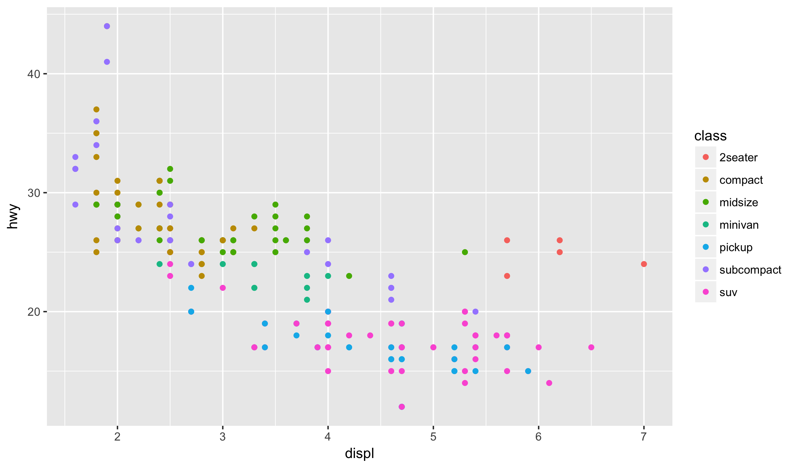

This plot begins to show the power of **ggplot2** by showing
how easily we can add information to a visualization with
only a minor modification of the code.

It is possible to set the value of optional aesthetics to
a fix value rather than assigning it to a variable in the
dataset. To do this, we pass the value directly to the
geom layer without going through the `aes` function. Here,
we make a point plot with large (default size is 1),
yellow, opaque points (alpha = 1 is default, alpha = 0 is
invisible):


ggplot(mpg, aes(displ, hwy)) +
  geom_point(alpha = 0.2, color = "yellow", size = 10)


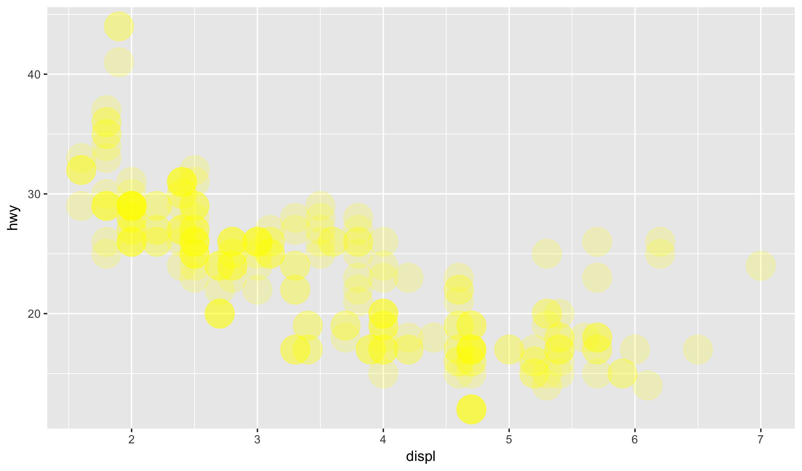

Of course, we can mix these two together:


ggplot(mpg, aes(displ, hwy)) +
  geom_point(aes(color = class), alpha = 0.2, size = 10)


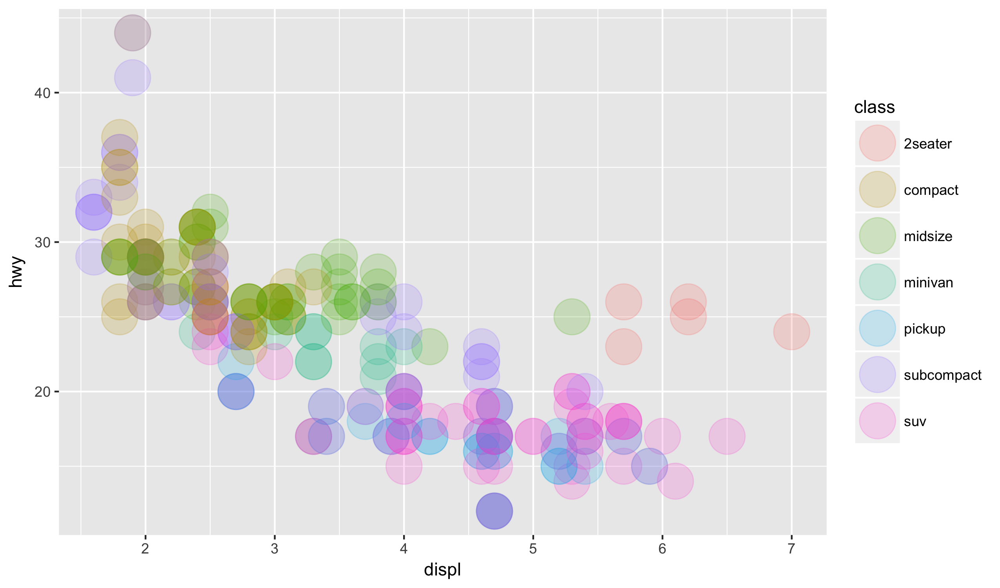

Notice that if you add a `geom_line` layer to this plot,
the color, size, and alpha parameters will not pass through
because we specified them in the geom layer and not in the
`ggplot` function.

### Labels and Themes

There are other layer types beyond geometries, most of which
have default settings if we do not specify them manually. For
example, we can add a label to an aesthetic using the `labs`
function as follows:


ggplot(mpg, aes(displ, hwy)) +
  geom_point(aes(color = class)) +
  labs(x = "engine size in litres") +
  labs(y = "miles per gallon (highway)") +
  labs(color = "Car Class")


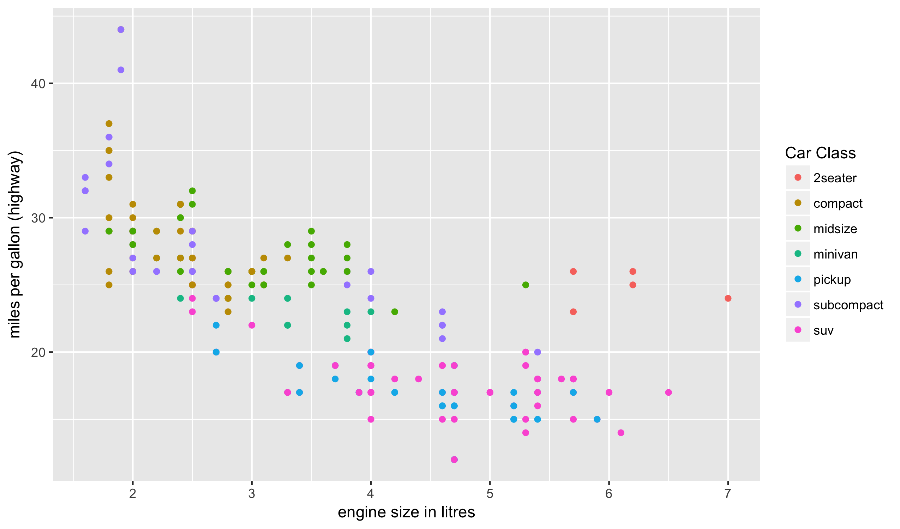

Look back the prior plots to see that these were added
automatically. Of course, you can add whatever subset of
these you need, letting the defaults hold for the other
values.

Another type of layer with a default value is the theme
layer. These describe all of the non-data oriented visual
aspects of the plot (such as the background color, the
size of the tick marks, and the font of the axis labels).
The default is `theme_classic`; I prefer `theme_minimal`:


ggplot(mpg, aes(displ, hwy)) +
  geom_point(aes(color = class)) +
  theme_minimal()


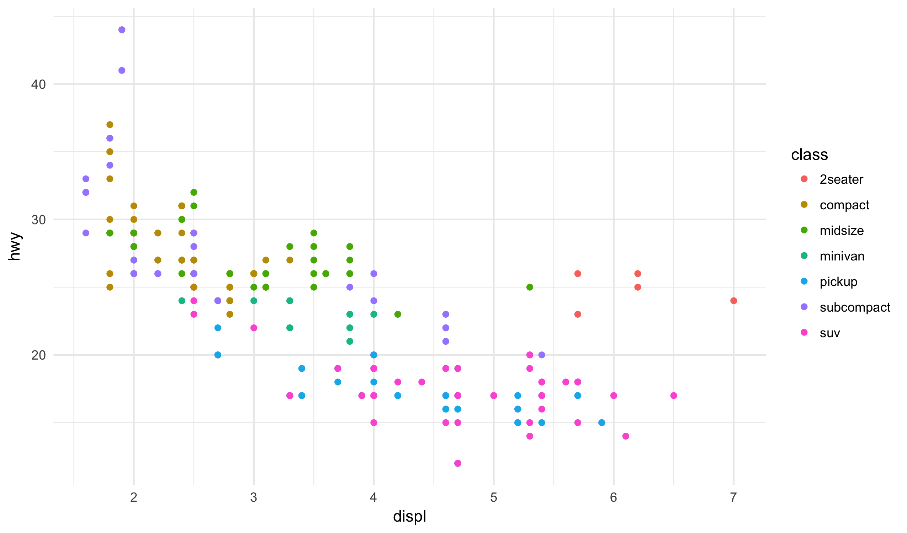

I find this much cleaner than the out-of-the-box theme.
Amongst other benefits, it saves a lot on ink when trying
to print!

## Resources

Here are several good resources if you want to learn more about
the Grammar of Graphics in R (the second in particular might
be very helpful as a reference):

- [R for Data Science: Chapter 3](http://r4ds.had.co.nz/data-visualisation.html)
- [ggplot2 cheatsheet](https://www.rstudio.com/wp-content/uploads/2015/03/ggplot2-cheatsheet.pdf)
- [ggplot2 aesthetic vignette](https://cran.r-project.org/web/packages/ggplot2/vignettes/ggplot2-specs.html)
- R help pages: type something like `?geom_point` for help

Of course, you can also ask me any questions you may have!
