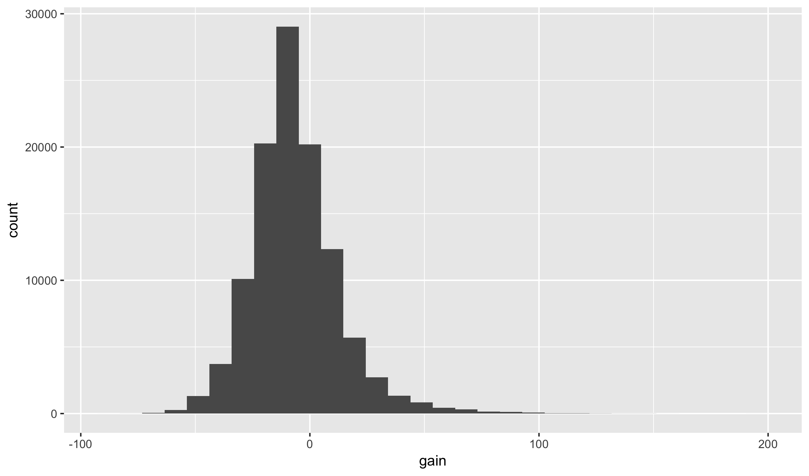


library(readr)
library(ggplot2)
library(dplyr)
library(viridis)


## Transforming Data

### Verbs

Today we are going to cover a set of functions that take
a data frame as an input and return a new version of the
data frame. These functions are called *verbs* and come
from the **dplyr** package. If you are familiar with
running database queries, note that all of these verbs
map onto SQL commands. In fact, R can be set up so that
**dplyr** is called over a database rather than a local
data frame in memory.

There are over 30 verbs within **dplyr**, though most are
either a minor variant or a specific application of another
verb. Today we will see just five of them, which do the
following:

- select a subset of rows from the original dataset (`filter`)
- rearrange the rows of the input (`arrange`)
- pick a subset of the variable from the original (`select`)
- create new variables (`mutate`)
- collapse rows into a single summary (`summarize`)

In the case of all verbs, the first argument is the original
data frame and the output is a new data frame. It is important
to note that **verbs do not modify the original data**; they
operate on a copy of the original data.

To illustrate these verbs we will work with a dataset of
the every commercial flight that departed from New York City
in 2013.


flights <- read_csv("https://statsmaths.github.io/stat_data/flights.csv")


We will work with this data set all week as it is a great example
of the power of **dplyr**. Note that this dataset is not small;
if you did not follow my instructions in `setup.R` for how to stop
R from saving old datasets I suggest doing that now as your computer
will start having trouble with all of the old data copies we are
creating.

### Filtering rows

The filter function takes a dataset and returns a subset of the rows
of the original data. The first argument is the dataset and the
remaining arguments are logical statements that filter the data
frame. Only rows where the statements are true will be returned.

Let's grab only those flights that left after 11pm (2300):


filter(flights, dep_time > 2300)



## # A tibble: 2,573 x 19
##     year month   day dep_time sched_dep_time dep_delay arr_time
##    <int> <int> <int>    <int>          <int>     <int>    <int>
##  1  2013     1     1     2302           2200        62     2342
##  2  2013     1     1     2306           2245        21       28
##  3  2013     1     1     2307           2245        22       32
##  4  2013     1     1     2310           2255        15       24
##  5  2013     1     1     2312           2000       192       21
##  6  2013     1     1     2323           2200        83       22
##  7  2013     1     1     2326           2130       116      131
##  8  2013     1     1     2327           2250        37       32
##  9  2013     1     1     2343           1724       379      314
## 10  2013     1     1     2353           2359        -6      425
## # ... with 2,563 more rows, and 12 more variables: sched_arr_time <int>,
## #   arr_delay <int>, carrier <chr>, flight <int>, tailnum <chr>,
## #   origin <chr>, dest <chr>, air_time <int>, distance <int>, hour <int>,
## #   minute <int>, time_hour <dttm>


Notice that the result now has only 2,581 rows. However, the original
dataset has not been changed. If we want to test for whether a
variable is exactly equal to another value we use two equal signs
`==`. Here are all the flights that departed on Christmas Day:


filter(flights, month == 11, day == 25)



## # A tibble: 936 x 19
##     year month   day dep_time sched_dep_time dep_delay arr_time
##    <int> <int> <int>    <int>          <int>     <int>    <int>
##  1  2013    11    25        5           2359         6      436
##  2  2013    11    25      508            500         8      647
##  3  2013    11    25      513            515        -2      801
##  4  2013    11    25      537            540        -3      827
##  5  2013    11    25      542            545        -3      845
##  6  2013    11    25      550            600       -10      843
##  7  2013    11    25      550            600       -10      647
##  8  2013    11    25      551            550         1     1019
##  9  2013    11    25      553            600        -7      657
## 10  2013    11    25      553            600        -7      826
## # ... with 926 more rows, and 12 more variables: sched_arr_time <int>,
## #   arr_delay <int>, carrier <chr>, flight <int>, tailnum <chr>,
## #   origin <chr>, dest <chr>, air_time <int>, distance <int>, hour <int>,
## #   minute <int>, time_hour <dttm>


If we want to do more with the data frame, we can save the results
as a new data frame:


flights_dec25 <- filter(flights, month == 11, day == 25)


In order to filter flights that took off between noon (1200) and
3pm (1500), that is easy with two logical statements (notice the
`>=` and `<=` for greater then and equal to and less than or
equal to):


filter(flights, dep_time >= 1200, dep_time <= 1500)



## # A tibble: 53,744 x 19
##     year month   day dep_time sched_dep_time dep_delay arr_time
##    <int> <int> <int>    <int>          <int>     <int>    <int>
##  1  2013     1     1     1200           1200         0     1408
##  2  2013     1     1     1202           1207        -5     1318
##  3  2013     1     1     1202           1159         3     1645
##  4  2013     1     1     1203           1205        -2     1501
##  5  2013     1     1     1203           1200         3     1519
##  6  2013     1     1     1204           1200         4     1500
##  7  2013     1     1     1205           1200         5     1503
##  8  2013     1     1     1206           1209        -3     1325
##  9  2013     1     1     1208           1158        10     1540
## 10  2013     1     1     1211           1215        -4     1423
## # ... with 53,734 more rows, and 12 more variables: sched_arr_time <int>,
## #   arr_delay <int>, carrier <chr>, flight <int>, tailnum <chr>,
## #   origin <chr>, dest <chr>, air_time <int>, distance <int>, hour <int>,
## #   minute <int>, time_hour <dttm>


How might we get flights that left between 11pm and 4am? Here
we need to say that either one of two conditions are true: the
flight left after 11pm OR before 4am. To encode this we use
a vertical bar `|` to stand in for the statement OR:


filter(flights, dep_time >= 2300 | dep_time <= 400)



## # A tibble: 3,808 x 19
##     year month   day dep_time sched_dep_time dep_delay arr_time
##    <int> <int> <int>    <int>          <int>     <int>    <int>
##  1  2013     1     1     2302           2200        62     2342
##  2  2013     1     1     2306           2245        21       28
##  3  2013     1     1     2307           2245        22       32
##  4  2013     1     1     2310           2255        15       24
##  5  2013     1     1     2312           2000       192       21
##  6  2013     1     1     2323           2200        83       22
##  7  2013     1     1     2326           2130       116      131
##  8  2013     1     1     2327           2250        37       32
##  9  2013     1     1     2343           1724       379      314
## 10  2013     1     1     2353           2359        -6      425
## # ... with 3,798 more rows, and 12 more variables: sched_arr_time <int>,
## #   arr_delay <int>, carrier <chr>, flight <int>, tailnum <chr>,
## #   origin <chr>, dest <chr>, air_time <int>, distance <int>, hour <int>,
## #   minute <int>, time_hour <dttm>


Pay close attention to the syntax as a lot of students at first
want to map directly from English into R with:


dep_time >= 2300 | <= 400



## Error: <text>:1:20: unexpected '<='
## 1: dep_time >= 2300 | <=
##                        ^


But this will throw an error message. Finally, you may want to
check whether a variable is in a fixed set of values (most often
this occurs with a categorical variable). To do this we use the
operator `%in%`. For example, here we select only those rows that
correspond to flights to Boston (BOS), Providence (PVD), or
Manchester, New Hampshire (MHT):


filter(flights, dest %in% c("BOS", "PVD", "MHT"))



## # A tibble: 16,312 x 19
##     year month   day dep_time sched_dep_time dep_delay arr_time
##    <int> <int> <int>    <int>          <int>     <int>    <int>
##  1  2013     1     1      559            559         0      702
##  2  2013     1     1      639            640        -1      739
##  3  2013     1     1      801            805        -4      900
##  4  2013     1     1      803            810        -7      903
##  5  2013     1     1      820            830       -10      940
##  6  2013     1     1      923            919         4     1026
##  7  2013     1     1      957            733       144     1056
##  8  2013     1     1     1033           1017        16     1130
##  9  2013     1     1     1154           1200        -6     1253
## 10  2013     1     1     1237           1245        -8     1340
## # ... with 16,302 more rows, and 12 more variables: sched_arr_time <int>,
## #   arr_delay <int>, carrier <chr>, flight <int>, tailnum <chr>,
## #   origin <chr>, dest <chr>, air_time <int>, distance <int>, hour <int>,
## #   minute <int>, time_hour <dttm>


### Arranging rows

Next, we will see how to reorder to rows in a data frame using the
`arrange` function. Like all verbs it takes the data frame as its
first argument. Other arguments specify which variables to sort by:


arrange(flights, dep_time)



## # A tibble: 327,346 x 19
##     year month   day dep_time sched_dep_time dep_delay arr_time
##    <int> <int> <int>    <int>          <int>     <int>    <int>
##  1  2013     1    13        1           2249        72      108
##  2  2013     1    31        1           2100       181      124
##  3  2013    11    13        1           2359         2      442
##  4  2013    12    16        1           2359         2      447
##  5  2013    12    20        1           2359         2      430
##  6  2013    12    26        1           2359         2      437
##  7  2013    12    30        1           2359         2      441
##  8  2013     2    11        1           2100       181      111
##  9  2013     2    24        1           2245        76      121
## 10  2013     3     8        1           2355         6      431
## # ... with 327,336 more rows, and 12 more variables: sched_arr_time <int>,
## #   arr_delay <int>, carrier <chr>, flight <int>, tailnum <chr>,
## #   origin <chr>, dest <chr>, air_time <int>, distance <int>, hour <int>,
## #   minute <int>, time_hour <dttm>


Other variables break ties in earlier variables:


arrange(flights, dep_time, arr_time)



## # A tibble: 327,346 x 19
##     year month   day dep_time sched_dep_time dep_delay arr_time
##    <int> <int> <int>    <int>          <int>     <int>    <int>
##  1  2013     6    24        1           1950       251      105
##  2  2013     4    10        1           1930       271      106
##  3  2013     1    13        1           2249        72      108
##  4  2013     2    11        1           2100       181      111
##  5  2013     3    19        1           2250        71      120
##  6  2013     2    24        1           2245        76      121
##  7  2013     1    31        1           2100       181      124
##  8  2013     7    22        1           2305        56      135
##  9  2013     5    22        1           1935       266      154
## 10  2013     7     1        1           2029       212      236
## # ... with 327,336 more rows, and 12 more variables: sched_arr_time <int>,
## #   arr_delay <int>, carrier <chr>, flight <int>, tailnum <chr>,
## #   origin <chr>, dest <chr>, air_time <int>, distance <int>, hour <int>,
## #   minute <int>, time_hour <dttm>


To sort a variable in reverse order, wrap it in the `desc` function:


arrange(flights, desc(dep_time), arr_time)



## # A tibble: 327,346 x 19
##     year month   day dep_time sched_dep_time dep_delay arr_time
##    <int> <int> <int>    <int>          <int>     <int>    <int>
##  1  2013     7    17     2400           2142       138       54
##  2  2013    12     9     2400           2250        70       59
##  3  2013     7    13     2400           2245        75      101
##  4  2013     6    17     2400           2145       135      102
##  5  2013     7     7     2400           1950       250      107
##  6  2013     8    10     2400           2245        75      110
##  7  2013     9    12     2400           2000       240      203
##  8  2013     7    13     2400           2155       125      225
##  9  2013     7    28     2400           2059       181      247
## 10  2013     2    11     2400           2135       145      251
## # ... with 327,336 more rows, and 12 more variables: sched_arr_time <int>,
## #   arr_delay <int>, carrier <chr>, flight <int>, tailnum <chr>,
## #   origin <chr>, dest <chr>, air_time <int>, distance <int>, hour <int>,
## #   minute <int>, time_hour <dttm>


### Selecting columns

With larger datasets (or when producing reports) it is sometimes
useful to select just a subset of the columns in the original
dataset. To do this, we use the `select` function. The first input
is the data set, with other arguments being variables we want to
look at:


select(flights, dep_time, origin, dest)



## # A tibble: 327,346 x 3
##    dep_time origin  dest
##       <int>  <chr> <chr>
##  1      517    EWR   IAH
##  2      533    LGA   IAH
##  3      542    JFK   MIA
##  4      544    JFK   BQN
##  5      554    LGA   ATL
##  6      554    EWR   ORD
##  7      555    EWR   FLL
##  8      557    LGA   IAD
##  9      557    JFK   MCO
## 10      558    LGA   ORD
## # ... with 327,336 more rows


I will now use this throughout our class notes so that you may
more clearly see what is going on without the variables of interest
(which tend to be on the end as we add them) being hidden.

### Adding and modifying variables

The `mutate` function creates new variable in our dataset as a
function of other variables already present in the data. The
function always add variables at the end of the dataset, so in
order to see the results we will work with a smaller subset:


flights_sml <- select(flights, year, month, day, arr_delay,
                      dep_delay, distance, air_time)


Lets calculate the average speed of the flight. The mutate function
takes the data frame as its first argument followed by named arguments
describing the new variables:


mutate(flights_sml, speed = distance / air_time * 60)



## # A tibble: 327,346 x 8
##     year month   day arr_delay dep_delay distance air_time    speed
##    <int> <int> <int>     <int>     <int>    <int>    <int>    <dbl>
##  1  2013     1     1        11         2     1400      227 370.0441
##  2  2013     1     1        20         4     1416      227 374.2731
##  3  2013     1     1        33         2     1089      160 408.3750
##  4  2013     1     1       -18        -1     1576      183 516.7213
##  5  2013     1     1       -25        -6      762      116 394.1379
##  6  2013     1     1        12        -4      719      150 287.6000
##  7  2013     1     1        19        -5     1065      158 404.4304
##  8  2013     1     1       -14        -3      229       53 259.2453
##  9  2013     1     1        -8        -3      944      140 404.5714
## 10  2013     1     1         8        -2      733      138 318.6957
## # ... with 327,336 more rows


Similarly, we can figure out how much time was lost or gained
between the departure delay and arrival delay:


mutate(flights_sml, gain = arr_delay - dep_delay)



## # A tibble: 327,346 x 8
##     year month   day arr_delay dep_delay distance air_time  gain
##    <int> <int> <int>     <int>     <int>    <int>    <int> <int>
##  1  2013     1     1        11         2     1400      227     9
##  2  2013     1     1        20         4     1416      227    16
##  3  2013     1     1        33         2     1089      160    31
##  4  2013     1     1       -18        -1     1576      183   -17
##  5  2013     1     1       -25        -6      762      116   -19
##  6  2013     1     1        12        -4      719      150    16
##  7  2013     1     1        19        -5     1065      158    24
##  8  2013     1     1       -14        -3      229       53   -11
##  9  2013     1     1        -8        -3      944      140    -5
## 10  2013     1     1         8        -2      733      138    10
## # ... with 327,336 more rows


Note that you can overwrite variables that already exist with mutate
as well, though in general this should be avoided.

### Summarizing data

The `summarize` function collapses a data frame into a single row
summary. We need to specify exactly what summaries are performed.
Here, we will grab the mean values for arrival and departure delays:


summarize(flights, avg_dep_delay = mean(dep_delay),
                   avg_arr_delay = mean(arr_delay))



## # A tibble: 1 x 2
##   avg_dep_delay avg_arr_delay
##           <dbl>         <dbl>
## 1      12.55516      6.895377


There is also a special function called `n()` that summarizes the
total number of rows:


summarize(flights, avg_dep_delay = mean(dep_delay),
                   avg_arr_delay = mean(arr_delay),
                   n = n())



## # A tibble: 1 x 3
##   avg_dep_delay avg_arr_delay      n
##           <dbl>         <dbl>  <int>
## 1      12.55516      6.895377 327346


Other summary functions that you might find useful:

- `min`
- `max`
- `median`
- `sd` - standard deviation
- `quantile(x, 0.25)` - generalization of median; here, a value
that is greater than 25% of the data
- `first`, `last`, `nth`

Summarizing datasets does not seem particularly useful here as
we have other ways of computing the means and counts of a dataset
without using a new function. The real power of the summary
function comes when we learn how to group datasets next class.

## Pipes

The pipe operator `%>%` is a relative newcomer within the R
ecosystem. It is incredibly useful for writing readable code
with **dplyr** and ggplot2. The pipe passes the output of
one function to the first argument of the next function. Because
`ggplot` and all of the dplyr verbs take a data frame as its
first input we can pipe together a number of operations without
saving the intermediate results.

For example, lets see the average change in delay between departure
and arrival for flights leaving from JFK:


flights %>%
  filter(origin == "JFK") %>%
  mutate(gain = arr_delay - dep_delay) %>%
  ggplot(aes(gain)) +
    geom_histogram()



## `stat_bin()` using `bins = 30`. Pick better value with `binwidth`.


We can also save the results of a long piped set of commands as
a new dataset:


flights_best_gain_jfk <- flights %>%
  filter(origin == "JFK") %>%
  mutate(gain = arr_delay - dep_delay) %>%
  filter(gain > 10) %>%
  arrange(desc(gain)) %>%
  select(year, month, day, dep_time, dest, gain)
flights_best_gain_jfk



## # A tibble: 15,696 x 6
##     year month   day dep_time  dest  gain
##    <int> <int> <int>    <int> <chr> <int>
##  1  2013    11     1      658   LAX   196
##  2  2013     7    10     1916   SFO   161
##  3  2013     7    22     1626   CMH   150
##  4  2013     2    16     1738   CLT   146
##  5  2013     7    10     1623   SFO   146
##  6  2013     7    28     1815   BUR   146
##  7  2013     6    30     1423   BUF   144
##  8  2013     3    18     1844   SFO   143
##  9  2013     6    24     1602   AUS   141
## 10  2013     7     7     1746   IAD   141
## # ... with 15,686 more rows


Notice the standard syntax of the piped commands: each line after
the first is indented and we usually pipe the data itself as the
first line. With a **ggplot2** command, subsequent rows are indented
twice.

## Resources

Here are several good resources if you want to learn more about
the **dplyr** package:

- [R for Data Science: Chapter 5](http://r4ds.had.co.nz/transform.html)
- [data transformation cheatsheet](https://github.com/rstudio/cheatsheets/raw/master/source/pdfs/data-transformation-cheatsheet.pdf)

Of course, you can also ask me any questions you may have!

