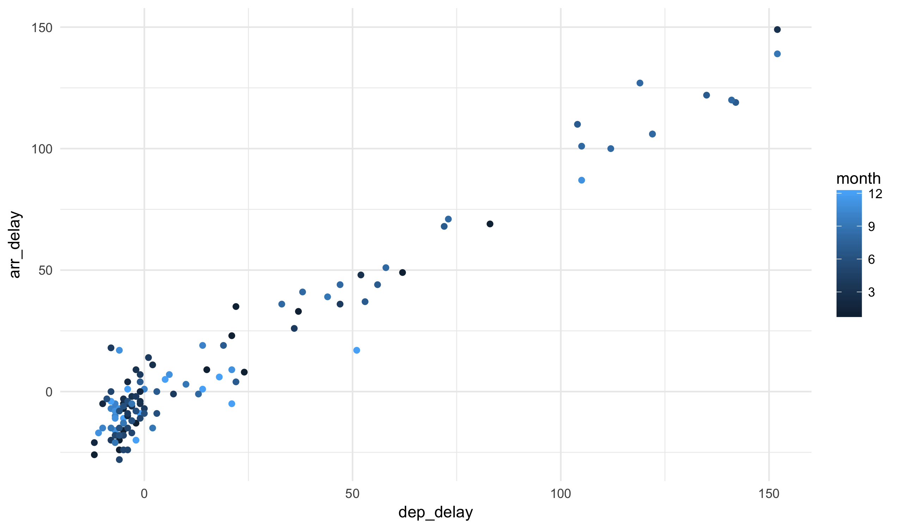
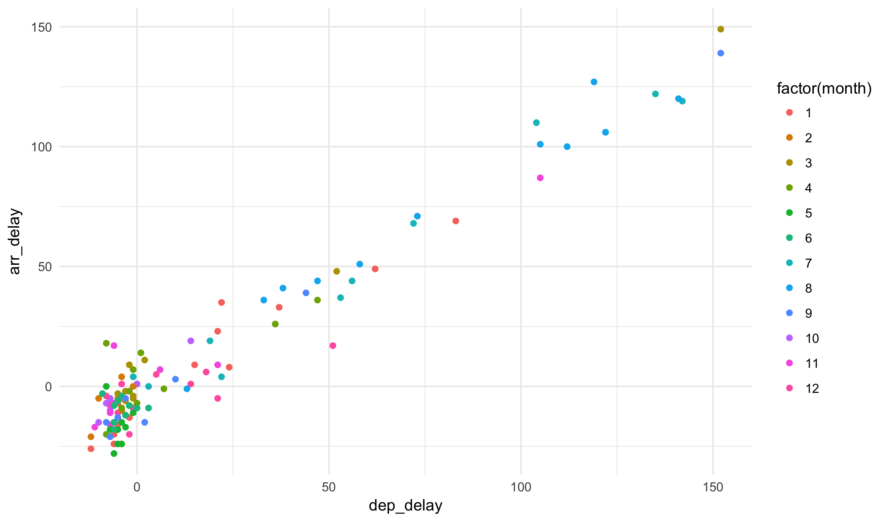
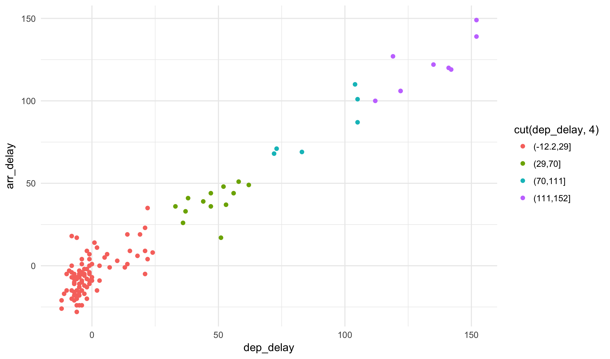


library(readr)
library(ggplot2)
library(dplyr)
library(viridis)


# Grouping data

Today we are going to look at the NYC flights dataset once again:


flights <- read_csv("https://statsmaths.github.io/stat_data/flights.csv")


Our object of study will be the function `group_by`, a **dplyr**
verb that seemingly does nothing (or very little) to a dataset.
Here, we group the flights data by month:


group_by(flights, month)



## # A tibble: 327,346 x 19
## # Groups:   month [12]
##     year month   day dep_time sched_dep_time dep_delay arr_time
##    <int> <int> <int>    <int>          <int>     <int>    <int>
##  1  2013     1     1      517            515         2      830
##  2  2013     1     1      533            529         4      850
##  3  2013     1     1      542            540         2      923
##  4  2013     1     1      544            545        -1     1004
##  5  2013     1     1      554            600        -6      812
##  6  2013     1     1      554            558        -4      740
##  7  2013     1     1      555            600        -5      913
##  8  2013     1     1      557            600        -3      709
##  9  2013     1     1      557            600        -3      838
## 10  2013     1     1      558            600        -2      753
## # ... with 327,336 more rows, and 12 more variables: sched_arr_time <int>,
## #   arr_delay <int>, carrier <chr>, flight <int>, tailnum <chr>,
## #   origin <chr>, dest <chr>, air_time <int>, distance <int>, hour <int>,
## #   minute <int>, time_hour <dttm>


Other than a note in the output, the dataset is completely unchanged.
I like to think of the `group_by` function as putting a post-it note
on the dataset saying "treat unique combinations of the grouped variables
as their own data frames". When passing the output of this function
to `summarize`, it will not return one summary row *for each group*.

For example:


flights %>%
  group_by(month) %>%
  summarize(avg_dep_delay = mean(dep_delay),
            avg_arr_delay = mean(arr_delay),
            n = n())



## # A tibble: 12 x 4
##    month avg_dep_delay avg_arr_delay     n
##    <int>         <dbl>         <dbl> <int>
##  1     1      9.985491     6.1299720 26398
##  2     2     10.760239     5.6130194 23611
##  3     3     13.164289     5.8075765 27902
##  4     4     13.849187    11.1760630 27564
##  5     5     12.891709     3.5215088 28128
##  6     6     20.725614    16.4813296 27075
##  7     7     21.522179    16.7113067 28293
##  8     8     12.570524     6.0406524 28756
##  9     9      6.630285    -4.0183636 27010
## 10    10      6.233175    -0.1670627 28618
## 11    11      5.420340     0.4613474 26971
## 12    12     16.482161    14.8703553 27020


We see that flights in June take off on average 20 minutes late, whereas
flights in November took off only a 5.4 minutes late.

We can group by multiple variables at once as well. Here we show the
average departure delay by airport and by month:


flights %>%
  group_by(origin, month) %>%
  summarize(avg_dep_delay = mean(dep_delay),
            avg_arr_delay = mean(arr_delay),
            n = n()) %>%
  ggplot(aes(month, avg_dep_delay)) +
    geom_point(aes(color = origin), size = 4) +
    geom_line(aes(color = origin)) +
    scale_color_viridis(discrete = TRUE)


Notice that when grouping by multiple variables the summarize
function *peels off* the outer most layer of the grouping:


flights %>%
  group_by(origin, month) %>%
  summarize(avg_dep_delay = mean(dep_delay),
            avg_arr_delay = mean(arr_delay),
            n = n())



## # A tibble: 36 x 5
## # Groups:   origin [?]
##    origin month avg_dep_delay avg_arr_delay     n
##     <chr> <int>         <dbl>         <dbl> <int>
##  1    EWR     1     14.855657     12.816556  9616
##  2    EWR     2     12.995452      8.775160  8575
##  3    EWR     3     18.050624     10.600799 10015
##  4    EWR     4     17.255987     14.143388 10231
##  5    EWR     5     15.228768      5.381928 10303
##  6    EWR     6     22.338537     16.863599  9736
##  7    EWR     7     21.858977     15.460201 10126
##  8    EWR     8     13.408123      6.712342 10144
##  9    EWR     9      7.142170     -4.729972  9362
## 10    EWR    10      8.636918      2.604737 10006
## # ... with 26 more rows


To remove all grouping, using the `ungroup()` function:


flights %>%
  group_by(origin, month) %>%
  summarize(avg_dep_delay = mean(dep_delay),
            avg_arr_delay = mean(arr_delay),
            n = n()) %>%
  ungroup()



## # A tibble: 36 x 5
##    origin month avg_dep_delay avg_arr_delay     n
##     <chr> <int>         <dbl>         <dbl> <int>
##  1    EWR     1     14.855657     12.816556  9616
##  2    EWR     2     12.995452      8.775160  8575
##  3    EWR     3     18.050624     10.600799 10015
##  4    EWR     4     17.255987     14.143388 10231
##  5    EWR     5     15.228768      5.381928 10303
##  6    EWR     6     22.338537     16.863599  9736
##  7    EWR     7     21.858977     15.460201 10126
##  8    EWR     8     13.408123      6.712342 10144
##  9    EWR     9      7.142170     -4.729972  9362
## 10    EWR    10      8.636918      2.604737 10006
## # ... with 26 more rows


It is also possible to use grouped data with `mutate` and
`filter`. For example, here we return the 3 latest flights
for each day in the dataset:


flights %>%
  group_by(year, month, day) %>%
  filter(rank(desc(arr_delay)) <= 3) %>%
  select(year, month, day, arr_delay)



## # A tibble: 1,085 x 4
## # Groups:   year, month, day [365]
##     year month   day arr_delay
##    <int> <int> <int>     <int>
##  1  2013     1     1       851
##  2  2013     1     1       338
##  3  2013     1     1       456
##  4  2013     1     2       323
##  5  2013     1     2       368
##  6  2013     1     2       359
##  7  2013     1     3       270
##  8  2013     1     3       257
##  9  2013     1     3       285
## 10  2013     1     4       162
## # ... with 1,075 more rows


Here, we see what proportion of the arrival delays is taken
up by each destination airport:


flights %>%
  group_by(origin, dest) %>%
  summarize(dep_delay_total = sum(dep_delay)) %>%
  mutate(dep_delay_prop = dep_delay_total / sum(dep_delay_total) * 100) %>%
  arrange(desc(dep_delay_prop))



## # A tibble: 223 x 4
## # Groups:   origin [3]
##    origin  dest dep_delay_total dep_delay_prop
##     <chr> <chr>           <int>          <dbl>
##  1    LGA   ATL          114050      10.962288
##  2    LGA   ORD           90553       8.703797
##  3    JFK   SFO           96032       7.322174
##  4    JFK   LAX           94355       7.194308
##  5    LGA   CLT           53226       5.115991
##  6    JFK   BOS           66763       5.090494
##  7    LGA   FLL           50516       4.855510
##  8    EWR   ORD           84707       4.818450
##  9    LGA   DEN           47741       4.588782
## 10    LGA   MCO           46028       4.424131
## # ... with 213 more rows


Yes, pipes with chained together grouped mutates and summaries
can get complex very quickly! Try to keep up with the basic ideas
and the more complicated examples will begin making sense soon.

# Variable types

When we print the flights dataset you should see that there are
short three or four letter abbreviations associated with each
variable. These describe the variable types of each column.
Specifically, we will see the following types in this course:

- `int` for integers
- `dbl` for doubles, or real numbers
- `chr` for characters
- `dttm` for date-times (a date + a time).
- `lgl` for a logical value (TRUE or FALSE)
- `fctr` for factors, a categorical variable from a fix dictionary of values
- `date` for dates (without a time component)

We have already seen how to use logical statements to convert
numbers and characters into logical values. It is sometimes useful
to treat numeric data (`int` and `dbl`) as categorical data. Many
variables, such as month and day, are stored as numbers by can just
as easily be treated as discrete character values.

The `factor` function turns any variable into a factor
variable. We can use the `mutate` function to make a permanent
change, or apply it inline to effect the way a plot is built.
For example, compare this:


filter(flights, day == 1, hour > 21) %>%
  ggplot(aes(dep_delay, arr_delay)) +
    geom_point(aes(color = month)) +
    theme_minimal()


And this:


filter(flights, day == 1, hour > 21) %>%
  ggplot(aes(dep_delay, arr_delay)) +
    geom_point(aes(color = factor(month))) +
    theme_minimal()


Alternatively, if a variable is truly continuous we can convert
it into a factor by using the `cut` function. This function splits
the range of the variable into evenly sized buckets and associates
each input with a specific value of the bucket. For example,
take the following example:


filter(flights, day == 1, hour > 21) %>%
  ggplot(aes(dep_delay, arr_delay)) +
    geom_point(aes(color = cut(dep_delay, 4))) +
    theme_minimal()


Of course, we would usually not color the points using the same
variable as one of the axes, but this helps illustrate what the
function is doing.

Later in the semester we will learn more functions specifically
for working with factors (from the **forcats** package) and
date-times (from the **lubridate** package).

