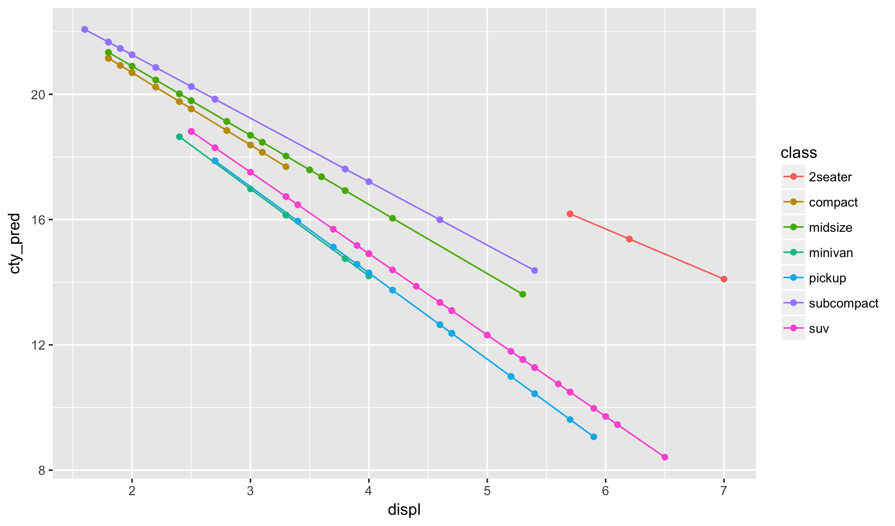


library(readr)
library(ggplot2)
library(dplyr)
library(viridis)


## Linear Regression

We started looking at models in R last class. Today we will fill in some of
the details of linear regression, particularly how to apply it to models
with more than one regression vector.

There are three basic tasks of modelling in statistics:

- exploratory: understanding the distributions and
relationships between variables
- inferential: formal statistical hypothesis tests and
confidence intervals
- prediction: building models to predict new outputs

One reason for the popularity of linear regression models is
that they are excellent choices for all three types of tasks.
We'll cover aspects of all three today.

## Simple Linear Models

### Tea data

We are going to look at a dataset of teas. Specifically,
tea reviews from the [Adagio Tea](http://www.adagio.com/) website.
I collected this dataset about 12 months ago, so it should be
similar but not exactly the same as what is one the site today.
Let's read the data into R from my website:


tea <- read_csv("https://statsmaths.github.io/stat_data/tea.csv")


Opening the data in the data viewer, we see the variable `score`,
which is the primary variable we would like to understand. That is,
what makes a tea that people like?

Variables available to predict the output are the type of tea,
the number of reviews received the price of the tea. The latter
is given in estimated cents per cup as reported on the site.
We also have the full name of the tea.

### Ordinary least squares

The classical linear regression model assumes that the
average value, or mean, of the response Y is a linear
function of X. Symbolically, with the index i representing
the i'th sample, this gives:

$$ \text{mean} (Y_i) = \alpha + \beta * X_i $$

Similarly, we can write that Y is equal to a fixed linear
effect dependent on X plus a random variable epsilon with
zero mean.

$$ Y_i = \alpha + \beta * X_i + \epsilon_i, \quad mean(\epsilon_i) = 0 $$

The estimation task here is to find reasonable estimates for
the alpha and beta components given pairs of observations (X, Y).
There are many ways of doing this but by far the most common is
to use what is known as **Ordinary Least Squares** or OLS.
This selects the alpha and beta that minimize the squared errors
implied by the linear model. As before, let's write this down
symbolically:

$$ \alpha, \beta \in \arg\min \left\{ \left. \sum_i \left(y_i - a - b x_i \right)^2 \quad \right| \quad a, b \in \mathbb{R} \right\} $$

### Linear Models - Visually

In order to better understand linear models, it helps to see a
picture. Below I have drawn a line through our dataset and
indicated the errors (also known as residuals) that the ordinary
least squares is concerned with minimizing.


tea <- mutate(tea, score_pred = 89 + num_reviews * 0.002)
ggplot(tea, aes(num_reviews, score)) +
  geom_line(aes(y = score_pred), color = "orange") +
  geom_point()


Notice that this line under-guesses most of the score of teas, particularly
if the number of reviews is low.

## Using lm

Now, let's compute the best fit line using the lm function:


model <- lm(score ~ num_reviews, data = tea)
model



## 
## Call:
## lm(formula = score ~ num_reviews, data = tea)
## 
## Coefficients:
## (Intercept)  num_reviews  
##   9.227e+01    9.233e-04


Let's use the predict function to fit this model
to our data:


tea <- mutate(tea, score_pred = predict(model))


And now plot the fitted values. Does it visually
correspond to where you would expect the best fit
line to run?


ggplot(tea, aes(num_reviews, score)) +
  geom_smooth(method = "lm") +
  geom_point() +
  geom_segment(aes(xend = num_reviews, yend = score_pred))


Notice how I was able to put together this relatively complex
plot using the geometry layers from last week. Specifically, by
assigning the aesthetics `xend` and `yend` we can create line
segments showing the residuals.

## Multivariate linear regression

The linear regression model I just introduced is known
as simple linear regression because there is only one
explanatory variable. We can easy consider multivariate
models; for instance, we can be write a two variable
model mathematically as follows:

$$ Y_i = \alpha + \beta * X_i + \gamma * Z_i + \epsilon_i, \quad mean(\epsilon_i) = 0 $$

The geometric interpretation of this is that we have plane
in place of the line in the simple linear regression model.

Each slope coefficient (beta and gamma here) corresponds to a
weight placed on how much the response changes with each
predictor variable.

Fitting multivariate models is also quite easy with the
`lm` function. Simply add the variables together that
you would like to use for prediction. Here we use both
the number of reviews and the price of the tea:


model <- lm(score ~ num_reviews + price, data = tea)
tea <- mutate(tea, score_pred = predict(model))
model



## 
## Call:
## lm(formula = score ~ num_reviews + price, data = tea)
## 
## Coefficients:
## (Intercept)  num_reviews        price  
##   91.609849     0.001231     0.018160


Using the color aesthetic we
can visualize the predicted values of this model. Don't
get hung up on the code below; concentrate on the output.


tea_grid <- expand.grid(seq(min(tea$num_reviews), max(tea$num_reviews), length.out = 20),
                        seq(min(tea$price), max(tea$price), length.out = 20))
tea_grid <- data_frame(num_reviews = tea_grid[,1],
                       price = tea_grid[,2])
tea_grid$score_pred <- predict(model, newdata = tea_grid)
ggplot(tea_grid, aes(price, num_reviews)) +
  geom_point(aes(color = score_pred), size = 5) +
  scale_color_viridis() +
  theme_minimal()


## Interpreting Regression Models

The interpretation of a regression model can be described succinctly in
the language of calculus. The slopes correspond to how much we expect the
mean of the response to change as an individual predictor changes, with
all other predictors held fixed. The exact interpretation of these
models is very difficult when there are more than a few numeric variables.
Generally I find them useful for describing patterns in the data but
find that one should not rely too closely on the exact output unless
you understand the model assumptions very well and know exactly how
the data were collected.

## Inference for Regression Models

As mentioned last time, we can easily get p-values that test
whether each coefficient in a regression model is zero by
calling the `summary` function on the model output of `lm`:


model <- lm(score ~ num_reviews + price, data = tea)
summary(model)



## 
## Call:
## lm(formula = score ~ num_reviews + price, data = tea)
## 
## Residuals:
##     Min      1Q  Median      3Q     Max 
## -8.7081 -0.9658  0.1446  1.1335  7.1378 
## 
## Coefficients:
##              Estimate Std. Error t value Pr(>|t|)    
## (Intercept) 9.161e+01  2.388e-01 383.553  < 2e-16 ***
## num_reviews 1.231e-03  2.168e-04   5.678 4.01e-08 ***
## price       1.816e-02  4.169e-03   4.356 1.98e-05 ***
## ---
## Signif. codes:  0 '***' 0.001 '**' 0.01 '*' 0.05 '.' 0.1 ' ' 1
## 
## Residual standard error: 1.846 on 235 degrees of freedom
## Multiple R-squared:  0.1432,	Adjusted R-squared:  0.1359 
## F-statistic: 19.64 on 2 and 235 DF,  p-value: 1.3e-08


The tests are all T-tests; the t-score as well as the standard errors
are included in the table at well. We need more probability theory
than we have time to cover here to explain the detailed assumptions
that make these p-values valid, but approximately we have the following:

- the actual model is linear
- the samples are all independent
- the predictor values are "full rank" (you cannot write any
predictor as a linear combination of the others)
- the x-values are either non-random or independent of the errors

Similarly, we can access confidence intervals for the linear model
using the `confint` function.

