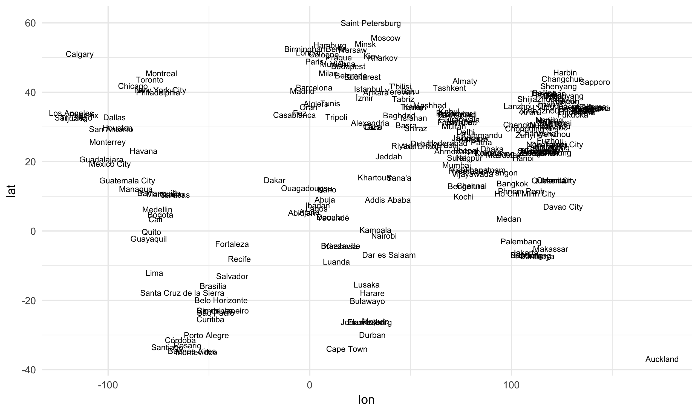
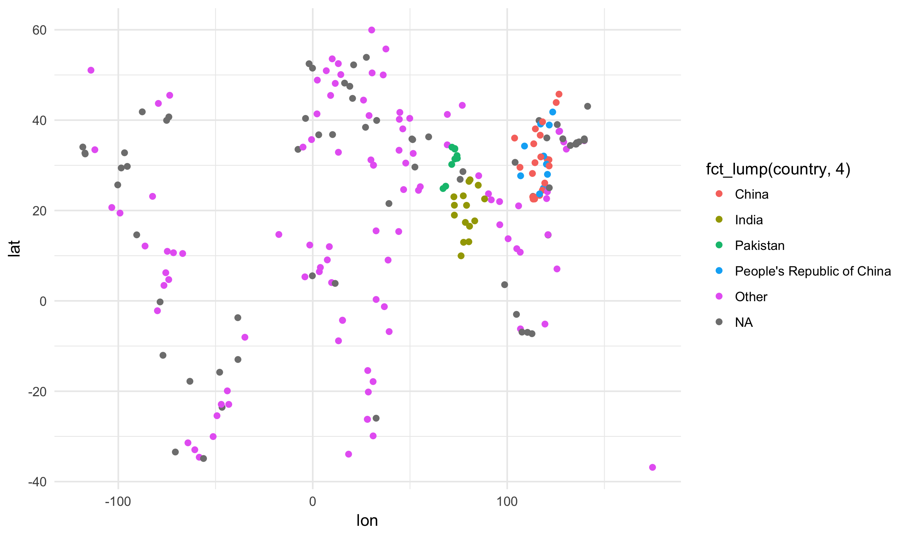


library(readr)
library(ggplot2)
library(dplyr)
library(viridis)
library(stringi)


## Web scraping

Today, we are going to use R to systemically build a dataset from
information on Wikipedia.

Words of caution about scraping data (note: this is not legal
advice):

- many websites prohibit the automatic downloading of material
in their terms and conditions
- a small set of people have gotten in serious trouble for scraping
websites against their terms of use
- we are only going to apply this to Wikipedia, as they have
generously permissive rules about this sort of thing
- if you ever want to replicate this on a large scale, please use
the Wikipedia API rather than the tools here

### Largest cities

Wikipedia has curated a table of the most populous cities in the
world. We can download this list, as in the last class, using
the following code:


url <- "https://en.wikipedia.org/wiki/List_of_largest_cities"
wpage <- data_frame(line = readLines(url))


Make sure to view the site itself as well in a browser.

### Extracting cities

Searching through the source HTML, we see that rows in the
city table always start with the string `<th scope="row">`.
Let's filter our dataset to only include these rows:


wpage <- filter(wpage, stri_detect(line, fixed = '<th scope="row">'))


We will also remove all HTML tags on these rows, and store the results as
the variable city.


wpage <- mutate(wpage, city = stri_replace_all(line, "", regex = "<[^>]+>"))
wpage$city



##   [1] "Chongqing"               "Shanghai"               
##   [3] "Delhi"                   "Beijing"                
##   [5] "Mumbai"                  "Lagos"                  
##   [7] "Karachi"                 "Dhaka"                  
##   [9] "Guangzhou"               "Istanbul"               
##  [11] "Tokyo"                   "Bengaluru"              
##  [13] "Moscow"                  "São Paulo"              
##  [15] "Lahore"                  "Cairo"                  
##  [17] "Kinshasa"                "Jakarta"                
##  [19] "New York City"           "Seoul"                  
##  [21] "Wenzhou"                 "Mexico City"            
##  [23] "Lima"                    "London"                 
##  [25] "Xi'an"                   "Hyderabad"              
##  [27] "Chennai"                 "Ahmedabad"              
##  [29] "Shenzhen"                "Bangkok"                
##  [31] "Vadodara"                "Suzhou"                 
##  [33] "Nanjing"                 "Dongguan"               
##  [35] "Tehran"                  "Quanzhou"               
##  [37] "Shenyang"                "Bogotá"                 
##  [39] "Ho Chi Minh City"        "Hong Kong"              
##  [41] "Baghdad"                 "Fuzhou"                 
##  [43] "Changsha"                "Wuhan"                  
##  [45] "Tianjin"                 "Hanoi"                  
##  [47] "Rio de Janeiro"          "Qingdao"                
##  [49] "Foshan"                  "Zunyi"                  
##  [51] "Santiago"                "Riyadh"                 
##  [53] "Singapore"               "Shantou"                
##  [55] "Ankara"                  "Yangon"                 
##  [57] "Saint Petersburg"        "Casablanca"             
##  [59] "Abidjan"                 "Chengdu"                
##  [61] "Alexandria"              "Kolkata"                
##  [63] "Surat"                   "Johannesburg"           
##  [65] "Dar es Salaam"           "Shijiazhuang"           
##  [67] "Harbin"                  "Giza"                   
##  [69] "İzmir"                   "Zhengzhou"              
##  [71] "New Taipei City"         "Los Angeles"            
##  [73] "Changchun"               "Cape Town"              
##  [75] "Yokohama"                "Khartoum"               
##  [77] "Guayaquil"               "Hangzhou"               
##  [79] "Xiamen"                  "Berlin"                 
##  [81] "Busan"                   "Ningbo"                 
##  [83] "Jeddah"                  "Durban"                 
##  [85] "Algiers"                 "Kabul"                  
##  [87] "Hefei"                   "Mashhad"                
##  [89] "Pyongyang"               "Madrid"                 
##  [91] "Faisalabad"              "Baku"                   
##  [93] "Tangshan"                "Ekurhuleni"             
##  [95] "Nairobi"                 "Zhongshan"              
##  [97] "Pune"                    "Addis Ababa"            
##  [99] "Jaipur"                  "Buenos Aires"           
## [101] "Incheon"                 "Quezon City"            
## [103] "Kiev"                    "Salvador"               
## [105] "Rome"                    "Dubai"                  
## [107] "Luanda"                  "Lucknow"                
## [109] "Kaohsiung"               "Kanpur"                 
## [111] "Surabaya"                "Taichung"               
## [113] "Basra"                   "Toronto"                
## [115] "Taipei"                  "Chicago"                
## [117] "Osaka"                   "Quito"                  
## [119] "Chaozhou"                "Fortaleza"              
## [121] "Chittagong"              "Bandung"                
## [123] "Managua"                 "Brasília"               
## [125] "Belo Horizonte"          "Daegu"                  
## [127] "Houston"                 "Douala"                 
## [129] "Medellin"                "Yaoundé"                
## [131] "Nagpur"                  "Cali"                   
## [133] "Tashkent"                "Nagoya"                 
## [135] "Isfahan"                 "Phnom Penh"             
## [137] "Kochi"                   "Paris"                  
## [139] "Ouagadougou"             "Lanzhou"                
## [141] "Kano"                    "Dalian"                 
## [143] "Guatemala City"          "Havana"                 
## [145] "Rawalpindi"              "Medan"                  
## [147] "Accra"                   "Visakhapatnam"          
## [149] "Gujranwala"              "Jinan"                  
## [151] "Karaj"                   "Peshawar"               
## [153] "Minsk"                   "Caracas"                
## [155] "Sana'a"                  "Sapporo"                
## [157] "Tainan"                  "Bucharest"              
## [159] "Curitiba"                "Shiraz"                 
## [161] "Vienna"                  "Brazzaville"            
## [163] "Bhopal"                  "Hamburg"                
## [165] "Manila"                  "Kuala Lumpur"           
## [167] "Maputo"                  "Budapest"               
## [169] "Warsaw"                  "Lusaka"                 
## [171] "Kathmandu"               "Tabriz"                 
## [173] "Hyderabad"               "Palembang"              
## [175] "Almaty"                  "Tijuana"                
## [177] "Patna"                   "Montreal"               
## [179] "Davao City"              "Harare"                 
## [181] "Barcelona"               "Maracaibo"              
## [183] "Caloocan"                "Philadelphia"           
## [185] "Novosibirsk"             "Phoenix"                
## [187] "Bulawayo"                "Oran"                   
## [189] "Semarang"                "Recife"                 
## [191] "Kobe"                    "Daejeon"                
## [193] "Kampala"                 "Kawasaki"               
## [195] "Guadalajara"             "Auckland"               
## [197] "Vijayawada"              "Fukuoka"                
## [199] "Kwangju"                 "Porto Alegre"           
## [201] "Kyoto"                   "San Antonio"            
## [203] "Santa Cruz de la Sierra" "Munich"                 
## [205] "Kharkiv"                 "Yekaterinburg"          
## [207] "San Diego"               "Barranquilla"           
## [209] "Milan"                   "Ibadan"                 
## [211] "Makassar"                "Córdoba"                
## [213] "Prague"                  "Mandalay"               
## [215] "Dallas"                  "Montevideo"             
## [217] "Nizhny Novgorod"         "Abuja"                  
## [219] "Calgary"                 "Saitama"                
## [221] "Hiroshima"               "Rosario"                
## [223] "Brisbane"                "Belgrade"               
## [225] "Campinas"                "Ulsan"                  
## [227] "Omsk"                    "Dakar"                  
## [229] "Abu Dhabi"               "Monterrey"              
## [231] "Tripoli"                 "Rostov-on-Don"          
## [233] "T'bilisi"                "Fez"                    
## [235] "Birmingham"              "Yerevan"                
## [237] "Cologne"                 "Tunis"                  
## [239] "Islamabad"


Finally, looking at row of data, notice that there is a link to the
Wikipedia page about each city:


wpage$line[1]



## [1] "<th scope=\"row\"><a href=\"/wiki/Chongqing\" title=\"Chongqing\">Chongqing</a></th>"


We can extract these using the `stri_extract` function:


wpage <- mutate(wpage, link = stri_extract(line, regex = "/wiki/[^[\"]]+"))
wpage$link



##   [1] "/wiki/Chongqing"                           
##   [2] "/wiki/Shanghai"                            
##   [3] "/wiki/Delhi"                               
##   [4] "/wiki/Beijing"                             
##   [5] "/wiki/Mumbai"                              
##   [6] "/wiki/Lagos"                               
##   [7] "/wiki/Karachi"                             
##   [8] "/wiki/Dhaka"                               
##   [9] "/wiki/Guangzhou"                           
##  [10] "/wiki/Istanbul"                            
##  [11] "/wiki/Tokyo"                               
##  [12] "/wiki/Bengaluru"                           
##  [13] "/wiki/Moscow"                              
##  [14] "/wiki/S%C3%A3o_Paulo"                      
##  [15] "/wiki/Lahore"                              
##  [16] "/wiki/Cairo"                               
##  [17] "/wiki/Kinshasa"                            
##  [18] "/wiki/Jakarta"                             
##  [19] "/wiki/New_York_City"                       
##  [20] "/wiki/Seoul"                               
##  [21] "/wiki/Wenzhou"                             
##  [22] "/wiki/Mexico_City"                         
##  [23] "/wiki/Lima"                                
##  [24] "/wiki/London"                              
##  [25] "/wiki/Xi%27an"                             
##  [26] "/wiki/Hyderabad"                           
##  [27] "/wiki/Chennai"                             
##  [28] "/wiki/Ahmedabad"                           
##  [29] "/wiki/Shenzhen"                            
##  [30] "/wiki/Bangkok"                             
##  [31] "/wiki/Vadodara"                            
##  [32] "/wiki/Suzhou"                              
##  [33] "/wiki/Nanjing"                             
##  [34] "/wiki/Dongguan"                            
##  [35] "/wiki/Tehran"                              
##  [36] "/wiki/Quanzhou"                            
##  [37] "/wiki/Shenyang"                            
##  [38] "/wiki/Bogot%C3%A1"                         
##  [39] "/wiki/Ho_Chi_Minh_City"                    
##  [40] "/wiki/Hong_Kong"                           
##  [41] "/wiki/Baghdad"                             
##  [42] "/wiki/Fuzhou"                              
##  [43] "/wiki/Changsha"                            
##  [44] "/wiki/Wuhan"                               
##  [45] "/wiki/Tianjin"                             
##  [46] "/wiki/Hanoi"                               
##  [47] "/wiki/Rio_de_Janeiro"                      
##  [48] "/wiki/Qingdao"                             
##  [49] "/wiki/Foshan"                              
##  [50] "/wiki/Zunyi"                               
##  [51] "/wiki/Santiago"                            
##  [52] "/wiki/Riyadh"                              
##  [53] "/wiki/Singapore"                           
##  [54] "/wiki/Shantou"                             
##  [55] "/wiki/Ankara"                              
##  [56] "/wiki/Yangon"                              
##  [57] "/wiki/Saint_Petersburg"                    
##  [58] "/wiki/Casablanca"                          
##  [59] "/wiki/Abidjan"                             
##  [60] "/wiki/Chengdu"                             
##  [61] "/wiki/Alexandria"                          
##  [62] "/wiki/Kolkata"                             
##  [63] "/wiki/Surat"                               
##  [64] "/wiki/Johannesburg"                        
##  [65] "/wiki/Dar_es_Salaam"                       
##  [66] "/wiki/Shijiazhuang"                        
##  [67] "/wiki/Harbin"                              
##  [68] "/wiki/Giza"                                
##  [69] "/wiki/%C4%B0zmir"                          
##  [70] "/wiki/Zhengzhou"                           
##  [71] "/wiki/New_Taipei_City"                     
##  [72] "/wiki/Los_Angeles"                         
##  [73] "/wiki/Changchun"                           
##  [74] "/wiki/Cape_Town"                           
##  [75] "/wiki/Yokohama"                            
##  [76] "/wiki/Khartoum"                            
##  [77] "/wiki/Guayaquil"                           
##  [78] "/wiki/Hangzhou"                            
##  [79] "/wiki/Xiamen"                              
##  [80] "/wiki/Berlin"                              
##  [81] "/wiki/Busan"                               
##  [82] "/wiki/Ningbo"                              
##  [83] "/wiki/Jeddah"                              
##  [84] "/wiki/Durban"                              
##  [85] "/wiki/Algiers"                             
##  [86] "/wiki/Kabul"                               
##  [87] "/wiki/Hefei"                               
##  [88] "/wiki/Mashhad"                             
##  [89] "/wiki/Pyongyang"                           
##  [90] "/wiki/Madrid"                              
##  [91] "/wiki/Faisalabad"                          
##  [92] "/wiki/Baku"                                
##  [93] "/wiki/Tangshan"                            
##  [94] "/wiki/Ekurhuleni_Metropolitan_Municipality"
##  [95] "/wiki/Nairobi"                             
##  [96] "/wiki/Zhongshan"                           
##  [97] "/wiki/Pune"                                
##  [98] "/wiki/Addis_Ababa"                         
##  [99] "/wiki/Jaipur"                              
## [100] "/wiki/Buenos_Aires"                        
## [101] "/wiki/Incheon"                             
## [102] "/wiki/Quezon_City"                         
## [103] "/wiki/Kiev"                                
## [104] "/wiki/Salvador,_Bahia"                     
## [105] "/wiki/Rome"                                
## [106] "/wiki/Dubai"                               
## [107] "/wiki/Luanda"                              
## [108] "/wiki/Lucknow"                             
## [109] "/wiki/Kaohsiung"                           
## [110] "/wiki/Kanpur"                              
## [111] "/wiki/Surabaya"                            
## [112] "/wiki/Taichung"                            
## [113] "/wiki/Basra"                               
## [114] "/wiki/Toronto"                             
## [115] "/wiki/Taipei"                              
## [116] "/wiki/Chicago"                             
## [117] "/wiki/Osaka"                               
## [118] "/wiki/Quito"                               
## [119] "/wiki/Chaozhou"                            
## [120] "/wiki/Fortaleza"                           
## [121] "/wiki/Chittagong"                          
## [122] "/wiki/Bandung"                             
## [123] "/wiki/Managua"                             
## [124] "/wiki/Bras%C3%ADlia"                       
## [125] "/wiki/Belo_Horizonte"                      
## [126] "/wiki/Daegu"                               
## [127] "/wiki/Houston"                             
## [128] "/wiki/Douala"                              
## [129] "/wiki/Medellin"                            
## [130] "/wiki/Yaound%C3%A9"                        
## [131] "/wiki/Nagpur"                              
## [132] "/wiki/Cali"                                
## [133] "/wiki/Tashkent"                            
## [134] "/wiki/Nagoya"                              
## [135] "/wiki/Isfahan"                             
## [136] "/wiki/Phnom_Penh"                          
## [137] "/wiki/Kochi"                               
## [138] "/wiki/Paris"                               
## [139] "/wiki/Ouagadougou"                         
## [140] "/wiki/Lanzhou"                             
## [141] "/wiki/Kano"                                
## [142] "/wiki/Dalian"                              
## [143] "/wiki/Guatemala_City"                      
## [144] "/wiki/Havana"                              
## [145] "/wiki/Rawalpindi"                          
## [146] "/wiki/Medan"                               
## [147] "/wiki/Accra"                               
## [148] "/wiki/Visakhapatnam"                       
## [149] "/wiki/Gujranwala"                          
## [150] "/wiki/Jinan"                               
## [151] "/wiki/Karaj"                               
## [152] "/wiki/Peshawar"                            
## [153] "/wiki/Minsk"                               
## [154] "/wiki/Caracas"                             
## [155] "/wiki/Sana%27a"                            
## [156] "/wiki/Sapporo"                             
## [157] "/wiki/Tainan"                              
## [158] "/wiki/Bucharest"                           
## [159] "/wiki/Curitiba"                            
## [160] "/wiki/Shiraz"                              
## [161] "/wiki/Vienna"                              
## [162] "/wiki/Brazzaville"                         
## [163] "/wiki/Bhopal"                              
## [164] "/wiki/Hamburg"                             
## [165] "/wiki/Manila"                              
## [166] "/wiki/Kuala_Lumpur"                        
## [167] "/wiki/Maputo"                              
## [168] "/wiki/Budapest"                            
## [169] "/wiki/Warsaw"                              
## [170] "/wiki/Lusaka"                              
## [171] "/wiki/Kathmandu"                           
## [172] "/wiki/Tabriz"                              
## [173] "/wiki/Hyderabad,_Sindh"                    
## [174] "/wiki/Palembang"                           
## [175] "/wiki/Almaty"                              
## [176] "/wiki/Tijuana"                             
## [177] "/wiki/Patna"                               
## [178] "/wiki/Montreal"                            
## [179] "/wiki/Davao_City"                          
## [180] "/wiki/Harare"                              
## [181] "/wiki/Barcelona"                           
## [182] "/wiki/Maracaibo"                           
## [183] "/wiki/Caloocan"                            
## [184] "/wiki/Philadelphia"                        
## [185] "/wiki/Novosibirsk"                         
## [186] "/wiki/Phoenix,_Arizona"                    
## [187] "/wiki/Bulawayo"                            
## [188] "/wiki/Oran"                                
## [189] "/wiki/Semarang"                            
## [190] "/wiki/Recife"                              
## [191] "/wiki/Kobe"                                
## [192] "/wiki/Daejeon"                             
## [193] "/wiki/Kampala"                             
## [194] "/wiki/Kawasaki,_Kanagawa"                  
## [195] "/wiki/Guadalajara"                         
## [196] "/wiki/Auckland"                            
## [197] "/wiki/Vijayawada"                          
## [198] "/wiki/Fukuoka"                             
## [199] "/wiki/Kwangju"                             
## [200] "/wiki/Porto_Alegre"                        
## [201] "/wiki/Kyoto"                               
## [202] "/wiki/San_Antonio"                         
## [203] "/wiki/Santa_Cruz_de_la_Sierra"             
## [204] "/wiki/Munich"                              
## [205] "/wiki/Kharkiv"                             
## [206] "/wiki/Yekaterinburg"                       
## [207] "/wiki/San_Diego"                           
## [208] "/wiki/Barranquilla"                        
## [209] "/wiki/Milan"                               
## [210] "/wiki/Ibadan"                              
## [211] "/wiki/Makassar"                            
## [212] "/wiki/C%C3%B3rdoba,_Argentina"             
## [213] "/wiki/Prague"                              
## [214] "/wiki/Mandalay"                            
## [215] "/wiki/Dallas"                              
## [216] "/wiki/Montevideo"                          
## [217] "/wiki/Nizhny_Novgorod"                     
## [218] "/wiki/Abuja"                               
## [219] "/wiki/Calgary"                             
## [220] "/wiki/Saitama,_Saitama"                    
## [221] "/wiki/Hiroshima"                           
## [222] "/wiki/Rosario,_Santa_Fe"                   
## [223] "/wiki/Brisbane"                            
## [224] "/wiki/Belgrade"                            
## [225] "/wiki/Campinas"                            
## [226] "/wiki/Ulsan"                               
## [227] "/wiki/Omsk"                                
## [228] "/wiki/Dakar"                               
## [229] "/wiki/Abu_Dhabi"                           
## [230] "/wiki/Monterrey"                           
## [231] "/wiki/Tripoli"                             
## [232] "/wiki/Rostov-on-Don"                       
## [233] "/wiki/T%27bilisi"                          
## [234] "/wiki/Fez,_Morocco"                        
## [235] "/wiki/Birmingham"                          
## [236] "/wiki/Yerevan"                             
## [237] "/wiki/Cologne"                             
## [238] "/wiki/Tunis"                               
## [239] "/wiki/Islamabad"


### A city page

With this link, we can now download the specific information
from a given city. For instance, let's take the 5'th city
(Lagos) and download the website from Wikipedia:


i <- 5
url <- stri_c("https://en.wikipedia.org", wpage$link[i])
cpage <- data_frame(line = readLines(url))


Note the use of the `stri_c` function to combine the base URL
with the link.

### Coordinates

One piece of information on most city pages is the latitude and
longitude of the city. We can find this by detecting the string
"Coordinates:" in the webpage. Here, we save only the first
occurrence of the string (here there is only one, but we want
to safely abstract this to other pages):


coord <- filter(cpage, stri_detect(line,
                          fixed = "Coordinates:"))$line[1]
coord



## [1] "<td colspan=\"2\" style=\"text-align:center\">Coordinates: <a class=\"external text\" href=\"//tools.wmflabs.org/geohack/geohack.php?pagename=Mumbai&amp;params=18_58_30_N_72_49_33_E_type:city(12442373)_region:IN-MH\">18°58′30″N 72°49′33″E / 18.97500°N 72.82583°E / 18.97500; 72.82583</a><a href=\"/wiki/Geographic_coordinate_system\" title=\"Geographic coordinate system\">Coordinates</a>: <a class=\"external text\" href=\"//tools.wmflabs.org/geohack/geohack.php?pagename=Mumbai&amp;params=18_58_30_N_72_49_33_E_type:city(12442373)_region:IN-MH\">18°58′30″N 72°49′33″E / 18.97500°N 72.82583°E / 18.97500; 72.82583</a></td>"


Looking at the output, we want to not just remove the HTML tags but
to capture a very specific part of the tags. Here we get the easiest
form of the coordinates from the "geo" tag:


coord <- stri_extract(coord,
                      regex = "[^<]+")
coord



## [1] "18.97500; 72.82583"


We want to now remove the html tags. We could do this by a regular expression,
but let's instead do it by taking a substring:


coord <- stri_sub(coord, 19, -8)
coord



## [1] "18.97500; 72.82583"


Next, we want to split the string into two parts based on the ";" symbol.
We do this with the `stri_split` function.


coord <- stri_split(coord, fixed = ";")[[1]]
coord



## [1] "18.97500"  " 72.82583"


Finally, we want to convert these strings into numbers. Recall that
`factor` turns numeric data into categorical ones; at the time, I
mentioned that rarely can we go in the reverse order. Here we use
the `as.numeric` function to do just that:


coord <- as.numeric(coord)
lat <- coord[1]
lon <- coord[2]
lat



## [1] 18.975



lon



## [1] 72.82583


### Country name

Let's also find the name of the country that each city is in.
this is a bit complicated because the row that shows the tag
"Country" is actually one away from the row that gives the
data:


filter(cpage, stri_detect(line,
               fixed = "<th scope=\"row\">Country</th>"))



## # A tibble: 1 x 1
##                               line
##                              <chr>
## 1 "<th scope=\"row\">Country</th>"


To fix this, wrap the `stri_detect` function in the function `which`. This
gives the indices where something is True:


id <- which(stri_detect(cpage$line,
             fixed = "<th scope=\"row\">Country</th>"))
id



## [1] 99


Now, we just add 1 to this index (extracting just the first one, in case there
are multiple) and grab those lines:


country <- cpage$line[id[1] + 1]
country



## [1] "<td><a href=\"/wiki/India\" title=\"India\">India</a></td>"


Cleaning up the results yields the desired information:


country <- cpage$line[which(stri_detect(cpage$line,
            fixed = "<th scope=\"row\">Country</th>"))[1] + 1]
country <- stri_replace_all(country, "", regex = "<[^>]+>")
country <- stri_replace_all(country, "", fixed = "&#160;")
country



## [1] "India"


### Automating over cities

We now have code that works on a single city page. Let's add empty
attributes to the `wpage` dataset. We'll fill these in in a moment.


wpage$lat <- NA
wpage$lon <- NA
wpage$country <- NA


We now use a *for loop* to cycle over all rows of the `wpage` dataset.
A simple template describing how the loop works looks like the block
belove, with the extraction code filled in at the comment:


for (i in 1:nrow(wpage)) {
  url <- stri_c("https://en.wikipedia.org", wpage$link[i])
  cpage <- data_frame(line = readLines(url))

  # extract stuff

  wpage$lat[i] <- lat
  wpage$lon[i] <- lon
  wpage$country[i] <- country
}


Here is the full code, with the details filled in:


for (i in 1:nrow(wpage)) {
  url <- stri_c("https://en.wikipedia.org", wpage$link[i])
  cpage <- data_frame(line = readLines(url))

  coord <- filter(cpage,
      stri_detect(line, fixed = "Coordinates:"))$line[1]
  coord <- stri_extract(coord,
      regex = "[^<]+")
  coord <- stri_sub(coord, 19, -8)
  coord <- stri_split(coord, fixed = ";")[[1]]
  coord <- as.numeric(coord)
  wpage$lat[i] <- coord[1]
  wpage$lon[i] <- coord[2]

  country <- cpage$line[which(stri_detect(cpage$line,
      fixed = "<th scope=\"row\">Country</th>"))[1] + 1]
  country <- stri_replace_all(country, "", regex = "<[^>]+>")
  country <- stri_replace_all(country, "", fixed = "&#160;")

  wpage$country[i] <- country
}


Running that takes several minutes and I do not want to ping
the Wikipedia server more than necessary. Here, I will just
load the final results, which I have loaded to the class
website:


## # A tibble: 239 x 6
##                                                                           line
##                                                                          <chr>
##  1 "<th scope=\"row\"><a href=\"/wiki/Shanghai\" title=\"Shanghai\">Shanghai</
##  2 "<th scope=\"row\"><a href=\"/wiki/Karachi\" title=\"Karachi\">Karachi</a><
##  3 "<th scope=\"row\"><a href=\"/wiki/Beijing\" title=\"Beijing\">Beijing</a><
##  4  "<th scope=\"row\"><a href=\"/wiki/Delhi\" title=\"Delhi\">Delhi</a></th>"
##  5  "<th scope=\"row\"><a href=\"/wiki/Lagos\" title=\"Lagos\">Lagos</a></th>"
##  6  "<th scope=\"row\"><a href=\"/wiki/Dhaka\" title=\"Dhaka\">Dhaka</a></th>"
##  7 "<th scope=\"row\"><a href=\"/wiki/Guangzhou\" title=\"Guangzhou\">Guangzho
##  8 "<th scope=\"row\"><a href=\"/wiki/Istanbul\" title=\"Istanbul\">Istanbul</
##  9  "<th scope=\"row\"><a href=\"/wiki/Tokyo\" title=\"Tokyo\">Tokyo</a></th>"
## 10 "<th scope=\"row\"><a href=\"/wiki/Mumbai\" title=\"Mumbai\">Mumbai</a></th
## # ... with 229 more rows, and 5 more variables: city <chr>, link <chr>,
## #   lat <dbl>, lon <dbl>, country <chr>


We can now plot the data as follows:


## Warning: Removed 15 rows containing missing values (geom_text).


We can label the most common countries by using the
`fct_lump` function from the **forcats** package:


## Warning: Removed 15 rows containing missing values (geom_point).


Or, simply tabulate by country:


count(wpage, country, sort = TRUE)



## # A tibble: 69 x 2
##                       country     n
##                         <chr> <int>
##  1                       <NA>    69
##  2                      China    21
##  3                      India    16
##  4 People's Republic of China    10
##  5                   Pakistan     9
##  6                     Russia     7
##  7                     Brazil     6
##  8                South Korea     5
##  9                   Colombia     4
## 10                    Germany     4
## # ... with 59 more rows


## Shortcuts with XML

The techniques above are very useful because they can be used to
extract meaningful data from arbitrary textual sources. When
working with properly formed HTML or XML, it is possible to
short cut many of these tricks by using a proper XML parser. The
**XML** package in R provides full-feature XML parser; it is
fantastic but would require a dedicated class or more to work
with so I am not going to cover it here. Here I will describe
just one simple function from the package that is particularly
useful.

Note that you'll need to install **XML** if you want
to use it as it was not included in the `setup.R` script we
had in the first week of class. Let's take a look
at the following Wikipedia page:

- [city tempuratures](https://en.wikipedia.org/wiki/List_of_cities_by_temperature)

There are a number of tables on this page. We can extract
these all as a list of R data frames using the `readHTMLTable`
function:


library(XML)



## Loading required package: methods



url <- "https://en.wikipedia.org/wiki/List_of_cities_by_temperature"
tabs <- readHTMLTable(readLines(url), stringsAsFactors = FALSE)
length(tabs)



## [1] 6


The six tables represent the six regions that the cities are broken
up into. Let's take the second element and convert it into a **dplyr**
data tibble:


as_data_frame(tabs[[2]])



## # A tibble: 49 x 16
##       Country      City             Jan            Feb            Mar
##         <chr>     <chr>           <chr>          <chr>          <chr>
##  1 Azerbaijan      Baku   "4.4\n(39.9)"  "4.2\n(39.6)"  "7.0\n(44.6)"
##  2 Bangladesh     Dhaka  "19.1\n(66.4)" "21.8\n(71.2)" "26.5\n(79.7)"
##  3      China   Beijing  "−3.1\n(26.4)"  "0.3\n(32.5)"  "6.7\n(44.1)"
##  4      China Chongqing   "8.0\n(46.4)" "10.1\n(50.2)" "14.0\n(57.2)"
##  5      China     Lhasa  "−2.1\n(28.2)"  "1.1\n(34.0)"  "4.6\n(40.3)"
##  6      China  Shanghai   "4.6\n(40.3)"  "6.1\n(43.0)"  "9.6\n(49.3)"
##  7      China    Ürümqi "−12.1\n(10.2)" "−9.3\n(15.3)" "−0.5\n(31.1)"
##  8    Georgia    Batumi       "6\n(43)"      "7\n(45)"      "8\n(46)"
##  9    Georgia   Tbilisi   "1.2\n(34.2)"  "2.7\n(36.9)"  "6.6\n(43.9)"
## 10  Hong Kong Hong Kong  "16.3\n(61.3)" "16.8\n(62.2)" "19.1\n(66.4)"
## # ... with 39 more rows, and 11 more variables: Apr <chr>, May <chr>,
## #   Jun <chr>, Jul <chr>, Aug <chr>, Sep <chr>, Oct <chr>, Nov <chr>,
## #   Dec <chr>, Year <chr>, Ref. <chr>


There is still some cleaning up needed here, but the `readHTMLTable`
function has saved us a lot of time in getting this far. A commonly
needed tweak is to access the hyperlinks within the table (they are
removed in the text above). Here, I define a custom parsing function
that returns the first link found in each cell:


hrefFun <- function(x){
  res <- xpathSApply(x,'./a/@href')[1]
  ifelse(!is.null(res), res, NA_character_)
}

tabs <- readHTMLTable(readLines(url), elFun = hrefFun, stringsAsFactors = FALSE)
as_data_frame(tabs[[2]])



## # A tibble: 49 x 16
##                    Country                   City   Jan   Feb   Mar   Apr
##                      <chr>                  <chr> <chr> <chr> <chr> <chr>
##  1        /wiki/Azerbaijan             /wiki/Baku  <NA>  <NA>  <NA>  <NA>
##  2        /wiki/Bangladesh            /wiki/Dhaka  <NA>  <NA>  <NA>  <NA>
##  3             /wiki/China          /wiki/Beijing  <NA>  <NA>  <NA>  <NA>
##  4             /wiki/China        /wiki/Chongqing  <NA>  <NA>  <NA>  <NA>
##  5             /wiki/China            /wiki/Lhasa  <NA>  <NA>  <NA>  <NA>
##  6             /wiki/China         /wiki/Shanghai  <NA>  <NA>  <NA>  <NA>
##  7             /wiki/China /wiki/%C3%9Cr%C3%BCmqi  <NA>  <NA>  <NA>  <NA>
##  8 /wiki/Georgia_(country)           /wiki/Batumi  <NA>  <NA>  <NA>  <NA>
##  9 /wiki/Georgia_(country)          /wiki/Tbilisi  <NA>  <NA>  <NA>  <NA>
## 10         /wiki/Hong_Kong        /wiki/Hong_Kong  <NA>  <NA>  <NA>  <NA>
## # ... with 39 more rows, and 10 more variables: May <chr>, Jun <chr>,
## #   Jul <chr>, Aug <chr>, Sep <chr>, Oct <chr>, Nov <chr>, Dec <chr>,
## #   Year <chr>, Ref. <chr>


You could then follow the links in the table and scrape those. This is the
sort of thing you will be doing for Project II.

