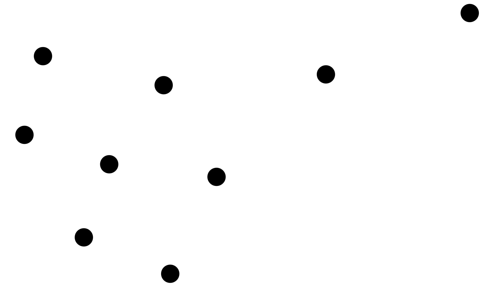
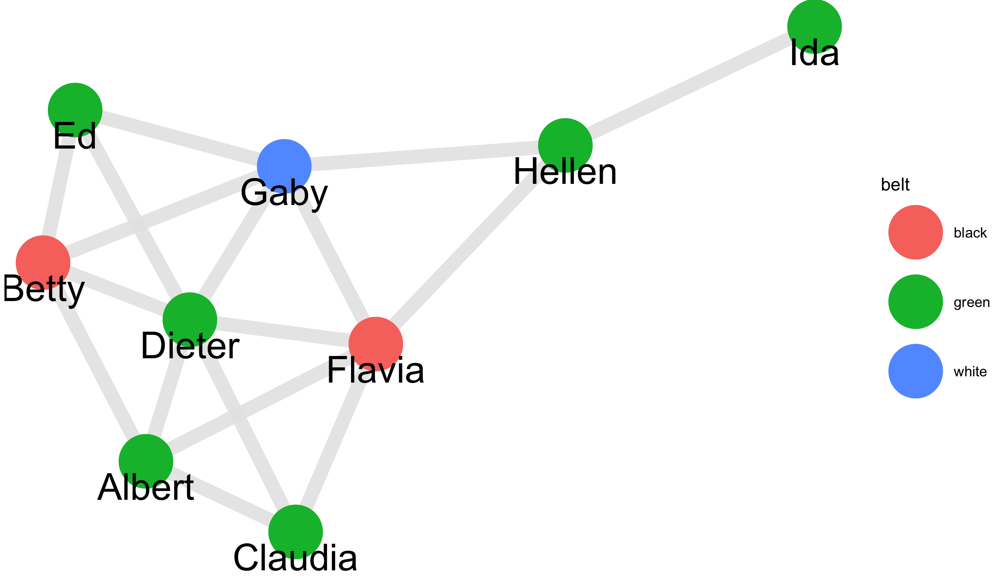
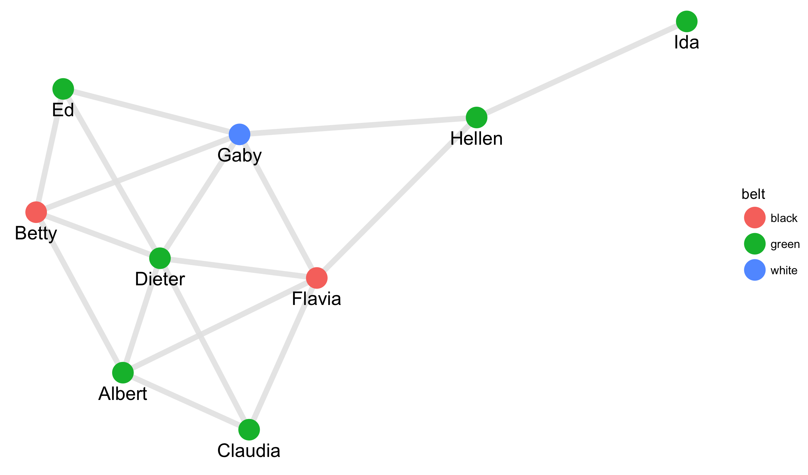
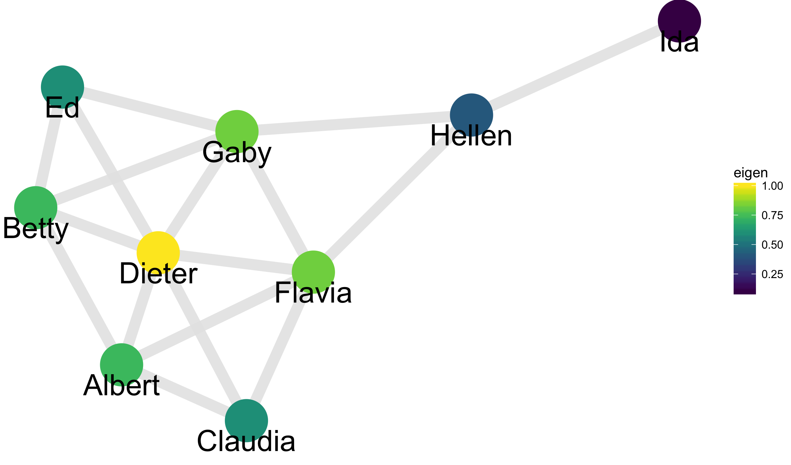
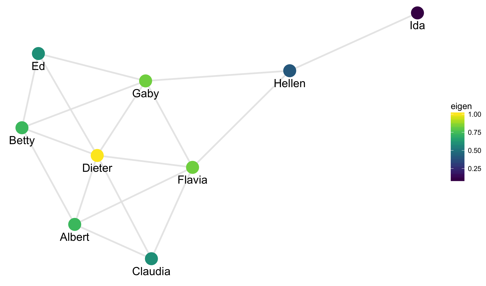
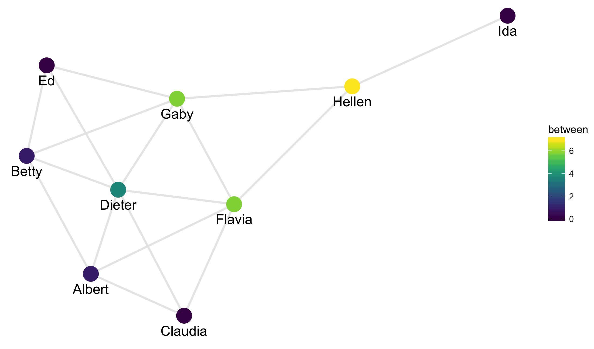
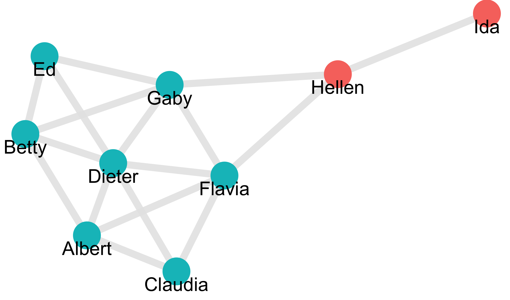
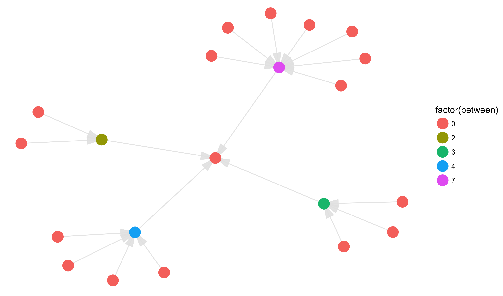
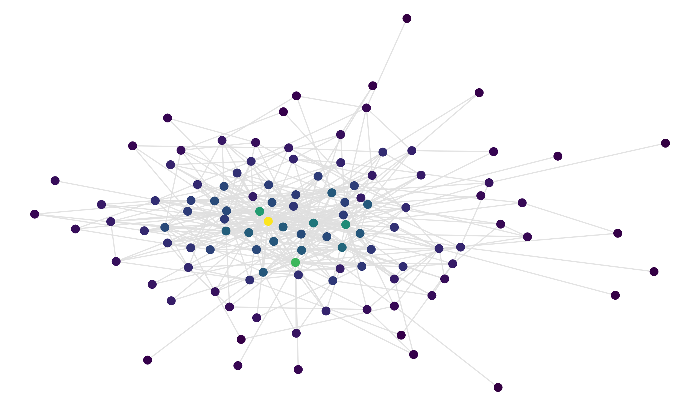
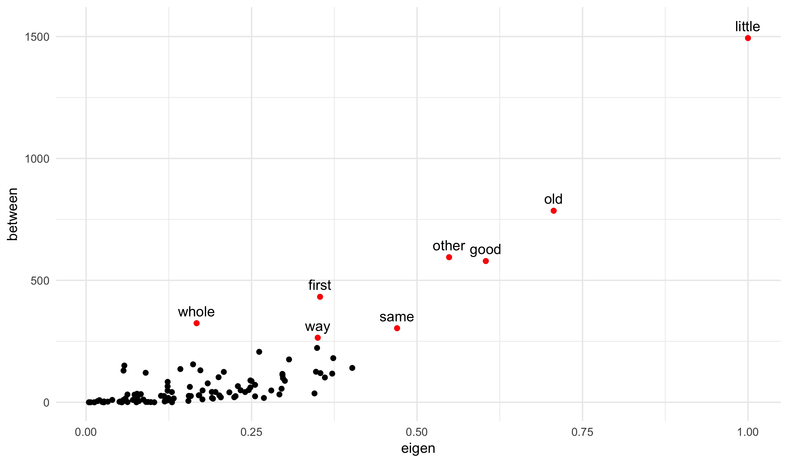


library(readr)
library(dplyr)
library(ggplot2)
library(viridis)



edges



## # A tibble: 17 x 2
##         id  id_out
##      <chr>   <chr>
##  1  Albert   Betty
##  2  Albert Claudia
##  3  Albert  Dieter
##  4  Albert  Flavia
##  5   Betty  Dieter
##  6   Betty      Ed
##  7   Betty    Gaby
##  8 Claudia  Dieter
##  9 Claudia  Flavia
## 10  Dieter      Ed
## 11  Dieter  Flavia
## 12  Dieter    Gaby
## 13      Ed    Gaby
## 14  Flavia    Gaby
## 15  Flavia  Hellen
## 16    Gaby  Hellen
## 17  Hellen     Ida



nodes



## # A tibble: 9 x 3
##        id   age  belt
##     <chr> <int> <chr>
## 1  Albert    14 green
## 2   Betty    12 black
## 3 Claudia    17 green
## 4  Dieter    16 green
## 5      Ed    17 green
## 6  Flavia    14 black
## 7    Gaby    15 white
## 8  Hellen    14 green
## 9     Ida    18 green



library(smodels)
z <- graph_data(edges, nodes)
nodes <- z$nodes
edges <- z$edges



nodes



## # A tibble: 9 x 14
##        id   age  belt        x         y degree degree_in degree_out
##     <chr> <int> <chr>    <dbl>     <dbl>  <dbl>     <dbl>      <dbl>
## 1  Albert    14 green 11.35163  7.513051      4         4          4
## 2   Betty    12 black 10.78134  8.700978      4         4          4
## 3 Claudia    17 green 12.18097  7.091058      3         3          3
## 4  Dieter    16 green 11.59502  8.360185      6         6          6
## 5      Ed    17 green 10.95917  9.613346      3         3          3
## 6  Flavia    14 black 12.62564  8.214088      5         5          5
## 7    Gaby    15 white 12.11797  9.276760      5         5          5
## 8  Hellen    14 green 13.67602  9.401838      3         3          3
## 9     Ida    18 green 15.05702 10.112879      1         1          1
## # ... with 6 more variables: eigen <dbl>, close <dbl>, between <dbl>,
## #   cluster <chr>, component <int>, component_size <dbl>



edges



## # A tibble: 17 x 6
##         id  id_out        x     xend        y      yend
##      <chr>   <chr>    <dbl>    <dbl>    <dbl>     <dbl>
##  1  Albert   Betty 11.35163 10.78134 7.513051  8.700978
##  2  Albert Claudia 11.35163 12.18097 7.513051  7.091058
##  3  Albert  Dieter 11.35163 11.59502 7.513051  8.360185
##  4  Albert  Flavia 11.35163 12.62564 7.513051  8.214088
##  5   Betty  Dieter 10.78134 11.59502 8.700978  8.360185
##  6   Betty      Ed 10.78134 10.95917 8.700978  9.613346
##  7   Betty    Gaby 10.78134 12.11797 8.700978  9.276760
##  8 Claudia  Dieter 12.18097 11.59502 7.091058  8.360185
##  9 Claudia  Flavia 12.18097 12.62564 7.091058  8.214088
## 10  Dieter      Ed 11.59502 10.95917 8.360185  9.613346
## 11  Dieter  Flavia 11.59502 12.62564 8.360185  8.214088
## 12  Dieter    Gaby 11.59502 12.11797 8.360185  9.276760
## 13      Ed    Gaby 10.95917 12.11797 9.613346  9.276760
## 14  Flavia    Gaby 12.62564 12.11797 8.214088  9.276760
## 15  Flavia  Hellen 12.62564 13.67602 8.214088  9.401838
## 16    Gaby  Hellen 12.11797 13.67602 9.276760  9.401838
## 17  Hellen     Ida 13.67602 15.05702 9.401838 10.112879



ggplot(nodes, aes(x, y)) +
  geom_point(size = 10) +
  theme_void()



ggplot(nodes, aes(x, y, label = id)) +
  geom_segment(aes(xend = xend, yend = yend), data = edges,
               color = grey(0.9), alpha = 0.9, size = 4) +
  geom_point(aes(color = belt), size = 15) +
  geom_text(aes(y = y - 0.15), size = 8) +
  theme_void()



library(plotly)



## 
## Attaching package: 'plotly'



## The following object is masked from 'package:ggplot2':
## 
##     last_plot



## The following object is masked from 'package:stats':
## 
##     filter



## The following object is masked from 'package:graphics':
## 
##     layout



ggplotly()



## We recommend that you use the dev version of ggplot2 with `ggplotly()`
## Install it with: `devtools::install_github('hadley/ggplot2')`


## Centrality


ggplot(nodes, aes(x, y, label = id)) +
  geom_segment(aes(xend = xend, yend = yend), data = edges,
               color = grey(0.9), alpha = 0.9, size = 4) +
  geom_point(aes(color = eigen), size = 15) +
  geom_text(aes(y = y - 0.15), size = 8) +
  scale_color_viridis() +
  theme_void()



ggplot(nodes, aes(x, y, label = id)) +
  geom_segment(aes(xend = xend, yend = yend), data = edges,
               color = grey(0.9), alpha = 0.9, size = 4) +
  geom_point(aes(color = close), size = 15) +
  geom_text(aes(y = y - 0.15), size = 8) +
  scale_color_viridis() +
  theme_void()



ggplot(nodes, aes(x, y, label = id)) +
  geom_segment(aes(xend = xend, yend = yend), data = edges,
               color = grey(0.9), alpha = 0.9, size = 4) +
  geom_point(aes(color = between), size = 15) +
  geom_text(aes(y = y - 0.15), size = 8) +
  scale_color_viridis() +
  theme_void()


## Clusters


ggplot(nodes, aes(x, y, label = id)) +
  geom_segment(aes(xend = xend, yend = yend), data = edges,
               color = grey(0.9), alpha = 0.9, size = 4) +
  geom_point(aes(color = cluster), size = 15, show.legend = FALSE) +
  geom_text(aes(y = y - 0.15), size = 8) +
  theme_void()


## Social Network


nodes <- read_csv("~/gh/stat_data/work_nodes.csv")



## Parsed with column specification:
## cols(
##   id = col_integer(),
##   age = col_integer(),
##   tenure = col_double(),
##   level = col_integer(),
##   department = col_integer()
## )



edges <- read_csv("~/gh/stat_data/work_edges.csv")



## Parsed with column specification:
## cols(
##   id = col_integer(),
##   id_out = col_integer(),
##   advice = col_integer(),
##   friendship = col_integer(),
##   reports = col_integer()
## )



library(smodels)
temp <- graph_data(filter(edges, reports == 1), nodes, directed = TRUE)
nodes <- temp$nodes
edges <- temp$edges



ggplot(nodes, aes(x, y, label = id)) +
  geom_segment(aes(xend = xend, yend = yend), data = edges,
               color = grey(0.9), alpha = 0.9,
               arrow = arrow(type = "closed", angle = 15)) +
  geom_point(aes(color = factor(between)), size = 6) +
  #scale_color_viridis() + 
  theme_void()


## Other Networks

## 


z <- graph_data(edges, nodes)
nodes <- z$nodes
edges <- z$edges



ggplot(nodes, aes(x, y, label = id)) +
  geom_segment(aes(xend = xend, yend = yend), data = edges,
               color = grey(0.9), alpha = 0.9) +
  geom_point(aes(color = eigen), size = 3, show.legend = FALSE) +
  scale_color_viridis() + 
  theme_void()



ggplot(nodes, aes(eigen, between)) +
  geom_point() +
  geom_text(aes(y = between + 50, label = id), data = nodes[nodes$between > 250,]) +
  geom_point(color = "red", data = nodes[nodes$between > 250,]) +
  theme_minimal()


