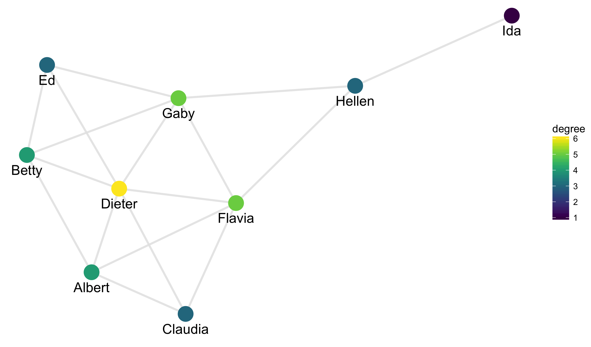
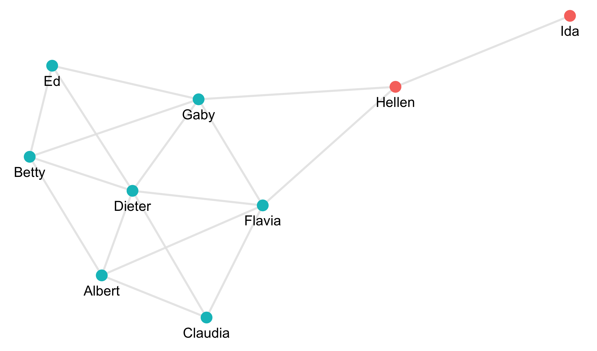
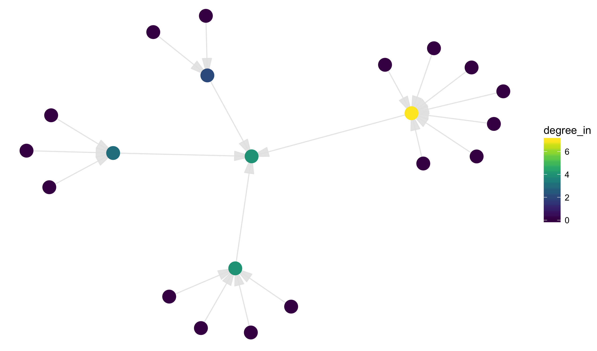
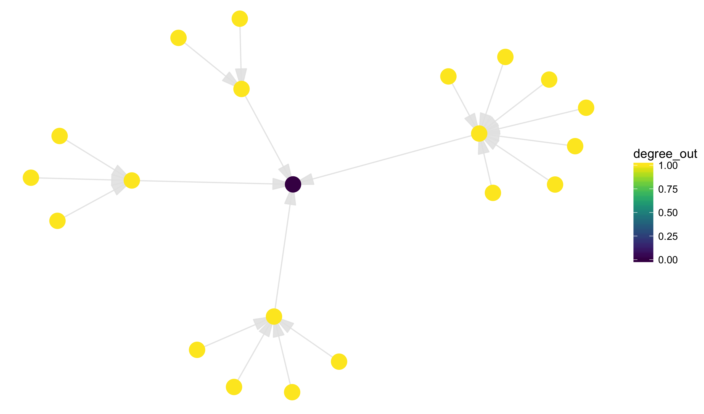


library(readr)
library(dplyr)
library(ggplot2)
library(viridis)


## Networks

Our last topic for this semester will be studying network data. I originally said
it would be spatial data, but I think you'll find this more interesting.

Network data consists of two types of objects:

- nodes, the primary object of study
- edges, connections between nodes

These two things can in theory be any set of objects with links between them.
Some common examples include:

- social networks: nodes are people and edges describe relationships
- family trees: nodes are people and edges describe marriage or child-parent relationships
- citation networks: nodes are papers/articles/books and edges are citations from one work to another
- similarity network: nodes are almost any entity and edges describe objects that are particularly
similar

Today we will see some simple ways of working with network data. Over this and the
next two classes we will see how to construct, manipulate, and visulize various
types of networks.

Note that you may have heard of what I call networks under the term of a *graph*. This
is the common name in the mathematical study. In math nodes are often called verticies.
You'll also hear edges called both links and connections. These all represent the same
structures, though the kinds of questions mathematicians are concerned with are generally
distinct from those of interest in statistics.

## Kite example

Our first network dataset is an artificial network created to illustrate some of the
primary properties. The graph is called a "kite" because of its shape.
We will move to more interesting data soon.

In order to describe a network dataset, we need two tables. The first describes the
edges, with the first column giving an `id` for the first node and the second giving
`id_out` for the second node. This implies that there is an edge between `id` and
`id_out`:


kite_edges



## # A tibble: 17 x 2
##         id  id_out
##      <chr>   <chr>
##  1  Albert   Betty
##  2  Albert Claudia
##  3  Albert  Dieter
##  4  Albert  Flavia
##  5   Betty  Dieter
##  6   Betty      Ed
##  7   Betty    Gaby
##  8 Claudia  Dieter
##  9 Claudia  Flavia
## 10  Dieter      Ed
## 11  Dieter  Flavia
## 12  Dieter    Gaby
## 13      Ed    Gaby
## 14  Flavia    Gaby
## 15  Flavia  Hellen
## 16    Gaby  Hellen
## 17  Hellen     Ida


Edge datasets may also contain additional metadata describing the specific relationship. 
There is also a table describing the nodes. This starts with a column giving the id of
the node, with other columns indicating metadata about the node. Here we have the age
of the person and whether they are a white, green, or black belt (we'll assume the
relationships indicate friendships within a karate class).


kite_nodes



## # A tibble: 9 x 3
##        id   age  belt
##     <chr> <int> <chr>
## 1  Albert    14 green
## 2   Betty    12 black
## 3 Claudia    17 green
## 4  Dieter    16 green
## 5      Ed    17 green
## 6  Flavia    14 black
## 7    Gaby    15 white
## 8  Hellen    14 green
## 9     Ida    18 green


These two tables fully describe the network, but there is not a lot that we can
do directly with them. We need to add learned network data to both the edges and
nodes. To do this, you'll need to re-install the **smodels** package and install the
**igraph** package:


install.packages("igraph")
devtools::install_github("statsmaths/smodels")


Once installed, load the smodels package and pass the edges and nodes to the
function `graph_data`:


library(smodels)
gr <- graph_data(kite_edges, kite_nodes)
names(gr)



## [1] "nodes" "edges"


The output is a list of two tables; we can extract them in order to look at what 
they contain. The nodes now have many additional columns describing features of the
network. We'll cover this in a moment:


nodes <- gr$nodes
nodes



## # A tibble: 9 x 14
##        id   age  belt        x         y degree degree_in degree_out
##     <chr> <int> <chr>    <dbl>     <dbl>  <dbl>     <dbl>      <dbl>
## 1  Albert    14 green 11.35163  7.513051      4         4          4
## 2   Betty    12 black 10.78134  8.700978      4         4          4
## 3 Claudia    17 green 12.18097  7.091058      3         3          3
## 4  Dieter    16 green 11.59502  8.360185      6         6          6
## 5      Ed    17 green 10.95917  9.613346      3         3          3
## 6  Flavia    14 black 12.62564  8.214088      5         5          5
## 7    Gaby    15 white 12.11797  9.276760      5         5          5
## 8  Hellen    14 green 13.67602  9.401838      3         3          3
## 9     Ida    18 green 15.05702 10.112879      1         1          1
## # ... with 6 more variables: eigen <dbl>, close <dbl>, between <dbl>,
## #   cluster <chr>, component <int>, component_size <dbl>


And the edges now have coordinates describing how we could plot the data:


edges <- gr$edges
edges



## # A tibble: 17 x 6
##         id  id_out        x     xend        y      yend
##      <chr>   <chr>    <dbl>    <dbl>    <dbl>     <dbl>
##  1  Albert   Betty 11.35163 10.78134 7.513051  8.700978
##  2  Albert Claudia 11.35163 12.18097 7.513051  7.091058
##  3  Albert  Dieter 11.35163 11.59502 7.513051  8.360185
##  4  Albert  Flavia 11.35163 12.62564 7.513051  8.214088
##  5   Betty  Dieter 10.78134 11.59502 8.700978  8.360185
##  6   Betty      Ed 10.78134 10.95917 8.700978  9.613346
##  7   Betty    Gaby 10.78134 12.11797 8.700978  9.276760
##  8 Claudia  Dieter 12.18097 11.59502 7.091058  8.360185
##  9 Claudia  Flavia 12.18097 12.62564 7.091058  8.214088
## 10  Dieter      Ed 11.59502 10.95917 8.360185  9.613346
## 11  Dieter  Flavia 11.59502 12.62564 8.360185  8.214088
## 12  Dieter    Gaby 11.59502 12.11797 8.360185  9.276760
## 13      Ed    Gaby 10.95917 12.11797 9.613346  9.276760
## 14  Flavia    Gaby 12.62564 12.11797 8.214088  9.276760
## 15  Flavia  Hellen 12.62564 13.67602 8.214088  9.401838
## 16    Gaby  Hellen 12.11797 13.67602 9.276760  9.401838
## 17  Hellen     Ida 13.67602 15.05702 9.401838 10.112879


Two important new variables in the `nodes` dataset are `x` and `y`. These indicate
where the nodes should be plotted. These were determined by a *graph layout* algorithm
called Fruchterman–Reingold. We can see the layout of the nodes here (I'll write the
code in terms of the object `gr` as we will not usually extract the tables directly):


ggplot(gr$nodes, aes(x, y)) +
  geom_point(size = 6) +
  theme_void()


We see that the nodes are spread out over the space in a reasonably nice pattern. I've used the
theme `theme_void` because I have no need for the specific values of `x` and `y`. Now let's use
the edges dataset to add the links between the nodes. I'll also add names directly
below each node and color the nodes based on what karate belt each person has earned.


ggplot(gr$nodes, aes(x, y, label = id)) +
  geom_segment(aes(xend = xend, yend = yend), data = gr$edges,
               color = grey(0.9), alpha = 0.9, size = 2) +
  geom_point(aes(color = belt), size = 7) +
  geom_text(aes(y = y - 0.15), size = 5) +
  theme_void()


Notice that the layout made linked nodes close together and minimizes crossing of edges. The
algorithm actually uses a physics simulation where edges are treated as springs and nodes as
positively charged particles. Hence, the nodes want to spread out but the edge push together
neighboring nodes.

You'll probably find it useful to create interactive graphics. For instance, this creates an
interactive plot with the names created when scrolling over the data.


ggplot(gr$nodes, aes(x, y, label = id)) +
  geom_segment(aes(xend = xend, yend = yend), data = gr$edges,
               color = grey(0.9), alpha = 0.9, size = 2) +
  geom_point(aes(color = belt), size = 7) +
  theme_void()

library(plotly)
ggplotly()


## Centrality

We'll now take a look at some of the other metadata included with the `graph_data` function.
Many of the variables concern the centrality of a particular node. There are a few different
ways of measuring this. 

Eigenvalue centrality constructs a score for each node such that each nodes centrality score
is proportional to the sum of its neighbors scores. In math:

$$ s_{i} = \lambda \cdot \sum_{j \in \text{neighbors of node i}} s_j $$

So the more neighbors a node has the higher it's centrality, though neighbors that are central
themselves contribute more than nodes that are not otherwise very central. We won't go into the
many today, but this can be solved by computing the eigenvalue problem for the adjacency matrix
of the graph. By convention, the maximum eigen centrality score is equal to 1 (otherwise, we could
multiple all scores by a constant but keep the same relationship): 


ggplot(gr$nodes, aes(x, y, label = id)) +
  geom_segment(aes(xend = xend, yend = yend), data = gr$edges,
               color = grey(0.9), alpha = 0.9, size = 1) +
  geom_point(aes(color = eigen), size = 7) +
  geom_text(aes(y = y - 0.15), size = 5) +
  scale_color_viridis() +
  theme_void()


In this measurment, we see that Dieter is the most central node. He is right in the middle of the
cluster of most densely connection points.

Another centrality measurement is called *betweenness*. Consider all shortest paths between all pairs
of nodes in the network. Betweenness measures, for each node, the proportion of these paths that run
through a given node. We can plot this as well:


ggplot(gr$nodes, aes(x, y, label = id)) +
  geom_segment(aes(xend = xend, yend = yend), data = gr$edges,
               color = grey(0.9), alpha = 0.9, size = 1) +
  geom_point(aes(color = between), size = 7) +
  geom_text(aes(y = y - 0.15), size = 5) +
  scale_color_viridis() +
  theme_void()


The score in R is scaled by a factor depending on the number of nodes in the graph (generally, we 
only care about the relative values anyway). Notice now that Hellen is much more central because 
she connects everyone in the graph to Ida.

Another measurement of centrality is called *closeness*. It is defined as the average distance (number
of hops) from each node to a given node of interest.


ggplot(gr$nodes, aes(x, y, label = id)) +
  geom_segment(aes(xend = xend, yend = yend), data = gr$edges,
               color = grey(0.9), alpha = 0.9, size = 1) +
  geom_point(aes(color = close), size = 7) +
  geom_text(aes(y = y - 0.15), size = 5) +
  scale_color_viridis() +
  theme_void()


Here Gaby, Flavia, and Dieter are equally central. Flavia and Gaby have fewer direct links,
but are closer to Ida than Dieter. 

Finally, we can also use degree centrality. This simply measures how many neighbors a graph
has.


ggplot(gr$nodes, aes(x, y, label = id)) +
  geom_segment(aes(xend = xend, yend = yend), data = gr$edges,
               color = grey(0.9), alpha = 0.9, size = 1) +
  geom_point(aes(color = degree), size = 7) +
  geom_text(aes(y = y - 0.15), size = 5) +
  scale_color_viridis() +
  theme_void()


Notice that these measures agree to some extent but do measure slightly different aspects
of centrality. Nodes that have a high betweenness but relatively low eigen centrality are
known as *gatekeepers* (such as Hellen above). These are the influencial people who link
clusters within a graph.

## Clusters

Speaking of clusters, the varible `cluster` gives a clustering of the graph nodes into a
given number of groups. 


ggplot(gr$nodes, aes(x, y, label = id)) +
  geom_segment(aes(xend = xend, yend = yend), data = gr$edges,
               color = grey(0.9), alpha = 0.9, size = 1) +
  geom_point(aes(color = cluster), size = 5, show.legend = FALSE) +
  geom_text(aes(y = y - 0.15), size = 5) +
  theme_void()


Here there is a large primary group (the blue one) and the small subgroup of Hellen and Ida (the red
one).

## Social Network

Let's explore these ideas on a larger social network dataset. This consists of
employees at a small fictional company:


work_nodes <- read_csv("https://statsmaths.github.io/stat_data/work_nodes.csv")



## Parsed with column specification:
## cols(
##   id = col_integer(),
##   age = col_integer(),
##   tenure = col_double(),
##   level = col_integer(),
##   department = col_integer()
## )



work_edges <- read_csv("https://statsmaths.github.io/stat_data/work_edges.csv")



## Parsed with column specification:
## cols(
##   id = col_integer(),
##   id_out = col_integer(),
##   advice = col_integer(),
##   friendship = col_integer(),
##   reports = col_integer()
## )


There are several variables describing the nature of the relationship between co-workers.
We know whether the employees are friends, report to each other, and whether they seek 
each other out for advice.


work_edges



## # A tibble: 441 x 5
##       id id_out advice friendship reports
##    <int>  <int>  <int>      <int>   <int>
##  1     1      1      0          0       0
##  2     1      2      1          1       1
##  3     1      3      0          0       0
##  4     1      4      1          1       0
##  5     1      5      0          0       0
##  6     1      6      0          0       0
##  7     1      7      0          0       0
##  8     1      8      1          1       0
##  9     1      9      0          0       0
## 10     1     10      0          0       0
## # ... with 431 more rows


We can build a graph showing friendship relationships by filtering on friendships:


library(smodels)
gr <- graph_data(filter(work_edges, friendship == 1), work_nodes)


We see that there is not a very strong age-dependency to the friendship graph:


ggplot(gr$nodes, aes(x, y, label = id)) +
  geom_segment(aes(xend = xend, yend = yend), data = gr$edges,
               color = grey(0.9), alpha = 0.9) +
  geom_point(aes(color = age), size = 6) +
  scale_color_viridis() +
  theme_void()


We can also look at the reporting relationships. Here, however, the edges have a direction
to them (one person reports to the other person). We can specify this in the option `directed`
in the function `graph_data`:


library(smodels)
gr <- graph_data(filter(work_edges, reports == 1), work_nodes, directed = TRUE)


We can graph the data with arrows by specifying the `arrow` option in `geom_segment`:


ggplot(gr$nodes, aes(x, y, label = id)) +
  geom_segment(aes(xend = xend, yend = yend), data = gr$edges,
               color = grey(0.9), alpha = 0.9,
               arrow = arrow(type = "closed", angle = 15)) +
  geom_point(aes(color = factor(level)), size = 6) +
  theme_void()


Notice that there is are variables `degree_in` and `degree_out` the look at the difference
between being close to other nodes as inputs or outputs. For example:


ggplot(gr$nodes, aes(x, y, label = id)) +
  geom_segment(aes(xend = xend, yend = yend), data = gr$edges,
               color = grey(0.9), alpha = 0.9,
               arrow = arrow(type = "closed", angle = 15)) +
  geom_point(aes(color = degree_in), size = 6) +
  scale_color_viridis() +
  theme_void()


The out degree is one for everyone other than the head of the company:


ggplot(gr$nodes, aes(x, y, label = id)) +
  geom_segment(aes(xend = xend, yend = yend), data = gr$edges,
               color = grey(0.9), alpha = 0.9,
               arrow = arrow(type = "closed", angle = 15)) +
  geom_point(aes(color = degree_out), size = 6) +
  scale_color_viridis() +
  theme_void()


Generally, I don't worry much about direction in networks and treat all networks as undirected.
Occasionally it can be useful, however, to consider the egges as only occuring in one direction.

## Other Networks

While there are certain types of networks commonly seen and used (such as citations graphs and
forms of social networks), this need not be the only kind of graph that we can construct. Here
is a network of common English nouns and adjectives with words connected that tend to co-occur.


gr <- graph_data(edges, nodes)
ggplot(gr$nodes, aes(x, y, label = id)) +
  geom_segment(aes(xend = xend, yend = yend), data = gr$edges,
               color = grey(0.9), alpha = 0.9) +
  geom_point(aes(color = eigen), size = 3, show.legend = FALSE) +
  scale_color_viridis() + 
  theme_void()


In the second and third network lectures we will see how to create various networks ourselves
from data.

