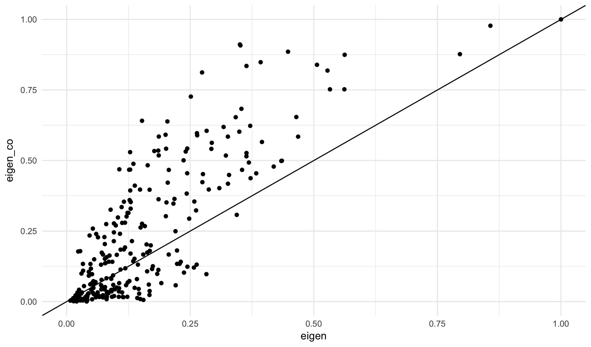
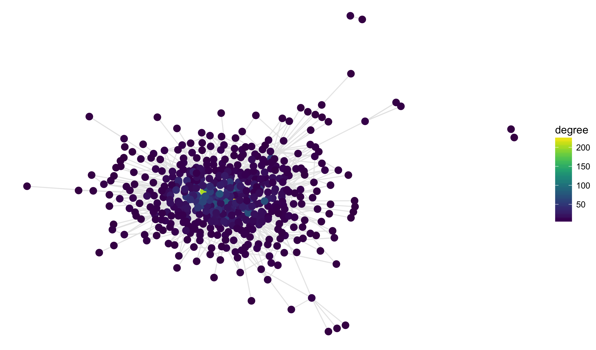


library(readr)
library(dplyr)
library(ggplot2)
library(viridis)
library(stringi)


## 


page <- "/wiki/Richmond,_Virginia"

url <- sprintf("https://en.wikipedia.org%s", page)
wpage <- data_frame(line = readLines(url))



## Warning in file(con, "r"): URL 'https://en.wikipedia.org/wiki/
## Richmond,_Virginia': status was 'Couldn't resolve host name'



## Error in file(con, "r"): cannot open connection



wpage <- filter(wpage, stri_detect(line, fixed = "<p"))



## Error in filter(wpage, stri_detect(line, fixed = "<p")): object 'wpage' not found



links <- stri_extract_all(wpage$line, regex = "\"/wiki/[^[\"#]]+")



## Error in stri_extract_all_regex(str, regex, ...): object 'wpage' not found



links[1:3]



## Error in eval(expr, envir, enclos): object 'links' not found



links <- unlist(links)



## Error in unlist(links): object 'links' not found



links <- stri_sub(links[!is.na(links)], 2, -1)



## Error in stri_sub(links[!is.na(links)], 2, -1): object 'links' not found



links <- unique(links)



## Error in unique(links): object 'links' not found



links <- links[!stri_detect(links, fixed = ":")]



## Error in eval(expr, envir, enclos): object 'links' not found



links



## Error in eval(expr, envir, enclos): object 'links' not found



pages <- links
edges <- matrix(NA_character_, ncol = 2, nrow = 0)
for (i in seq_along(pages)) {
  url <- sprintf("https://en.wikipedia.org%s", pages[i])
  wpage <- data_frame(line = readLines(url))
  wpage <- filter(wpage, stri_detect(line, fixed = "<p"))
  links <- stri_extract_all(wpage$line,
                            regex = "\"/wiki/[^[\"#]]+")
  links <- unlist(links)
  links <- stri_sub(links[!is.na(links)], 2, -1)
  links <- unique(links)
  links <- links[!stri_detect(links, fixed = ":")]

  if (length(links) > 0)
    edges <- rbind(edges, cbind(pages[i], links))

  cat(sprintf("Done with %03d of %03d (%06d rows)\n",
      i, length(pages), nrow(edges)))
}

write_rds(edges, "../assets/data/wiki_link_edges.rds")



mean(edges[,2] %in% edges[,1])



## [1] 0.06038156



el <- edges[edges[,2] %in% edges[,1],]
el[,1] <- stri_sub(el[,1], 7, -1)
el[,2] <- stri_sub(el[,2], 7, -1)
head(el)



##                                  links                             
## [1,] "Commonwealth_(U.S._state)" "United_States"                   
## [2,] "Commonwealth_(U.S._state)" "Pennsylvania"                    
## [3,] "Commonwealth_(U.S._state)" "Virginia"                        
## [4,] "Commonwealth_(U.S._state)" "Virginia_Commonwealth_University"
## [5,] "Commonwealth_(U.S._state)" "Virginia_State_University"       
## [6,] "Commonwealth_(U.S._state)" "Ettrick,_Virginia"



library(smodels)
gr <- graph_data(as_data_frame(el))



ggplot(gr$nodes, aes(x, y, label = id)) +
  geom_segment(aes(xend = xend, yend = yend), data = gr$edges,
               color = grey(0.9), alpha = 0.9) +
  geom_point(aes(color = eigen), size = 3) +
  scale_color_viridis() +
  theme_void()



arrange(gr$nodes, desc(eigen))$id[1:25]



##  [1] "Virginia"                             
##  [2] "American_Civil_War"                   
##  [3] "United_States"                        
##  [4] "Confederate_States_of_America"        
##  [5] "Washington,_D.C."                     
##  [6] "Southern_United_States"               
##  [7] "African_American"                     
##  [8] "Native_Americans_in_the_United_States"
##  [9] "Petersburg,_Virginia"                 
## [10] "Norfolk,_Virginia"                    
## [11] "American_Revolutionary_War"           
## [12] "Williamsburg,_Virginia"               
## [13] "Hampton_Roads"                        
## [14] "Philadelphia"                         
## [15] "Abraham_Lincoln"                      
## [16] "American_Revolution"                  
## [17] "New_Orleans"                          
## [18] "Charlottesville,_Virginia"            
## [19] "Hispanic_and_Latino_Americans"        
## [20] "Ulysses_S._Grant"                     
## [21] "George_B._McClellan"                  
## [22] "United_States_Census_Bureau"          
## [23] "Georgia_(U.S._state)"                 
## [24] "Jefferson_Davis"                      
## [25] "Jamestown,_Virginia"



ggplot(gr$nodes, aes(eigen, between)) +
  geom_point() +
  geom_text(aes(y = between - 400, label = id),
            data = filter(gr$nodes, between > 5000)) +
  theme_minimal()



temp <- gr$nodes %>%
  group_by(cluster) %>%
  mutate(cluster_size = length(cluster)) %>%
  filter(cluster_size > 5) %>%
  arrange(cluster, eigen) %>%
  top_n(wt = eigen, n = 5)
split(temp$id, temp$cluster)



## $`1`
## [1] "George_B._McClellan"           "Ulysses_S._Grant"             
## [3] "Abraham_Lincoln"               "Confederate_States_of_America"
## [5] "American_Civil_War"           
## 
## $`10`
## [1] "Science_Museum_of_Virginia"      "Broad_Street_Station_(Richmond)"
## [3] "Fan_district"                    "Monument_Avenue"                
## [5] "Neoclassical_architecture"      
## 
## $`14`
## [1] "Geographic_coordinate_system"   "Virginia_General_Assembly"     
## [3] "George_Washington"              "President_of_the_United_States"
## [5] "Thomas_Jefferson"              
## 
## $`16`
## [1] "Minor_League_Baseball"            "Richmond_Braves"                 
## [3] "San_Francisco_Giants"             "Richmond_Flying_Squirrels"       
## [5] "The_Diamond_(Richmond,_Virginia)"
## 
## $`17`
## [1] "Bus"                            "Paratransit"                   
## [3] "Tram"                           "Streetcar"                     
## [5] "Main_Street_Station_(Richmond)"
## 
## $`2`
## [1] "Country_music"                   "Korean_War"                     
## [3] "Gulf_War"                        "Federal_Bureau_of_Investigation"
## [5] "Blues"                          
## 
## $`23`
## [1] "Capital_One_Financial_Corporation" "CarMax"                           
## [3] "Owens_%26_Minor"                   "Dominion_Resources"               
## [5] "Fortune_500"                      
## 
## $`27`
## [1] "Microbrewery"     "Daniel_Day-Lewis" "ROA_(artist)"    
## [4] "Hinduism"         "England"         
## 
## $`3`
## [1] "National_Football_League"      "American_Broadcasting_Company"
## [3] "Fox_Broadcasting_Company"      "NBC"                          
## [5] "Southeastern_United_States"   
## 
## $`32`
## [1] "Southside_Speedway"               "Monster_Energy"                  
## [3] "Denny_Hamlin"                     "Monster_Energy_NASCAR_Cup_Series"
## [5] "NASCAR"                          
## 
## $`5`
## [1] "Chesterfield_County,_Virginia" "James_River_(Virginia)"       
## [3] "Jamestown,_Virginia"           "Petersburg,_Virginia"         
## [5] "Virginia"                     
## 
## $`7`
## [1] "Medical_College_of_Virginia"      "VCU"                             
## [3] "Atlantic_10_Conference"           "University_of_Richmond"          
## [5] "Virginia_Commonwealth_University"
## 
## $`9`
## [1] "Native_Americans_in_the_United_States"
## [2] "African_American"                     
## [3] "Southern_United_States"               
## [4] "Washington,_D.C."                     
## [5] "United_States"


## Co-citation


gr_co <- graph_data(filter(co_cite(as_data_frame(el)), count > 2))



ggplot(gr_co$nodes, aes(x, y, label = id)) +
  geom_segment(aes(xend = xend, yend = yend), data = gr_co$edges,
               color = grey(0.9), alpha = 0.9) +
  geom_point(aes(color = eigen), size = 3) +
  scale_color_viridis() +
  theme_void()



arrange(gr_co$nodes, desc(eigen))$id[1:25]



##  [1] "Virginia"                             
##  [2] "American_Civil_War"                   
##  [3] "2010_United_States_Census"            
##  [4] "Amtrak"                               
##  [5] "American_Revolutionary_War"           
##  [6] "United_States"                        
##  [7] "Confederate_States_of_America"        
##  [8] "American_Revolution"                  
##  [9] "Native_Americans_in_the_United_States"
## [10] "United_States_Census_Bureau"          
## [11] "African_American"                     
## [12] "Humid_subtropical_climate"            
## [13] "Washington,_D.C."                     
## [14] "Southern_United_States"               
## [15] "Geographic_coordinate_system"         
## [16] "Jamestown,_Virginia"                  
## [17] "Norfolk,_Virginia"                    
## [18] "James_River_(Virginia)"               
## [19] "National_Register_of_Historic_Places" 
## [20] "Commonwealth_(U.S._state)"            
## [21] "Hispanic_and_Latino_Americans"        
## [22] "Chesapeake_Bay"                       
## [23] "George_Washington"                    
## [24] "Thomas_Jefferson"                     
## [25] "Asian_American"



nodes <- left_join(gr$nodes, gr_co$nodes, by = "id", suffix = c("", "_co"))



ggplot(nodes, aes(eigen, eigen_co)) +
  geom_point() +
  geom_abline(slope = 1, intercept = 0) + 
  theme_minimal() 



## Warning: Removed 260 rows containing missing values (geom_point).



mutate(nodes, diff = abs(eigen - eigen_co)) %>%
  arrange(desc(diff)) %>%
  select(id, eigen, eigen_co) %>%
  print(n = 25)



## # A tibble: 516 x 3
##                                       id     eigen  eigen_co
##                                    <chr>     <dbl>     <dbl>
##  1             2010_United_States_Census 0.3505215 0.9111282
##  2                                Amtrak 0.3515536 0.9077685
##  3             Humid_subtropical_climate 0.2739453 0.8119748
##  4  National_Register_of_Historic_Places 0.1524895 0.6408039
##  5          Geographic_coordinate_system 0.2512314 0.7264585
##  6           United_States_Census_Bureau 0.3637797 0.8349717
##  7                   American_Revolution 0.3924372 0.8482810
##  8            American_Revolutionary_War 0.4478144 0.8854673
##  9             Commonwealth_(U.S._state) 0.2037917 0.6383459
## 10    K%C3%B6ppen_climate_classification 0.1284063 0.5296201
## 11           Race_(United_States_Census) 0.1864423 0.5848264
## 12      Independent_city_(United_States) 0.2000970 0.5911974
## 13           Atlantic_Seaboard_fall_line 0.1065935 0.4687387
## 14              National_Football_League 0.1773334 0.5335557
## 15                       Greyhound_Lines 0.1350569 0.4882485
## 16         American_Broadcasting_Company 0.1853293 0.5351120
## 17           Public_Broadcasting_Service 0.1264675 0.4672426
## 18                                   NBC 0.2012074 0.5418885
## 19                             Fall_line 0.1284453 0.4677509
## 20                        Asian_American 0.2635537 0.5967182
## 21 Native_Americans_in_the_United_States 0.5063734 0.8391105
## 22              Fox_Broadcasting_Company 0.1862610 0.5181195
## 23                   Jamestown,_Virginia 0.3535163 0.6831185
## 24             Virginia_General_Assembly 0.2640497 0.5892099
## 25                     George_Washington 0.2831768 0.6051181
## # ... with 491 more rows


## Text similarity


page <- "/wiki/Statistics"

url <- sprintf("https://en.wikipedia.org%s", page)
wpage <- data_frame(line = readLines(url))



## Warning in file(con, "r"): URL 'https://en.wikipedia.org/wiki/Statistics':
## status was 'Couldn't resolve host name'



## Error in file(con, "r"): cannot open connection



wpage <- filter(wpage, stri_detect(line, fixed = "<p"))



## Error in filter(wpage, stri_detect(line, fixed = "<p")): object 'wpage' not found



links <- stri_extract_all(wpage$line, regex = "\"/wiki/[^[\"#]]+")



## Error in stri_extract_all_regex(str, regex, ...): object 'wpage' not found



links <- unlist(links)



## Error in unlist(links): object 'links' not found



links <- stri_sub(links[!is.na(links)], 2, -1)



## Error in stri_sub(links[!is.na(links)], 2, -1): object 'links' not found



links <- unique(links)



## Error in unique(links): object 'links' not found



links <- links[!stri_detect(links, fixed = ":")]



## Error in eval(expr, envir, enclos): object 'links' not found



pages <- links
df <- data_frame(pages = pages, text = NA_character_)
for (i in seq_along(pages)) {
  url <- sprintf("https://en.wikipedia.org%s", pages[i])
  wpage <- data_frame(line = readLines(url))
  wpage <- filter(wpage, stri_detect(line, fixed = "<p"))
  wpage$line <- stri_replace_all(wpage$line, "", regex = "<[^>]+>")
  df$text[i] <- stri_paste(wpage$line, collapse = "")

  cat(sprintf("Done with %03d of %03d\n", i, length(pages)))
}



library(tokenizers)
token_list <- tokenize_words(df$text)
token_df <- term_list_to_df(token_list)
X <- term_df_to_matrix(token_df)



## Error in validObject(.Object): invalid class "dgTMatrix" object: Not a valid 'Mnumeric' class object



d <- as.matrix(dist(X))



## Error in as.matrix(x): object 'X' not found



d <- data_frame(dist = as.numeric(d),
                row = as.integer(row(d)),
                col = as.integer(col(d)))



## Error in overscope_eval_next(overscope, expr): object 'd' not found



el <- filter(d, row != col)



## Error in filter(d, row != col): object 'd' not found



el <- filter(el, dist < 45)



## Error in UseMethod("filter_"): no applicable method for 'filter_' applied to an object of class "c('matrix', 'character')"



el <- data_frame(id = df$pages[el$row], id_out = df$pages[el$col])



## Error in el$row: $ operator is invalid for atomic vectors



el$id <- stri_sub(el$id, 7, -1)



## Error in el$id: $ operator is invalid for atomic vectors



el$id_out <- stri_sub(el$id_out, 7, -1)



## Error in el$id_out: $ operator is invalid for atomic vectors



gr <- graph_data(el)



## Error in cbind_all(x): Argument 1 must have names



ggplot(gr$nodes, aes(x, y, label = id)) +
  geom_segment(aes(xend = xend, yend = yend), data = gr$edges,
               color = grey(0.9), alpha = 0.9) +
  geom_point(aes(color = degree), size = 3) +
  scale_color_viridis() +
  theme_void()



el <- filter(d, row != col)



## Error in filter(d, row != col): object 'd' not found



el <- filter(group_by(el, row), dist <= sort(dist)[3])



## Error in UseMethod("group_by_"): no applicable method for 'group_by_' applied to an object of class "c('matrix', 'character')"



el <- data_frame(id = df$pages[el$row], id_out = df$pages[el$col])



## Error in el$row: $ operator is invalid for atomic vectors



el$id <- stri_sub(el$id, 7, -1)



## Error in el$id: $ operator is invalid for atomic vectors



el$id_out <- stri_sub(el$id_out, 7, -1)



## Error in el$id_out: $ operator is invalid for atomic vectors



gr <- graph_data(el)



## Error in cbind_all(x): Argument 1 must have names



ggplot(gr$nodes, aes(x, y, label = id)) +
  geom_segment(aes(xend = xend, yend = yend), data = gr$edges,
               color = grey(0.9), alpha = 0.9) +
  geom_point(aes(color = eigen), size = 3) +
  scale_color_viridis() +
  theme_void()



temp <- gr$nodes %>%
  group_by(cluster) %>%
  mutate(cluster_size = length(cluster)) %>%
  filter(cluster_size > 5) %>%
  arrange(cluster, eigen) %>%
  top_n(wt = eigen, n = 5)
split(temp$id, temp$cluster)



## $`1`
## [1] "George_B._McClellan"           "Ulysses_S._Grant"             
## [3] "Abraham_Lincoln"               "Confederate_States_of_America"
## [5] "American_Civil_War"           
## 
## $`10`
## [1] "Science_Museum_of_Virginia"      "Broad_Street_Station_(Richmond)"
## [3] "Fan_district"                    "Monument_Avenue"                
## [5] "Neoclassical_architecture"      
## 
## $`14`
## [1] "Geographic_coordinate_system"   "Virginia_General_Assembly"     
## [3] "George_Washington"              "President_of_the_United_States"
## [5] "Thomas_Jefferson"              
## 
## $`16`
## [1] "Minor_League_Baseball"            "Richmond_Braves"                 
## [3] "San_Francisco_Giants"             "Richmond_Flying_Squirrels"       
## [5] "The_Diamond_(Richmond,_Virginia)"
## 
## $`17`
## [1] "Bus"                            "Paratransit"                   
## [3] "Tram"                           "Streetcar"                     
## [5] "Main_Street_Station_(Richmond)"
## 
## $`2`
## [1] "Country_music"                   "Korean_War"                     
## [3] "Gulf_War"                        "Federal_Bureau_of_Investigation"
## [5] "Blues"                          
## 
## $`23`
## [1] "Capital_One_Financial_Corporation" "CarMax"                           
## [3] "Owens_%26_Minor"                   "Dominion_Resources"               
## [5] "Fortune_500"                      
## 
## $`27`
## [1] "Microbrewery"     "Daniel_Day-Lewis" "ROA_(artist)"    
## [4] "Hinduism"         "England"         
## 
## $`3`
## [1] "National_Football_League"      "American_Broadcasting_Company"
## [3] "Fox_Broadcasting_Company"      "NBC"                          
## [5] "Southeastern_United_States"   
## 
## $`32`
## [1] "Southside_Speedway"               "Monster_Energy"                  
## [3] "Denny_Hamlin"                     "Monster_Energy_NASCAR_Cup_Series"
## [5] "NASCAR"                          
## 
## $`5`
## [1] "Chesterfield_County,_Virginia" "James_River_(Virginia)"       
## [3] "Jamestown,_Virginia"           "Petersburg,_Virginia"         
## [5] "Virginia"                     
## 
## $`7`
## [1] "Medical_College_of_Virginia"      "VCU"                             
## [3] "Atlantic_10_Conference"           "University_of_Richmond"          
## [5] "Virginia_Commonwealth_University"
## 
## $`9`
## [1] "Native_Americans_in_the_United_States"
## [2] "African_American"                     
## [3] "Southern_United_States"               
## [4] "Washington,_D.C."                     
## [5] "United_States"


