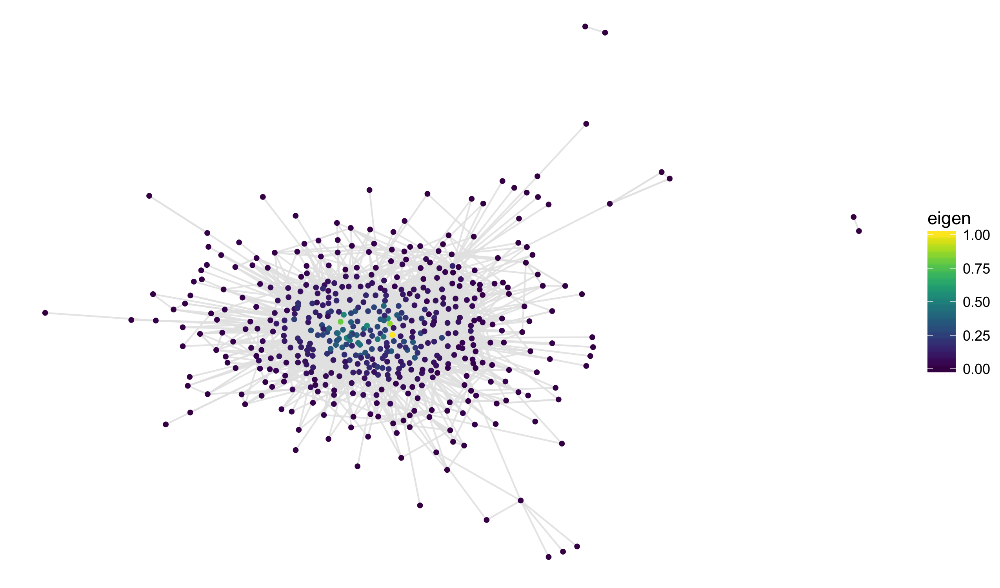
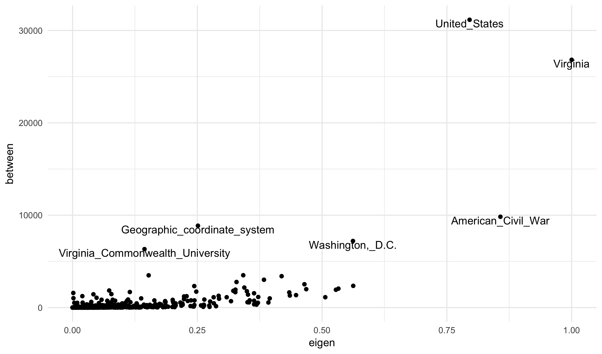
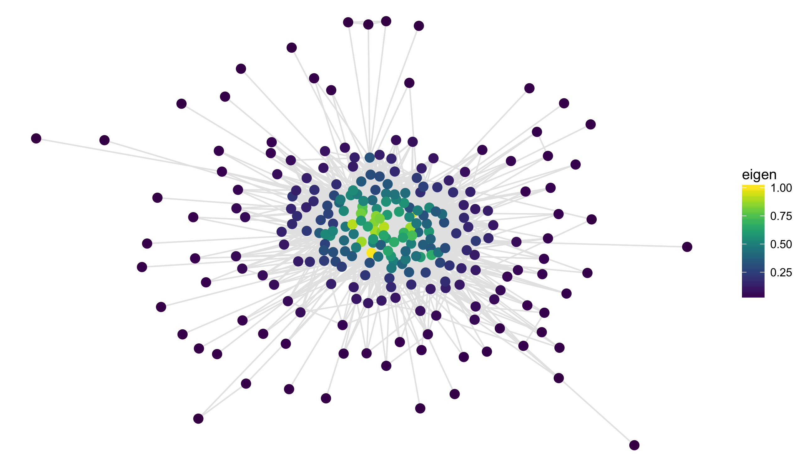
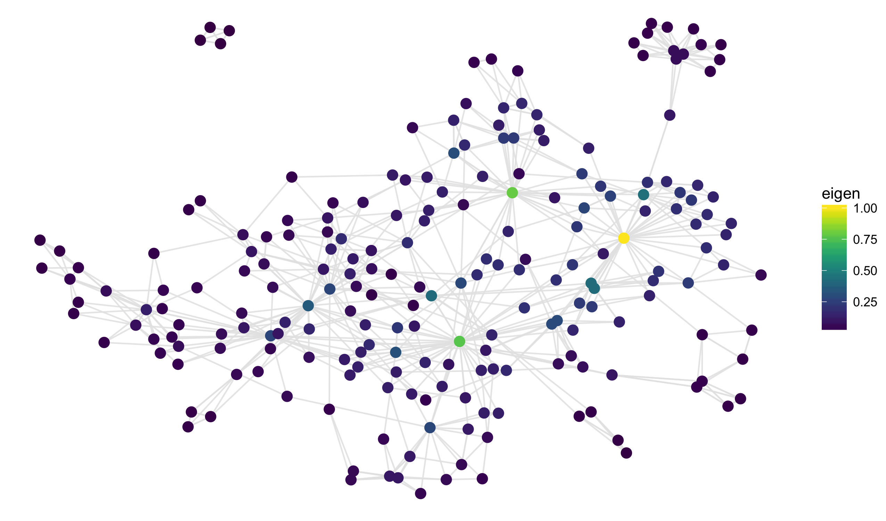


library(readr)
library(dplyr)
library(ggplot2)
library(viridis)
library(stringi)
library(Matrix)
library(methods)


## Citation Networks

Today we are going to build several types of graphs describing the relationship between Wikipedia
pages. This builds nicely on the text analysis work that you have from project II (the code should
actually be more straightforward as you'll generally be able to take mine with only minor changes).

Let's start with building a citation graph. That is, our nodes will be Wikipedia pages and two pages
will share an edge if there is a link between their pages. To start, I'll select the Richmond, Virginia
page. We'll print out the links from the first three paragraphs:


page <- "/wiki/Richmond,_Virginia"

url <- sprintf("https://en.wikipedia.org%s", page)
wpage <- data_frame(line = readLines(url))
wpage <- filter(wpage, stri_detect(line, fixed = "<p"))
links <- stri_extract_all(wpage$line, regex = "\"/wiki/[^[\"#]]+")
links[1:3]



## [[1]]
## [1] "\"/wiki/Help:IPA/English"                 
## [2] "\"/wiki/Help:Pronunciation_respelling_key"
## [3] "\"/wiki/Commonwealth_(U.S._state)"        
## [4] "\"/wiki/Virginia"                         
## [5] "\"/wiki/Metropolitan_Statistical_Area"    
## [6] "\"/wiki/Greater_Richmond_Region"          
## [7] "\"/wiki/Independent_city_(United_States)" 
## 
## [[2]]
## [1] "\"/wiki/2010_United_States_Census" 
## [2] "\"/wiki/List_of_cities_in_Virginia"
## [3] "\"/wiki/Richmond-Petersburg"       
## [4] "\"/wiki/Virginia_statistical_areas"
## 
## [[3]]
##  [1] "\"/wiki/Fall_line"                    
##  [2] "\"/wiki/James_River"                  
##  [3] "\"/wiki/Williamsburg,_Virginia"       
##  [4] "\"/wiki/Charlottesville,_Virginia"    
##  [5] "\"/wiki/Washington,_D.C."             
##  [6] "\"/wiki/Henrico_County,_Virginia"     
##  [7] "\"/wiki/Chesterfield_County,_Virginia"
##  [8] "\"/wiki/Interstate_95_in_Virginia"    
##  [9] "\"/wiki/Interstate_64_in_Virginia"    
## [10] "\"/wiki/Interstate_295_(Virginia)"    
## [11] "\"/wiki/Virginia_State_Route_288"     
## [12] "\"/wiki/Midlothian,_Virginia"         
## [13] "\"/wiki/Glen_Allen,_Virginia"         
## [14] "\"/wiki/Short_Pump,_Virginia"         
## [15] "\"/wiki/Mechanicsville,_Virginia"


Notice that we do not want links that contain a colon (":") as these are special Wikipedia pages.
Filtering these out and taking the unique links gives a fairly large set of pages:


links <- unlist(links)
links <- stri_sub(links[!is.na(links)], 2, -1)
links <- unique(links)
links <- links[!stri_detect(links, fixed = ":")]
links



##   [1] "/wiki/Commonwealth_(U.S._state)"                                                    
##   [2] "/wiki/Virginia"                                                                     
##   [3] "/wiki/Metropolitan_Statistical_Area"                                                
##   [4] "/wiki/Greater_Richmond_Region"                                                      
##   [5] "/wiki/Independent_city_(United_States)"                                             
##   [6] "/wiki/2010_United_States_Census"                                                    
##   [7] "/wiki/List_of_cities_in_Virginia"                                                   
##   [8] "/wiki/Richmond-Petersburg"                                                          
##   [9] "/wiki/Virginia_statistical_areas"                                                   
##  [10] "/wiki/Fall_line"                                                                    
##  [11] "/wiki/James_River"                                                                  
##  [12] "/wiki/Williamsburg,_Virginia"                                                       
##  [13] "/wiki/Charlottesville,_Virginia"                                                    
##  [14] "/wiki/Washington,_D.C."                                                             
##  [15] "/wiki/Henrico_County,_Virginia"                                                     
##  [16] "/wiki/Chesterfield_County,_Virginia"                                                
##  [17] "/wiki/Interstate_95_in_Virginia"                                                    
##  [18] "/wiki/Interstate_64_in_Virginia"                                                    
##  [19] "/wiki/Interstate_295_(Virginia)"                                                    
##  [20] "/wiki/Virginia_State_Route_288"                                                     
##  [21] "/wiki/Midlothian,_Virginia"                                                         
##  [22] "/wiki/Glen_Allen,_Virginia"                                                         
##  [23] "/wiki/Short_Pump,_Virginia"                                                         
##  [24] "/wiki/Mechanicsville,_Virginia"                                                     
##  [25] "/wiki/Powhatan_Confederacy"                                                         
##  [26] "/wiki/Jamestown,_Virginia"                                                          
##  [27] "/wiki/Colony_and_Dominion_of_Virginia"                                              
##  [28] "/wiki/American_Revolution"                                                          
##  [29] "/wiki/Patrick_Henry"                                                                
##  [30] "/wiki/Give_me_liberty_or_give_me_death"                                             
##  [31] "/wiki/St._John%27s_Episcopal_Church_(Richmond,_Virginia)"                           
##  [32] "/wiki/Virginia_Statute_for_Religious_Freedom"                                       
##  [33] "/wiki/Thomas_Jefferson"                                                             
##  [34] "/wiki/American_Civil_War"                                                           
##  [35] "/wiki/Confederate_States_of_America"                                                
##  [36] "/wiki/Streetcar"                                                                    
##  [37] "/wiki/Jackson_Ward"                                                                 
##  [38] "/wiki/United_States_Court_of_Appeals_for_the_Fourth_Circuit"                        
##  [39] "/wiki/United_States_courts_of_appeals"                                              
##  [40] "/wiki/Federal_Reserve_Bank_of_Richmond"                                             
##  [41] "/wiki/Federal_Reserve_System"                                                       
##  [42] "/wiki/Dominion_Resources"                                                           
##  [43] "/wiki/WestRock"                                                                     
##  [44] "/wiki/Fortune_500"                                                                  
##  [45] "/wiki/Christopher_Newport"                                                          
##  [46] "/wiki/James_River_(Virginia)"                                                       
##  [47] "/wiki/Powhatan"                                                                     
##  [48] "/wiki/William_Byrd_II"                                                              
##  [49] "/wiki/William_Mayo_(civil_engineer)"                                                
##  [50] "/wiki/Richmond,_London"                                                             
##  [51] "/wiki/River_Thames"                                                                 
##  [52] "/wiki/Richmond_Hill,_London"                                                        
##  [53] "/wiki/Give_me_Liberty_or_Give_me_Death"                                             
##  [54] "/wiki/Saint_John%27s_Church,_Richmond,_Virginia"                                    
##  [55] "/wiki/First_Continental_Congress"                                                   
##  [56] "/wiki/Benedict_Arnold"                                                              
##  [57] "/wiki/Sampson_Mathews"                                                              
##  [58] "/wiki/Freedom_of_religion"                                                          
##  [59] "/wiki/Greek_Revival_architecture"                                                   
##  [60] "/wiki/Virginia_State_Capitol"                                                       
##  [61] "/wiki/Charles-Louis_Cl%C3%A9risseau"                                                
##  [62] "/wiki/American_Revolutionary_War"                                                   
##  [63] "/wiki/James_River_bateau"                                                           
##  [64] "/wiki/George_Washington"                                                            
##  [65] "/wiki/James_River_and_Kanawha_Canal"                                                
##  [66] "/wiki/Westham,_Virginia"                                                            
##  [67] "/wiki/Appalachian_Mountains"                                                        
##  [68] "/wiki/Kanawha_River"                                                                
##  [69] "/wiki/Ohio_River"                                                                   
##  [70] "/wiki/Mississippi_River"                                                            
##  [71] "/wiki/Hydropower"                                                                   
##  [72] "/wiki/Southeastern_United_States"                                                   
##  [73] "/wiki/Henry_Box_Brown"                                                              
##  [74] "/wiki/Baltimore"                                                                    
##  [75] "/wiki/President_Street_Station"                                                     
##  [76] "/wiki/Philadelphia,_Wilmington_and_Baltimore_Railroad"                              
##  [77] "/wiki/Underground_Railroad"                                                         
##  [78] "/wiki/Philadelphia"                                                                 
##  [79] "/wiki/Pennsylvania"                                                                 
##  [80] "/wiki/Richmond_and_Petersburg_Railroad"                                             
##  [81] "/wiki/Port_Walthall"                                                                
##  [82] "/wiki/Baltimore,_Maryland"                                                          
##  [83] "/wiki/Philadelphia,_Pennsylvania"                                                   
##  [84] "/wiki/Norfolk,_Virginia"                                                            
##  [85] "/wiki/Hampton_Roads"                                                                
##  [86] "/wiki/Fort_Sumter"                                                                  
##  [87] "/wiki/United_States"                                                                
##  [88] "/wiki/Montgomery,_Alabama"                                                          
##  [89] "/wiki/Army_of_Northern_Virginia"                                                    
##  [90] "/wiki/Tredegar_Iron_Works"                                                          
##  [91] "/wiki/CSS_Virginia"                                                                 
##  [92] "/wiki/USS_Merrimac"                                                                 
##  [93] "/wiki/Ironclad"                                                                     
##  [94] "/wiki/Ordnance_ammunition"                                                          
##  [95] "/wiki/Confederate_Congress"                                                         
##  [96] "/wiki/Virginia_General_Assembly"                                                    
##  [97] "/wiki/Museum_of_the_Confederacy"                                                    
##  [98] "/wiki/Seven_Days_Battles"                                                           
##  [99] "/wiki/George_B._McClellan"                                                          
## [100] "/wiki/Peninsula_campaign"                                                           
## [101] "/wiki/Petersburg,_Virginia"                                                         
## [102] "/wiki/John_B._Gordon"                                                               
## [103] "/wiki/Battle_of_Fort_Stedman"                                                       
## [104] "/wiki/Philip_Sheridan"                                                              
## [105] "/wiki/George_Pickett"                                                               
## [106] "/wiki/Battle_of_Five_Forks"                                                         
## [107] "/wiki/Ulysses_S._Grant"                                                             
## [108] "/wiki/Jefferson_Davis"                                                              
## [109] "/wiki/Godfrey_Weitzel"                                                              
## [110] "/wiki/United_States_Colored_Troops"                                                 
## [111] "/wiki/Mayor_of_Richmond"                                                            
## [112] "/wiki/Abraham_Lincoln"                                                              
## [113] "/wiki/Danville,_Virginia"                                                           
## [114] "/wiki/John_Archibald_Campbell"                                                      
## [115] "/wiki/Emancipation_Proclamation"                                                    
## [116] "/wiki/Battle_of_Sayler%27s_Creek"                                                   
## [117] "/wiki/Appomattox_Court_House,_Virginia"                                             
## [118] "/wiki/Irwinville,_Georgia"                                                          
## [119] "/wiki/Fort_Monroe"                                                                  
## [120] "/wiki/United_States_Civil_War"                                                      
## [121] "/wiki/James_Albert_Bonsack"                                                         
## [122] "/wiki/Roanoke,_Virginia"                                                            
## [123] "/wiki/Tram"                                                                         
## [124] "/wiki/Richmond_Union_Passenger_Railway"                                             
## [125] "/wiki/Frank_J._Sprague"                                                             
## [126] "/wiki/Southern_United_States"                                                       
## [127] "/wiki/Maggie_L._Walker"                                                             
## [128] "/wiki/John_Mitchell,_Jr."                                                           
## [129] "/wiki/Manchester,_Virginia"                                                         
## [130] "/wiki/WRVA_(AM)"                                                                    
## [131] "/wiki/WTVR-TV"                                                                      
## [132] "/wiki/Virginia_Commonwealth_University"                                             
## [133] "/wiki/Medical_College_of_Virginia"                                                  
## [134] "/wiki/Richmond_Professional_Institute"                                              
## [135] "/wiki/Arthur_Ashe"                                                                  
## [136] "/wiki/Monument_Avenue"                                                              
## [137] "/wiki/United_States_Census_Bureau"                                                  
## [138] "/wiki/Piedmont_region_of_Virginia"                                                  
## [139] "/wiki/Tidewater_region_of_Virginia"                                                 
## [140] "/wiki/Blue_Ridge_Mountains"                                                         
## [141] "/wiki/Appomattox_River"                                                             
## [142] "/wiki/Chickahominy_River"                                                           
## [143] "/wiki/United_States_metropolitan_area"                                              
## [144] "/wiki/List_of_United_States_metropolitan_statistical_areas_by_population"           
## [145] "/wiki/Colonial_Heights,_Virginia"                                                   
## [146] "/wiki/Hopewell,_Virginia"                                                           
## [147] "/wiki/Charles_City_County,_Virginia"                                                
## [148] "/wiki/Dinwiddie_County,_Virginia"                                                   
## [149] "/wiki/Goochland_County,_Virginia"                                                   
## [150] "/wiki/Hanover_County,_Virginia"                                                     
## [151] "/wiki/New_Kent_County,_Virginia"                                                    
## [152] "/wiki/Powhatan_County,_Virginia"                                                    
## [153] "/wiki/Prince_George_County,_Virginia"                                               
## [154] "/wiki/Downtown_Richmond"                                                            
## [155] "/wiki/Shockoe_Bottom"                                                               
## [156] "/wiki/Church_Hill"                                                                  
## [157] "/wiki/Jefferson_Hotel_(Richmond,_Virginia)"                                         
## [158] "/wiki/St._John%27s_Episcopal_Church,_Richmond,_Virginia"                            
## [159] "/wiki/Fulton_Hill"                                                                  
## [160] "/wiki/Mosby_Court"                                                                  
## [161] "/wiki/Interstate_64"                                                                
## [162] "/wiki/Interstate_195_(Virginia)"                                                    
## [163] "/wiki/Boulevard_(Richmond,_Virginia)"                                               
## [164] "/wiki/Fan_district"                                                                 
## [165] "/wiki/Victorian_architecture"                                                       
## [166] "/wiki/Virginia_Historical_Society"                                                  
## [167] "/wiki/Virginia_Museum_of_Fine_Arts"                                                 
## [168] "/wiki/Downtown_Expressway"                                                          
## [169] "/wiki/Byrd_Park"                                                                    
## [170] "/wiki/Maymont"                                                                      
## [171] "/wiki/Hollywood_Cemetery_(Richmond,_Virginia)"                                      
## [172] "/wiki/Oregon_Hill"                                                                  
## [173] "/wiki/Carytown,_Richmond,_Virginia"                                                 
## [174] "/wiki/Chestnut_Hill-Plateau_Historic_District_(Richmond,_VA)"                       
## [175] "/wiki/The_West_End_(Richmond,_Virginia)"                                            
## [176] "/wiki/University_of_Richmond"                                                       
## [177] "/wiki/Humid_subtropical_climate"                                                    
## [178] "/wiki/K%C3%B6ppen_climate_classification"                                           
## [179] "/wiki/Chesapeake_Bay"                                                               
## [180] "/wiki/Hardiness_zone"                                                               
## [181] "/wiki/Precipitation_(meteorology)"                                                  
## [182] "/wiki/Hurricanes"                                                                   
## [183] "/wiki/Tropical_storms"                                                              
## [184] "/wiki/Hurricane_Connie"                                                             
## [185] "/wiki/Hurricane_Diane"                                                              
## [186] "/wiki/Hurricane_Gaston"                                                             
## [187] "/wiki/Freezing_rain"                                                                
## [188] "/wiki/Tornadoes"                                                                    
## [189] "/wiki/African_American"                                                             
## [190] "/wiki/White_American"                                                               
## [191] "/wiki/Asian_American"                                                               
## [192] "/wiki/Native_Americans_in_the_United_States"                                        
## [193] "/wiki/Pacific_Islands_American"                                                     
## [194] "/wiki/Multiracial_American"                                                         
## [195] "/wiki/Hispanic_and_Latino_Americans"                                                
## [196] "/wiki/White_(U.S._Census)"                                                          
## [197] "/wiki/African_American_(U.S._Census)"                                               
## [198] "/wiki/Native_American_(U.S._Census)"                                                
## [199] "/wiki/Asian_(U.S._Census)"                                                          
## [200] "/wiki/Pacific_Islander_(U.S._Census)"                                               
## [201] "/wiki/Race_(United_States_Census)"                                                  
## [202] "/wiki/Hispanic_(U.S._Census)"                                                       
## [203] "/wiki/Latino_(U.S._Census)"                                                         
## [204] "/wiki/Murder_rate"                                                                  
## [205] "/wiki/Homicides"                                                                    
## [206] "/wiki/Morgan_Quitno_Press"                                                          
## [207] "/wiki/Metropolitan_area"                                                            
## [208] "/wiki/Federal_Bureau_of_Investigation"                                              
## [209] "/wiki/Uniform_Crime_Reports"                                                        
## [210] "/wiki/First_Freedom_Center"                                                         
## [211] "/wiki/Monumental_Church"                                                            
## [212] "/wiki/St._Paul%27s_Episcopal_Church_of_Richmond,_Virginia"                          
## [213] "/wiki/First_Baptist_Church_(Richmond,_Virginia)"                                    
## [214] "/wiki/Reformed_church"                                                              
## [215] "/wiki/Second_Presbyterian_Church_(Richmond,_Virginia)"                              
## [216] "/wiki/Stonewall_Jackson"                                                            
## [217] "/wiki/Gothic_architecture"                                                          
## [218] "/wiki/Gas_lighting"                                                                 
## [219] "/wiki/St._Peter%27s_Church_(Richmond,_Virginia)"                                    
## [220] "/wiki/Cathedral_of_the_Sacred_Heart_in_Richmond"                                    
## [221] "/wiki/Mother_church"                                                                
## [222] "/wiki/Roman_Catholic_Diocese_of_Richmond"                                           
## [223] "/wiki/Oldest_synagogues_in_the_United_States"                                       
## [224] "/wiki/Congregation_Beth_Ahabah"                                                     
## [225] "/wiki/Yeshivah"                                                                     
## [226] "/wiki/Richmond_Jewish_Foundation"                                                   
## [227] "/wiki/Immigrants"                                                                   
## [228] "/wiki/St._John%27s_United_Church_of_Christ,_Richmond,_Virginia"                     
## [229] "/wiki/Masjid"                                                                       
## [230] "/wiki/Hinduism"                                                                     
## [231] "/wiki/LEED_certified"                                                               
## [232] "/wiki/Seminary"                                                                     
## [233] "/wiki/Virginia_Union_University"                                                    
## [234] "/wiki/Union_Theological_Seminary_%26_Presbyterian_School_of_Christian_Education"    
## [235] "/wiki/Baptist_Theological_Seminary_at_Richmond"                                     
## [236] "/wiki/United_House_of_Prayer_For_All_People"                                        
## [237] "/wiki/Church_Hill,_Richmond,_Virginia"                                              
## [238] "/wiki/Pope_Pius_VII"                                                                
## [239] "/wiki/Francis_Xavier_DiLorenzo"                                                     
## [240] "/wiki/Pope_John_Paul_II"                                                            
## [241] "/wiki/Atlantic_Seaboard_fall_line"                                                  
## [242] "/wiki/Tidewater_region"                                                             
## [243] "/wiki/Genworth_Financial"                                                           
## [244] "/wiki/CapitalOne"                                                                   
## [245] "/wiki/Philip_Morris_USA"                                                            
## [246] "/wiki/Hunton_%26_Williams"                                                          
## [247] "/wiki/McGuireWoods"                                                                 
## [248] "/wiki/Williams_Mullen"                                                              
## [249] "/wiki/Troutman_Sanders"                                                             
## [250] "/wiki/VCU"                                                                          
## [251] "/wiki/United_Network_for_Organ_Sharing"                                             
## [252] "/wiki/Organ_transplant"                                                             
## [253] "/wiki/Richmond_CenterStage"                                                         
## [254] "/wiki/Departures_(magazine)"                                                        
## [255] "/wiki/Microbrewery"                                                                 
## [256] "/wiki/Liquor"                                                                       
## [257] "/wiki/Distillation"                                                                 
## [258] "/wiki/Lincoln_(2012_film)"                                                          
## [259] "/wiki/Daniel_Day-Lewis"                                                             
## [260] "/wiki/Killing_Kennedy_(film)"                                                       
## [261] "/wiki/Rob_Lowe"                                                                     
## [262] "/wiki/National_Geographic_Channel"                                                  
## [263] "/wiki/Jamie_Bell"                                                                   
## [264] "/wiki/AMC_(TV_channel)"                                                             
## [265] "/wiki/PBS"                                                                          
## [266] "/wiki/MarketWatch"                                                                  
## [267] "/wiki/CarMax"                                                                       
## [268] "/wiki/Owens_%26_Minor"                                                              
## [269] "/wiki/MeadWestvaco"                                                                 
## [270] "/wiki/Markel_Corporation"                                                           
## [271] "/wiki/Altria_Group"                                                                 
## [272] "/wiki/Stamford,_Connecticut"                                                        
## [273] "/wiki/Aditya_Birla_Minacs"                                                          
## [274] "/wiki/Amazon.com"                                                                   
## [275] "/wiki/Honeywell_International"                                                      
## [276] "/wiki/SunTrust_Banks"                                                               
## [277] "/wiki/Atlanta"                                                                      
## [278] "/wiki/Capital_One_Financial_Corporation"                                            
## [279] "/wiki/McLean,_Virginia"                                                             
## [280] "/wiki/McKesson_Corporation"                                                         
## [281] "/wiki/DuPont"                                                                       
## [282] "/wiki/UPS_Freight"                                                                  
## [283] "/wiki/United_Parcel_Service"                                                        
## [284] "/wiki/Overnite_Transportation"                                                      
## [285] "/wiki/NewMarket_Corporation"                                                        
## [286] "/wiki/Brink%27s"                                                                    
## [287] "/wiki/Estes_Express_Lines"                                                          
## [288] "/wiki/Universal_Corporation"                                                        
## [289] "/wiki/Cavalier_Telephone_and_TV"                                                    
## [290] "/wiki/Cherry_Bekaert_%26_Holland"                                                   
## [291] "/wiki/Media_General"                                                                
## [292] "/wiki/Science_Museum_of_Virginia"                                                   
## [293] "/wiki/Neoclassicism"                                                                
## [294] "/wiki/Children%27s_Museum_of_Richmond"                                              
## [295] "/wiki/Virginia_Center_for_Architecture"                                             
## [296] "/wiki/Library_of_Virginia"                                                          
## [297] "/wiki/Valentine_Richmond_History_Center"                                            
## [298] "/wiki/Virginia_Holocaust_Museum"                                                    
## [299] "/wiki/Old_Dominion_Railway_Museum"                                                  
## [300] "/wiki/Richmond_National_Battlefield_Park"                                           
## [301] "/wiki/American_Civil_War_Center_at_Historic_Tredegar"                               
## [302] "/wiki/Court_End"                                                                    
## [303] "/wiki/Liverpool"                                                                    
## [304] "/wiki/Benin"                                                                        
## [305] "/wiki/Triangle_Trade"                                                               
## [306] "/wiki/Edgar_Allan_Poe_Museum_(Richmond)"                                            
## [307] "/wiki/John_Marshall"                                                                
## [308] "/wiki/Chief_Justice_of_the_United_States"                                           
## [309] "/wiki/President_of_the_United_States"                                               
## [310] "/wiki/A.P._Hill"                                                                    
## [311] "/wiki/Bill_Robinson"                                                                
## [312] "/wiki/Christopher_Columbus"                                                         
## [313] "/wiki/World_War_I_Memorial_Carillon"                                                
## [314] "/wiki/Carillon"                                                                     
## [315] "/wiki/Virginia_War_Memorial"                                                        
## [316] "/wiki/Korean_War"                                                                   
## [317] "/wiki/Vietnam_War"                                                                  
## [318] "/wiki/Gulf_War"                                                                     
## [319] "/wiki/War_in_Afghanistan_(2001%E2%80%93present)"                                    
## [320] "/wiki/Iraq_War"                                                                     
## [321] "/wiki/Agecroft_Hall"                                                                
## [322] "/wiki/Tudor_period"                                                                 
## [323] "/wiki/Manor_house"                                                                  
## [324] "/wiki/Windsor_Farms"                                                                
## [325] "/wiki/Pendlebury"                                                                   
## [326] "/wiki/Historic_counties_of_England"                                                 
## [327] "/wiki/Lancashire"                                                                   
## [328] "/wiki/England"                                                                      
## [329] "/wiki/DIY"                                                                          
## [330] "/wiki/Street_performance"                                                           
## [331] "/wiki/CentreStage"                                                                  
## [332] "/wiki/Blues"                                                                        
## [333] "/wiki/Country_music"                                                                
## [334] "/wiki/Bluegrass_music"                                                              
## [335] "/wiki/GWAR"                                                                         
## [336] "/wiki/Street_artists"                                                               
## [337] "/wiki/Art_Whino"                                                                    
## [338] "/wiki/RVA_Magazine"                                                                 
## [339] "/wiki/ROA_(artist)"                                                                 
## [340] "/wiki/Gaia_(artist)"                                                                
## [341] "/wiki/Jeff_Soto"                                                                    
## [342] "/wiki/Mark_Jenkins_(artist)"                                                        
## [343] "/wiki/Ron_English_(artist)"                                                         
## [344] "/wiki/Lewis_Hallam"                                                                 
## [345] "/wiki/Gallery_5"                                                                    
## [346] "/wiki/Visual_Arts_Center_of_Richmond"                                               
## [347] "/wiki/1708_Gallery"                                                                 
## [348] "/wiki/Artspace"                                                                     
## [349] "/wiki/Edgar_Allan_Poe"                                                              
## [350] "/wiki/The_Southern_Literary_Messenger"                                              
## [351] "/wiki/Ellen_Glasgow"                                                                
## [352] "/wiki/James_Branch_Cabell"                                                          
## [353] "/wiki/Meg_Medina"                                                                   
## [354] "/wiki/Dean_King"                                                                    
## [355] "/wiki/David_L._Robbins_(Virginia_writer)"                                           
## [356] "/wiki/Paule_Marshall"                                                               
## [357] "/wiki/Tom_Wolfe"                                                                    
## [358] "/wiki/Breaking_Bad"                                                                 
## [359] "/wiki/Vince_Gilligan"                                                               
## [360] "/wiki/David_Baldacci"                                                               
## [361] "/wiki/Claudia_Emerson"                                                              
## [362] "/wiki/Kathleen_Graber"                                                              
## [363] "/wiki/T._R._Hummer"                                                                 
## [364] "/wiki/Dave_Smith_(poet)"                                                            
## [365] "/wiki/David_Wojahn"                                                                 
## [366] "/wiki/Susann_Cokal"                                                                 
## [367] "/wiki/Sheri_Reynolds"                                                               
## [368] "/wiki/Jon_Pineda"                                                                   
## [369] "/wiki/Anna_Journey"                                                                 
## [370] "/wiki/Urban_renewal"                                                                
## [371] "/wiki/Reconstruction_era_of_the_United_States"                                      
## [372] "/wiki/Patteson-Schutte_House"                                                       
## [373] "/wiki/Edgar_Allan_Poe_Museum_(Richmond,_Virginia)"                                  
## [374] "/wiki/Neoclassical_architecture"                                                    
## [375] "/wiki/White_House"                                                                  
## [376] "/wiki/United_States_Capitol"                                                        
## [377] "/wiki/Egyptian_Building"                                                            
## [378] "/wiki/Egyptian_Revival"                                                             
## [379] "/wiki/John_Russell_Pope"                                                            
## [380] "/wiki/Broad_Street_Station_(Richmond)"                                              
## [381] "/wiki/Branch_House"                                                                 
## [382] "/wiki/Beaux-Arts_architecture"                                                      
## [383] "/wiki/Main_Street_Station_(Richmond)"                                               
## [384] "/wiki/Ralph_Adams_Cram"                                                             
## [385] "/wiki/Cast-iron_architecture"                                                       
## [386] "/wiki/New_Orleans"                                                                  
## [387] "/wiki/Minoru_Yamasaki"                                                              
## [388] "/wiki/Architectural_firm"                                                           
## [389] "/wiki/Skidmore,_Owings_%26_Merrill"                                                 
## [390] "/wiki/Philip_Johnson"                                                               
## [391] "/wiki/WRVA_Building"                                                                
## [392] "/wiki/Richard_Neutra"                                                               
## [393] "/wiki/Rice_House_(Richmond,_Virginia)"                                              
## [394] "/wiki/Harvard_Five"                                                                 
## [395] "/wiki/Landis_Gores"                                                                 
## [396] "/wiki/I.M._Pei"                                                                     
## [397] "/wiki/Gordon_Bunshaft"                                                              
## [398] "/wiki/Steven_Holl"                                                                  
## [399] "/wiki/Virginia_Landmarks_Register"                                                  
## [400] "/wiki/National_Register_of_Historic_Places"                                         
## [401] "/wiki/Foodie"                                                                       
## [402] "/wiki/Cuisine_of_the_Southern_United_States"                                        
## [403] "/wiki/Sailor_sandwich"                                                              
## [404] "/wiki/Pastrami"                                                                     
## [405] "/wiki/Knockwurst"                                                                   
## [406] "/wiki/Swiss_cheese"                                                                 
## [407] "/wiki/Mustard_(condiment)"                                                          
## [408] "/wiki/Rye_bread"                                                                    
## [409] "/wiki/Monroe_Park"                                                                  
## [410] "/wiki/Belle_Isle_(Virginia)"                                                        
## [411] "/wiki/Rock_climbing"                                                                
## [412] "/wiki/Dog_park"                                                                     
## [413] "/wiki/Carriage"                                                                     
## [414] "/wiki/Joseph_Bryan_Park_Azalea_Garden"                                              
## [415] "/wiki/Chimborazo_Park"                                                              
## [416] "/wiki/Lewis_Ginter_Botanical_Garden"                                                
## [417] "/wiki/Theme_park"                                                                   
## [418] "/wiki/Kings_Dominion"                                                               
## [419] "/wiki/Busch_Gardens"                                                                
## [420] "/wiki/Washington_Redskins"                                                          
## [421] "/wiki/National_Football_League"                                                     
## [422] "/wiki/Training_camp_(National_Football_League)"                                     
## [423] "/wiki/Minor_league"                                                                 
## [424] "/wiki/Richmond_Kickers"                                                             
## [425] "/wiki/United_Soccer_League"                                                         
## [426] "/wiki/American_soccer_pyramid"                                                      
## [427] "/wiki/Richmond_Flying_Squirrels"                                                    
## [428] "/wiki/Eastern_League_(baseball)"                                                    
## [429] "/wiki/Minor_League_Baseball"                                                        
## [430] "/wiki/San_Francisco_Giants"                                                         
## [431] "/wiki/City_Stadium_(Richmond)"                                                      
## [432] "/wiki/The_Diamond_(Richmond,_Virginia)"                                             
## [433] "/wiki/Richmond_Braves"                                                              
## [434] "/wiki/Atlanta_Braves"                                                               
## [435] "/wiki/Major_League_Baseball"                                                        
## [436] "/wiki/Georgia_(U.S._state)"                                                         
## [437] "/wiki/Richmond_Black_Widows"                                                        
## [438] "/wiki/Sarah_Schkeeper"                                                              
## [439] "/wiki/Women%27s_Football_Alliance"                                                  
## [440] "/wiki/Arthur_Ashe_Athletic_Center"                                                  
## [441] "/wiki/Tennis"                                                                       
## [442] "/wiki/United_States_Tennis_Association"                                             
## [443] "/wiki/Charleston,_South_Carolina"                                                   
## [444] "/wiki/Atlanta,_Georgia"                                                             
## [445] "/wiki/Richmond_Raceway"                                                             
## [446] "/wiki/Monster_Energy"                                                               
## [447] "/wiki/NASCAR"                                                                       
## [448] "/wiki/Monster_Energy_NASCAR_Cup_Series"                                             
## [449] "/wiki/Southside_Speedway"                                                           
## [450] "/wiki/Richard_Petty"                                                                
## [451] "/wiki/Bobby_Allison"                                                                
## [452] "/wiki/Darrell_Waltrip"                                                              
## [453] "/wiki/Denny_Hamlin"                                                                 
## [454] "/wiki/2015_UCI_Road_World_Championships"                                            
## [455] "/wiki/College_basketball"                                                           
## [456] "/wiki/Richmond_Spiders"                                                             
## [457] "/wiki/VCU_Rams"                                                                     
## [458] "/wiki/Atlantic_10_Conference"                                                       
## [459] "/wiki/Robins_Center"                                                                
## [460] "/wiki/Stuart_C._Siegel_Center"                                                      
## [461] "/wiki/Richmond_Times-Dispatch"                                                      
## [462] "/wiki/Berkshire_Hathaway"                                                           
## [463] "/wiki/Style_Weekly"                                                                 
## [464] "/wiki/Richmond_Free_Press"                                                          
## [465] "/wiki/Designated_market_area"                                                       
## [466] "/wiki/Columbia_Broadcasting_System"                                                 
## [467] "/wiki/WRIC-TV"                                                                      
## [468] "/wiki/American_Broadcasting_Company"                                                
## [469] "/wiki/WWBT"                                                                         
## [470] "/wiki/NBC"                                                                          
## [471] "/wiki/WRLH-TV"                                                                      
## [472] "/wiki/Fox_Broadcasting_Company"                                                     
## [473] "/wiki/WUPV"                                                                         
## [474] "/wiki/The_CW_Television_Network"                                                    
## [475] "/wiki/Public_Broadcasting_Service"                                                  
## [476] "/wiki/WCVE-TV"                                                                      
## [477] "/wiki/WCVW"                                                                         
## [478] "/wiki/Talk_radio"                                                                   
## [479] "/wiki/City_council"                                                                 
## [480] "/wiki/Legislative"                                                                  
## [481] "/wiki/Executive_branch"                                                             
## [482] "/wiki/Curtis_Holt_Jr."                                                              
## [483] "/wiki/Henry_L._Marsh"                                                               
## [484] "/wiki/Council-manager"                                                              
## [485] "/wiki/L._Douglas_Wilder"                                                            
## [486] "/wiki/Levar_Stoney"                                                                 
## [487] "/wiki/Middle_school"                                                                
## [488] "/wiki/Maggie_L._Walker_Governor%27s_School_for_Government_and_International_Studies"
## [489] "/wiki/Newsweek"                                                                     
## [490] "/wiki/Charter_school"                                                               
## [491] "/wiki/Benedictine_High_School_(Richmond,_Virginia)"                                 
## [492] "/wiki/Brook_Road_Academy"                                                           
## [493] "/wiki/Collegiate_School_(Richmond,_Virginia)"                                       
## [494] "/wiki/St._Christopher%27s_School,_Richmond"                                         
## [495] "/wiki/Saint_Gertrude_High_School"                                                   
## [496] "/wiki/St._Catherine%27s_School,_Richmond,_Virginia"                                 
## [497] "/wiki/Southside_Baptist_Christian_School"                                           
## [498] "/wiki/Northstar_Academy_(Richmond,_Virginia)"                                       
## [499] "/wiki/The_Steward_School"                                                           
## [500] "/wiki/Trinity_Episcopal_High_School"                                                
## [501] "/wiki/Virginia_College"                                                             
## [502] "/wiki/South_University"                                                             
## [503] "/wiki/J._Sargeant_Reynolds_Community_College"                                       
## [504] "/wiki/John_Tyler_Community_College"                                                 
## [505] "/wiki/ECPI_College_of_Technology"                                                   
## [506] "/wiki/Virginia_State_University"                                                    
## [507] "/wiki/Ettrick,_Virginia"                                                            
## [508] "/wiki/Randolph-Macon_College"                                                       
## [509] "/wiki/Ashland,_Virginia"                                                            
## [510] "/wiki/Richmond_International_Airport"                                               
## [511] "/wiki/International_Air_Transport_Association_airport_code"                         
## [512] "/wiki/International_Civil_Aviation_Organization_airport_code"                       
## [513] "/wiki/Sandston,_Virginia"                                                           
## [514] "/wiki/Bus"                                                                          
## [515] "/wiki/Greyhound_Lines"                                                              
## [516] "/wiki/Megabus_(North_America)"                                                      
## [517] "/wiki/Charlotte"                                                                    
## [518] "/wiki/Raleigh,_North_Carolina"                                                      
## [519] "/wiki/GRTC_Pulse"                                                                   
## [520] "/wiki/Bus_rapid_transit"                                                            
## [521] "/wiki/Transit_(transportation)"                                                     
## [522] "/wiki/Paratransit"                                                                  
## [523] "/wiki/Greater_Richmond_Transit_of_Richmond,_Virginia"                               
## [524] "/wiki/Amtrak"                                                                       
## [525] "/wiki/Richmond_Staples_Mill_Road_(Amtrak_station)"                                  
## [526] "/wiki/Durham,_North_Carolina"                                                       
## [527] "/wiki/Savannah,_Georgia"                                                            
## [528] "/wiki/Newport_News,_Virginia"                                                       
## [529] "/wiki/Electric_power"                                                               
## [530] "/wiki/Dominion_Energy"                                                              
## [531] "/wiki/North_Anna_Nuclear_Generating_Station"                                        
## [532] "/wiki/Surry_Nuclear_Generating_Station"                                             
## [533] "/wiki/Chester,_Virginia"                                                            
## [534] "/wiki/Megawatts"                                                                    
## [535] "/wiki/Surry,_Virginia"                                                              
## [536] "/wiki/Wastewater"                                                                   
## [537] "/wiki/Town_twinning"                                                                
## [538] "/wiki/Geographic_coordinate_system"


As with the webscraping code, we'll cycle over all of these links and download each
page. Here, I'll just extract all links from *those* pages and built a matrix of all
links on every page mentioned on the Richmond, Virginia one.


pages <- links
edges <- matrix(NA_character_, ncol = 2, nrow = 0)
for (i in seq_along(pages)) {
  url <- sprintf("https://en.wikipedia.org%s", pages[i])
  wpage <- data_frame(line = readLines(url))
  wpage <- filter(wpage, stri_detect(line, fixed = "<p"))
  links <- stri_extract_all(wpage$line,
                            regex = "\"/wiki/[^[\"#]]+")
  links <- unlist(links)
  links <- stri_sub(links[!is.na(links)], 2, -1)
  links <- unique(links)
  links <- links[!stri_detect(links, fixed = ":")]

  if (length(links) > 0)
    edges <- rbind(edges, cbind(pages[i], links))

  cat(sprintf("Done with %03d of %03d (%06d rows)\n",
      i, length(pages), nrow(edges)))
}

write_rds(edges, "../assets/data/wiki_link_edges.rds")


This can take a little time, so I included a counter that prints out the progress of the
algorithm.

Notice that many of the links on these 538 pages are to other pages to in our set. On
average only 6% of the links are in our collection:


mean(edges[,2] %in% edges[,1])



## [1] 0.06038156


For now, we only want those edges that point to another page in our initial set. We
will construct a manual edge list from this:


el <- edges[edges[,2] %in% edges[,1],]
el[,1] <- stri_sub(el[,1], 7, -1)
el[,2] <- stri_sub(el[,2], 7, -1)
head(el)



##                                  links                             
## [1,] "Commonwealth_(U.S._state)" "United_States"                   
## [2,] "Commonwealth_(U.S._state)" "Pennsylvania"                    
## [3,] "Commonwealth_(U.S._state)" "Virginia"                        
## [4,] "Commonwealth_(U.S._state)" "Virginia_Commonwealth_University"
## [5,] "Commonwealth_(U.S._state)" "Virginia_State_University"       
## [6,] "Commonwealth_(U.S._state)" "Ettrick,_Virginia"


Now, I will use the `graph_data` function to extract network data from the edge
list. Notice that not passing a node list creates one automatically from the
edges (however, there will not be any additional metadata in this case to work
with):


library(smodels)
gr <- graph_data(as_data_frame(el))


Plotting the network we can get an idea of what the citation graph looks like:


ggplot(gr$nodes, aes(x, y, label = id)) +
  geom_segment(aes(xend = xend, yend = yend), data = gr$edges,
               color = grey(0.9), alpha = 0.9) +
  geom_point(aes(color = eigen), size = 1) +
  scale_color_viridis() +
  theme_void()


We could make this interactive to try to read the node names, which is helpful. Alternatively
we can work with the nodes data as a table, ordering from the largest to the smallest eigenvalue
centrality score:


arrange(gr$nodes, desc(eigen))$id[1:25]



##  [1] "Virginia"                             
##  [2] "American_Civil_War"                   
##  [3] "United_States"                        
##  [4] "Confederate_States_of_America"        
##  [5] "Washington,_D.C."                     
##  [6] "Southern_United_States"               
##  [7] "African_American"                     
##  [8] "Native_Americans_in_the_United_States"
##  [9] "Petersburg,_Virginia"                 
## [10] "Norfolk,_Virginia"                    
## [11] "American_Revolutionary_War"           
## [12] "Williamsburg,_Virginia"               
## [13] "Hampton_Roads"                        
## [14] "Philadelphia"                         
## [15] "Abraham_Lincoln"                      
## [16] "American_Revolution"                  
## [17] "New_Orleans"                          
## [18] "Charlottesville,_Virginia"            
## [19] "Hispanic_and_Latino_Americans"        
## [20] "Ulysses_S._Grant"                     
## [21] "George_B._McClellan"                  
## [22] "United_States_Census_Bureau"          
## [23] "Georgia_(U.S._state)"                 
## [24] "Jefferson_Davis"                      
## [25] "Jamestown,_Virginia"


What do you notice about the most central pages? Remember, Richmond is **not** included in
the set, so it is not surprising that it's missing.

Plotting eigenvalue and betweenness scores, we see that VCU and "Geographic Coordinate System"
are the gatekeepers in this network:


ggplot(gr$nodes, aes(eigen, between)) +
  geom_point() +
  geom_text(aes(y = between - 400, label = id),
            data = filter(gr$nodes, between > 5000)) +
  theme_minimal()


What are the clusters? Let's select the clusters with more than five pages and find the most
central nodes within each:


temp <- gr$nodes %>%
  group_by(cluster) %>%
  mutate(cluster_size = length(cluster)) %>%
  filter(cluster_size > 5) %>%
  arrange(cluster, eigen) %>%
  top_n(wt = eigen, n = 5)
split(temp$id, temp$cluster)



## $`1`
## [1] "George_B._McClellan"           "Ulysses_S._Grant"             
## [3] "Abraham_Lincoln"               "Confederate_States_of_America"
## [5] "American_Civil_War"           
## 
## $`10`
## [1] "Science_Museum_of_Virginia"      "Broad_Street_Station_(Richmond)"
## [3] "Fan_district"                    "Monument_Avenue"                
## [5] "Neoclassical_architecture"      
## 
## $`14`
## [1] "Geographic_coordinate_system"   "Virginia_General_Assembly"     
## [3] "George_Washington"              "President_of_the_United_States"
## [5] "Thomas_Jefferson"              
## 
## $`16`
## [1] "Minor_League_Baseball"            "Richmond_Braves"                 
## [3] "San_Francisco_Giants"             "Richmond_Flying_Squirrels"       
## [5] "The_Diamond_(Richmond,_Virginia)"
## 
## $`17`
## [1] "Bus"                            "Paratransit"                   
## [3] "Tram"                           "Streetcar"                     
## [5] "Main_Street_Station_(Richmond)"
## 
## $`2`
## [1] "Country_music"                   "Korean_War"                     
## [3] "Gulf_War"                        "Federal_Bureau_of_Investigation"
## [5] "Blues"                          
## 
## $`23`
## [1] "Capital_One_Financial_Corporation" "CarMax"                           
## [3] "Owens_%26_Minor"                   "Dominion_Resources"               
## [5] "Fortune_500"                      
## 
## $`27`
## [1] "Microbrewery"     "Daniel_Day-Lewis" "ROA_(artist)"    
## [4] "Hinduism"         "England"         
## 
## $`3`
## [1] "National_Football_League"      "American_Broadcasting_Company"
## [3] "Fox_Broadcasting_Company"      "NBC"                          
## [5] "Southeastern_United_States"   
## 
## $`32`
## [1] "Southside_Speedway"               "Monster_Energy"                  
## [3] "Denny_Hamlin"                     "Monster_Energy_NASCAR_Cup_Series"
## [5] "NASCAR"                          
## 
## $`5`
## [1] "Chesterfield_County,_Virginia" "James_River_(Virginia)"       
## [3] "Jamestown,_Virginia"           "Petersburg,_Virginia"         
## [5] "Virginia"                     
## 
## $`7`
## [1] "Medical_College_of_Virginia"      "VCU"                             
## [3] "Atlantic_10_Conference"           "University_of_Richmond"          
## [5] "Virginia_Commonwealth_University"
## 
## $`9`
## [1] "Native_Americans_in_the_United_States"
## [2] "African_American"                     
## [3] "Southern_United_States"               
## [4] "Washington,_D.C."                     
## [5] "United_States"


Could you describe any of these with a short title?

## Co-citation

An alternative method for constructing a citation network is to form the co-citation
network. A co-citation connects two nodes if *other* pages cite *both* of them together.
We can get co-citations using the `co_cite` function:


el_co <- co_cite(as_data_frame(el))
el_co



## # A tibble: 29,574 x 3
##                                  id                    id_out count
##                               <chr>                     <chr> <dbl>
##  1                    United_States Commonwealth_(U.S._state)     3
##  2                     Pennsylvania Commonwealth_(U.S._state)     2
##  3                         Virginia Commonwealth_(U.S._state)    14
##  4 Virginia_Commonwealth_University Commonwealth_(U.S._state)     1
##  5        Virginia_State_University Commonwealth_(U.S._state)     3
##  6                Ettrick,_Virginia Commonwealth_(U.S._state)     2
##  7       Southeastern_United_States Commonwealth_(U.S._state)     1
##  8            Appalachian_Mountains Commonwealth_(U.S._state)     3
##  9             Blue_Ridge_Mountains Commonwealth_(U.S._state)     3
## 10                   Chesapeake_Bay Commonwealth_(U.S._state)     2
## # ... with 29,564 more rows


You can toy around with how many counts you want to include before connecting two pages.
Here I'll just use 3 or more counts:


gr_co <- graph_data(filter(el_co, count >= 3))


The graph looks quite a bit different now:


ggplot(gr_co$nodes, aes(x, y, label = id)) +
  geom_segment(aes(xend = xend, yend = yend), data = gr_co$edges,
               color = grey(0.9), alpha = 0.9) +
  geom_point(aes(color = eigen), size = 3) +
  scale_color_viridis() +
  theme_void()


And the most central nodes have changed as well:


arrange(gr_co$nodes, desc(eigen))$id[1:25]



##  [1] "Virginia"                             
##  [2] "American_Civil_War"                   
##  [3] "2010_United_States_Census"            
##  [4] "Amtrak"                               
##  [5] "American_Revolutionary_War"           
##  [6] "United_States"                        
##  [7] "Confederate_States_of_America"        
##  [8] "American_Revolution"                  
##  [9] "Native_Americans_in_the_United_States"
## [10] "United_States_Census_Bureau"          
## [11] "African_American"                     
## [12] "Humid_subtropical_climate"            
## [13] "Washington,_D.C."                     
## [14] "Southern_United_States"               
## [15] "Geographic_coordinate_system"         
## [16] "Jamestown,_Virginia"                  
## [17] "Norfolk,_Virginia"                    
## [18] "James_River_(Virginia)"               
## [19] "National_Register_of_Historic_Places" 
## [20] "Commonwealth_(U.S._state)"            
## [21] "Hispanic_and_Latino_Americans"        
## [22] "Chesapeake_Bay"                       
## [23] "George_Washington"                    
## [24] "Thomas_Jefferson"                     
## [25] "Asian_American"


Let's join the two datasets together to find the largest differences:


nodes <- left_join(gr$nodes, gr_co$nodes, by = "id", suffix = c("", "_co"))


The eigenvalue scores are certainly correlated, but not a perfect copy of one another.


ggplot(nodes, aes(eigen, eigen_co)) +
  geom_point() +
  geom_abline(slope = 1, intercept = 0) +
  theme_minimal()



## Warning: Removed 260 rows containing missing values (geom_point).


Here are the most different nodes between the two measurements:


mutate(nodes, diff = abs(eigen - eigen_co)) %>%
  arrange(desc(diff)) %>%
  select(id, eigen, eigen_co) %>%
  print(n = 25)



## # A tibble: 516 x 3
##                                       id     eigen  eigen_co
##                                    <chr>     <dbl>     <dbl>
##  1             2010_United_States_Census 0.3505215 0.9111282
##  2                                Amtrak 0.3515536 0.9077685
##  3             Humid_subtropical_climate 0.2739453 0.8119748
##  4  National_Register_of_Historic_Places 0.1524895 0.6408039
##  5          Geographic_coordinate_system 0.2512314 0.7264585
##  6           United_States_Census_Bureau 0.3637797 0.8349717
##  7                   American_Revolution 0.3924372 0.8482810
##  8            American_Revolutionary_War 0.4478144 0.8854673
##  9             Commonwealth_(U.S._state) 0.2037917 0.6383459
## 10    K%C3%B6ppen_climate_classification 0.1284063 0.5296201
## 11           Race_(United_States_Census) 0.1864423 0.5848264
## 12      Independent_city_(United_States) 0.2000970 0.5911974
## 13           Atlantic_Seaboard_fall_line 0.1065935 0.4687387
## 14              National_Football_League 0.1773334 0.5335557
## 15                       Greyhound_Lines 0.1350569 0.4882485
## 16         American_Broadcasting_Company 0.1853293 0.5351120
## 17           Public_Broadcasting_Service 0.1264675 0.4672426
## 18                                   NBC 0.2012074 0.5418885
## 19                             Fall_line 0.1284453 0.4677509
## 20                        Asian_American 0.2635537 0.5967182
## 21 Native_Americans_in_the_United_States 0.5063734 0.8391105
## 22              Fox_Broadcasting_Company 0.1862610 0.5181195
## 23                   Jamestown,_Virginia 0.3535163 0.6831185
## 24             Virginia_General_Assembly 0.2640497 0.5892099
## 25                     George_Washington 0.2831768 0.6051181
## # ... with 491 more rows


Do you notice any patterns about these? Where do you think they tend to appear most?

## Text similarity

Citations are not the only way of creating a graph over the Wikipedia entries. An alternative
method is to use the text itself to connect pages that have similar content. Let's start with
the Statistics page, grabbing the links again:


page <- "/wiki/Statistics"

url <- sprintf("https://en.wikipedia.org%s", page)
wpage <- data_frame(line = readLines(url))
wpage <- filter(wpage, stri_detect(line, fixed = "<p"))
links <- stri_extract_all(wpage$line, regex = "\"/wiki/[^[\"#]]+")
links <- unlist(links)
links <- stri_sub(links[!is.na(links)], 2, -1)
links <- unique(links)
links <- links[!stri_detect(links, fixed = ":")]


Now, we will cycle over these pages but instead of grabbing links I'll just
save the text (without the HTML codes):


pages <- links
df <- data_frame(pages = pages, text = NA_character_)
for (i in seq_along(pages)) {
  url <- sprintf("https://en.wikipedia.org%s", pages[i])
  wpage <- data_frame(line = readLines(url))
  wpage <- filter(wpage, stri_detect(line, fixed = "<p"))
  wpage$line <- stri_replace_all(wpage$line, "", regex = "<[^>]+>")
  df$text[i] <- stri_paste(wpage$line, collapse = "")

  cat(sprintf("Done with %03d of %03d\n", i, length(pages)))
}


Now, I'll use the tokenization code to create a data frame showing
the "distance" between any two documents. The distance is a function
of how similar the words are between the documents


library(tokenizers)
token_list <- tokenize_words(df$text)
token_df <- term_list_to_df(token_list)
X <- term_df_to_matrix(token_df, scale = TRUE, min_df = 0.1, max_df = 0.9)
d <- as.matrix(dist(X))
d <- data_frame(dist = as.numeric(d),
                row = as.integer(row(d)),
                col = as.integer(col(d)))
d



## # A tibble: 46,225 x 3
##          dist   row   col
##         <dbl> <int> <int>
##  1 0.00000000     1     1
##  2 0.14772701     2     1
##  3 0.13748189     3     1
##  4 0.12921302     4     1
##  5 0.10425901     5     1
##  6 0.09102865     6     1
##  7 0.08635729     7     1
##  8 0.14550444     8     1
##  9 0.09114820     9     1
## 10 0.11999107    10     1
## # ... with 46,215 more rows


Then, I'll create an edge list by including only those documents that are a distance
of 45 away from each other (I selected this cut-off by trial and error):


el <- filter(d, row != col)
el <- filter(el, dist < 0.1)
el <- data_frame(id = df$pages[el$row], id_out = df$pages[el$col])
el$id <- stri_sub(el$id, 7, -1)
el$id_out <- stri_sub(el$id_out, 7, -1)


And you can see that the resulting graph is very centered on a tight clustering of documents:


gr <- graph_data(el)

ggplot(gr$nodes, aes(x, y, label = id)) +
  geom_segment(aes(xend = xend, yend = yend), data = gr$edges,
               color = grey(0.9), alpha = 0.9) +
  geom_point(aes(color = degree), size = 3) +
  scale_color_viridis() +
  theme_void()


Alternatively, we can connect each page to its k-nearest neighbors. Here, I'll link
to the closest 3 pages:


el <- filter(d, row != col)
el <- filter(group_by(el, row), dist <= sort(dist)[3])
el <- data_frame(id = df$pages[el$row], id_out = df$pages[el$col])
el$id <- stri_sub(el$id, 7, -1)
el$id_out <- stri_sub(el$id_out, 7, -1)


This graph looks quite a bit more interesting and spread out:


gr <- graph_data(el)

ggplot(gr$nodes, aes(x, y, label = id)) +
  geom_segment(aes(xend = xend, yend = yend), data = gr$edges,
               color = grey(0.9), alpha = 0.9) +
  geom_point(aes(color = eigen), size = 3) +
  scale_color_viridis() +
  theme_void()


Can you make any sense of the topics here?


temp <- gr$nodes %>%
  group_by(cluster) %>%
  mutate(cluster_size = length(cluster)) %>%
  filter(cluster_size > 5) %>%
  arrange(cluster, eigen) %>%
  top_n(wt = eigen, n = 5)
split(temp$id, temp$cluster)



## $`1`
## [1] "Integer_(computer_science)" "Longitude"                 
## [3] "Temperature"                "Level_of_measurement"      
## [5] "Central_tendency"          
## 
## $`10`
## [1] "UMVUE"                "Consistent_estimator" "Estimator"           
## [4] "Mean_squared_error"   "Unbiased_estimator"  
## 
## $`11`
## [1] "Null_hypothesis"                "Hypothesis_testing"            
## [3] "Critical_region"                "Statistical_hypothesis_testing"
## [5] "Test_statistic"                
## 
## $`12`
## [1] "Statistical_model"      "Statistical_theory"    
## [3] "Bayesian_probability"   "Inferential_statistics"
## [5] "Statistical_inference" 
## 
## $`2`
## [1] "Blaise_Pascal"         "Karl_Pearson"          "Ronald_Fisher"        
## [4] "Francis_Galton"        "History_of_statistics"
## 
## $`3`
## [1] "Maximum_likelihood"         "Sampling_(statistics)"     
## [3] "Random_sample"              "Resampling_(statistics)"   
## [5] "Bootstrapping_(statistics)"
## 
## $`4`
## [1] "Neural_networks"       "Forecasting"           "Spatial_data_analysis"
## [4] "Evolution"             "Census"               
## 
## $`5`
## [1] "Hawthorne_study"             "Hawthorne_effect"           
## [3] "Categorical_data"            "Categorical_variable"       
## [5] "Randomized_controlled_trial"
## 
## $`6`
## [1] "Least_squares"                     
## [2] "Method_of_least_squares"           
## [3] "Errors_and_residuals_in_statistics"
## [4] "Linear_regression"                 
## [5] "Ordinary_least_squares"            
## 
## $`7`
## [1] "Social_science"          "Sociology"              
## [3] "Computational_biology"   "Computational_sociology"
## [5] "Network_biology"        
## 
## $`8`
## [1] "Biostatistics"                       
## [2] "Causality"                           
## [3] "Instrumental_variable"               
## [4] "Correlation_does_not_imply_causation"
## [5] "Misuse_of_statistics"                
## 
## $`9`
## [1] "Random_variable"                     
## [2] "Independent_identically_distributed" 
## [3] "Measure-theoretic_probability_theory"
## [4] "Probability_theory"                  
## [5] "Probability_interpretations"


Changing the cut-off value significantly effects the output of the model. You'll have a chance to experiment
with this in Project 3.

