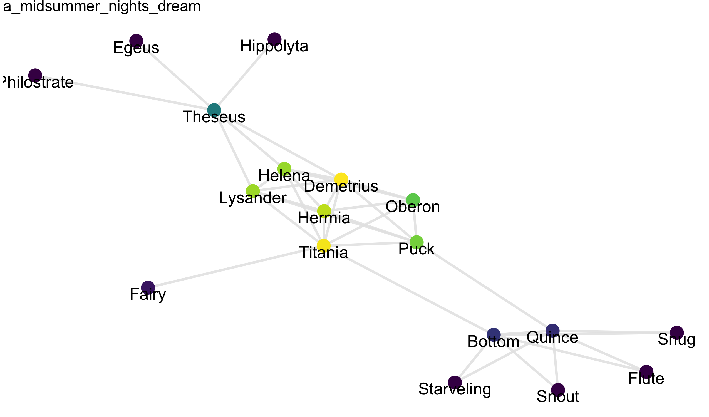


library(readr)
library(dplyr)
library(ggplot2)
library(viridis)


Today, we'll look at three additional examples of networks.
Pay attention as you'll be selecting from amongst these for
the third and final project.

## Baseball data


mlb_nodes <- read_csv("https://statsmaths.github.io/stat_data/mlb_teams_nodes.csv")
mlb_edges <- read_csv("https://statsmaths.github.io/stat_data/mlb_teams_edges.csv")
mlb_edges



## # A tibble: 51,535 x 4
##       id id_out  year count
##    <chr>  <chr> <int> <int>
##  1   MAN    BRA  1872     1
##  2   MAN    OLY  1872     8
##  3   ECK    BRA  1872     1
##  4   ECK    CNA  1872     5
##  5   ECK    CFC  1872     1
##  6   ECK    KEK  1872     2
##  7   ECK    NNA  1872     3
##  8   ECK    TRO  1872    12
##  9   ECK    OLY  1872     1
## 10   CFC    BLC  1872     1
## # ... with 51,525 more rows



library(smodels)
gr <- graph_data(filter(mlb_edges, year == 2010, count > 10), mlb_nodes)

ggplot(gr$nodes, aes(x, y, label = id)) +
  geom_segment(aes(xend = xend, yend = yend), data = gr$edges,
               color = grey(0.9), alpha = 0.9) +
  geom_point(aes(color = eigen), size = 6) +
  geom_text(aes(y = y - 0.1)) +
  scale_color_viridis() +
  theme_void()



college_nodes <- read_csv("https://statsmaths.github.io/stat_data/mlb_college_nodes.csv")
college_edges <- read_csv("https://statsmaths.github.io/stat_data/mlb_college_edges.csv")
college_edges



## # A tibble: 35,612 x 4
##           id id_out  year count
##        <chr>  <chr> <int> <int>
##  1   fordham    TRO  1871     1
##  2 villanova    ROK  1871     2
##  3 dartmouth    ECK  1872     1
##  4   fordham    TRO  1872     1
##  5 villanova    PNA  1872     1
##  6   fordham    NNA  1873     1
##  7 villanova    PWS  1873     1
##  8      yale    RES  1873     1
##  9 villanova    PWS  1874     1
## 10      yale    NHV  1875     2
## # ... with 35,602 more rows



library(smodels)
gr <- graph_data(filter(college_edges, year == 1950), college_nodes)

ggplot(gr$nodes, aes(x, y, label = id)) +
  geom_segment(aes(xend = xend, yend = yend), data = gr$edges,
               color = grey(0.9), alpha = 0.9) +
  geom_point(aes(color = type), size = 6) +
  geom_text(aes(y = y - 0.1)) +
  theme_void()


## RFID Tags


rfid_nodes <- read_csv("https://statsmaths.github.io/stat_data/rfid_nodes.csv")
rfid_edges <- read_csv("https://statsmaths.github.io/stat_data/rfid_edges.csv")
rfid_edges



## # A tibble: 32,424 x 3
##       id id_out  time
##    <int>  <int> <int>
##  1    15     31   140
##  2    15     22   160
##  3    15     16   500
##  4    15     16   520
##  5    16     22   560
##  6    16     22   580
##  7    16     22   600
##  8    16     22   620
##  9    16     22   680
## 10    11     16   680
## # ... with 32,414 more rows



library(smodels)
gr <- graph_data(filter(rfid_edges, time > 60 * 60 * 20, time < 60 * 60 * 22),
                 rfid_nodes)

ggplot(gr$nodes, aes(x, y, label = id)) +
  geom_segment(aes(xend = xend, yend = yend), data = gr$edges,
               color = grey(0.9), alpha = 0.9, size = 1) +
  geom_point(aes(color = status), size = 5) +
  geom_text(aes(y = y - 0.15), size = 5) +
  theme_void()


## Shakespeare characters


temp <- read_rds(url("https://github.com/statsmaths/stat_data/blob/gh-pages/shakespeare_plays.rds?raw=true"))
speech <- temp$speech
time <- temp$time
plays <- temp$plays



library(smodels)
gr <- graph_data(time[[1]])



## Warning: closing unused connection 5 (https://github.com/statsmaths/
## stat_data/blob/gh-pages/shakespeare_plays.rds?raw=true)



ggplot(gr$nodes, aes(x, y, label = id)) +
  geom_segment(aes(xend = xend, yend = yend), data = gr$edges,
               color = grey(0.9), alpha = 0.9, size = 1) +
  geom_point(aes(color = cluster), size = 5, show.legend = FALSE) +
  geom_text(aes(y = y - 0.15), size = 5) +
  theme_void() +
  ggtitle(plays[[1]])



gr <- graph_data(filter(speech[[1]], score > 1))
ggplot(gr$nodes, aes(x, y, label = id)) +
  geom_segment(aes(xend = xend, yend = yend), data = gr$edges,
               color = grey(0.9), alpha = 0.9, size = 1) +
  geom_point(aes(color = eigen), size = 5, show.legend = FALSE) +
  geom_text(aes(y = y - 0.15), size = 5) +
  scale_color_viridis() +
  theme_void() +
  ggtitle(plays[[1]])



gr <- graph_data(speech[[25]])
ggplot(gr$nodes, aes(x, y, label = id)) +
  geom_segment(aes(xend = xend, yend = yend), data = gr$edges,
               color = grey(0.9), alpha = 0.9, size = 1) +
  geom_point(aes(color = eigen), size = 5, show.legend = FALSE) +
  geom_text(aes(y = y - 0.15), size = 5) +
  scale_color_viridis() +
  theme_void() +
  ggtitle(plays[[25]])


## Project III

