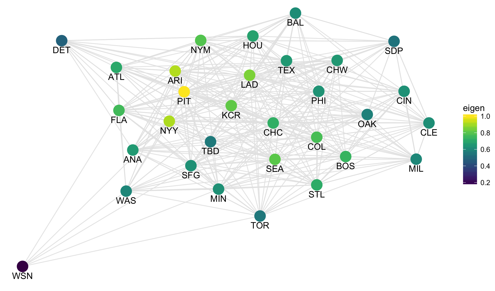
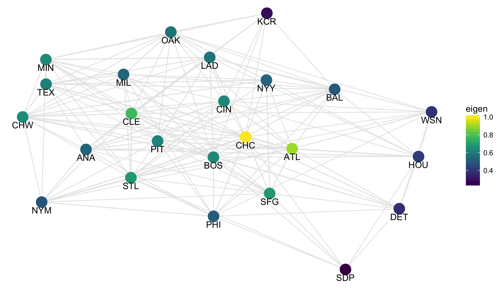
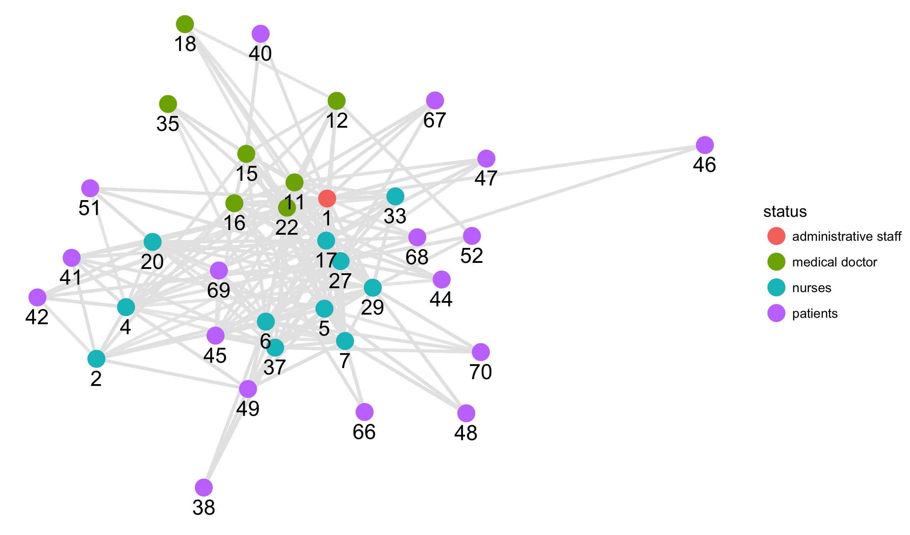
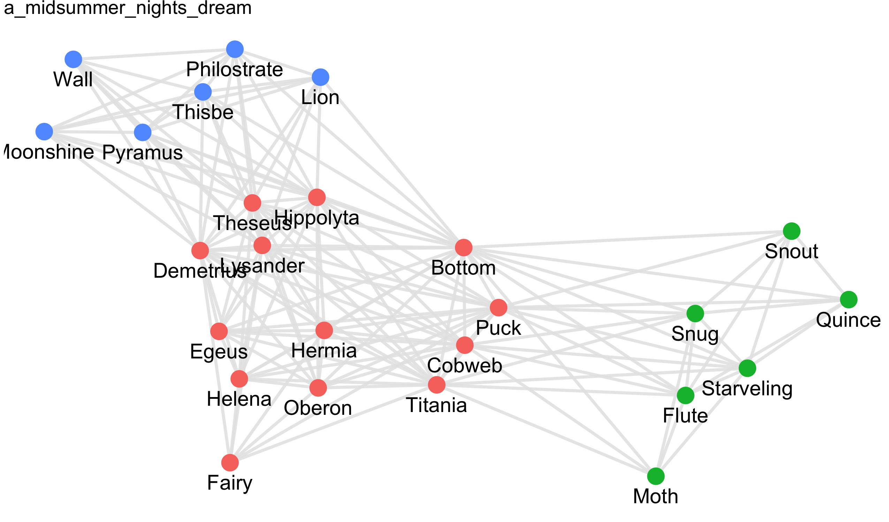
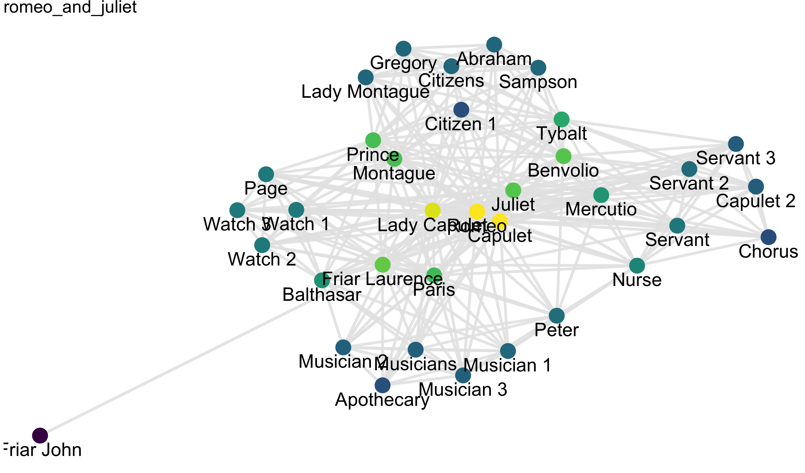


library(readr)
library(dplyr)
library(ggplot2)
library(viridis)


Today, we'll look at three additional examples of networks.
Pay attention as you'll be selecting from amongst these for
the third and final project. Notice that all of these, like 
the Supreme Court citations, are too large to look at all at
once and you'll need to subset the edges or nodes.

## Baseball data

For those of you interested in sports data, I have two datasets constructed from
Major League Baseball. The nodes in the first are the various MLB franchises:


mlb_nodes <- read_csv("https://statsmaths.github.io/stat_data/mlb_teams_nodes.csv")
mlb_nodes



## # A tibble: 120 x 2
##       id             name_full
##    <chr>                 <chr>
##  1   WSN  Washington Nationals
##  2   TOR     Toronto Blue Jays
##  3   TEX         Texas Rangers
##  4   TBD        Tampa Bay Rays
##  5   STL   St. Louis Cardinals
##  6   SFG  San Francisco Giants
##  7   SEA      Seattle Mariners
##  8   SDP      San Diego Padres
##  9   PIT    Pittsburgh Pirates
## 10   PHI Philadelphia Phillies
## # ... with 110 more rows


And the edges indicate, in a given year, how many players on one team came from
another team:


mlb_edges <- read_csv("https://statsmaths.github.io/stat_data/mlb_teams_edges.csv")
mlb_edges



## # A tibble: 51,535 x 4
##       id id_out  year count
##    <chr>  <chr> <int> <int>
##  1   MAN    BRA  1872     1
##  2   MAN    OLY  1872     8
##  3   ECK    BRA  1872     1
##  4   ECK    CNA  1872     5
##  5   ECK    CFC  1872     1
##  6   ECK    KEK  1872     2
##  7   ECK    NNA  1872     3
##  8   ECK    TRO  1872    12
##  9   ECK    OLY  1872     1
## 10   CFC    BLC  1872     1
## # ... with 51,525 more rows


To do something interesting with this, you'll need to take a subset of the years 
and (likely) truncate to only those edges with a large enough count. Here, I'll 
look at 2010 and counts above 10:


library(smodels)
gr <- graph_data(filter(mlb_edges, year == 2010, count > 10), mlb_nodes)

ggplot(gr$nodes, aes(x, y, label = id)) +
  geom_segment(aes(xend = xend, yend = yend), data = gr$edges,
               color = grey(0.9), alpha = 0.9) +
  geom_point(aes(color = eigen), size = 6) +
  geom_text(aes(y = y - 0.1)) +
  scale_color_viridis() +
  theme_void()


Interesting questions include local effects (how does this graph change over 
a specific decade), or how does it change over a long time period. For example,
here is the graph from before the modern free-agency era:


gr <- graph_data(filter(mlb_edges, year == 1970, count > 10), mlb_nodes)

ggplot(gr$nodes, aes(x, y, label = id)) +
  geom_segment(aes(xend = xend, yend = yend), data = gr$edges,
               color = grey(0.9), alpha = 0.9) +
  geom_point(aes(color = eigen), size = 6) +
  geom_text(aes(y = y - 0.1)) +
  scale_color_viridis() +
  theme_void()


The second baseball dataset is similar, but includes links between MLB teams and
college teams for a given year:


college_nodes <- read_csv("https://statsmaths.github.io/stat_data/mlb_college_nodes.csv")
college_edges <- read_csv("https://statsmaths.github.io/stat_data/mlb_college_edges.csv")
sample_n(college_nodes, size = 16)



## # A tibble: 16 x 3
##            id                       name_full    type
##         <chr>                           <chr>   <chr>
##  1    ohsincl      Sinclair Community College college
##  2    carivcc     Riverside Community College college
##  3    cadiabl           Diablo Valley College college
##  4  wlmjewell          William Jewell College college
##  5  northwood            Northwood University college
##  6    nmstate     New Mexico State University college
##  7    etennst East Tennessee State University college
##  8   monroecc        Monroe Community College college
##  9    bradley              Bradley University college
## 10    caelcam               El Camino College college
## 11      uconn       University of Connecticut college
## 12 millsapsms                Millsaps College college
## 13 franklinin                Franklin College college
## 14   bartonnc                  Barton College college
## 15        CBL                 Cleveland Blues     mlb
## 16    flbreva       Brevard Community College college


Take a look at the data from 1950:


library(smodels)
gr <- graph_data(filter(college_edges, year == 1950), college_nodes)

ggplot(gr$nodes, aes(x, y, label = id)) +
  geom_segment(aes(xend = xend, yend = yend), data = gr$edges,
               color = grey(0.9), alpha = 0.9) +
  geom_point(aes(color = type), size = 6) +
  geom_text(aes(y = y - 0.1)) +
  theme_void()


I can see some regional effects here in the 1950's graph (the Red Sox have the only players from
Providence and UConn, for example). Richmond even has a player on the Yankees roster!

## RFID Tags

The second set of graph data concerns RFID tags from a French Hospital system over the
course of 8 days. The nodes consist of patients, nurses, administrators, and physicians:


rfid_nodes <- read_csv("https://statsmaths.github.io/stat_data/rfid_nodes.csv")
sample_n(rfid_nodes, size = 10)



## # A tibble: 10 x 2
##       id         status
##    <int>          <chr>
##  1    50       patients
##  2    42       patients
##  3    40       patients
##  4    43       patients
##  5    25         nurses
##  6     3         nurses
##  7    35 medical doctor
##  8    17         nurses
##  9    18 medical doctor
## 10    15 medical doctor


The edges indicate whenever two entities came in contact with one another in a given 20-second
time interval:


rfid_edges <- read_csv("https://statsmaths.github.io/stat_data/rfid_edges.csv")
rfid_edges



## # A tibble: 32,424 x 3
##       id id_out  time
##    <int>  <int> <int>
##  1    15     31   140
##  2    15     22   160
##  3    15     16   500
##  4    15     16   520
##  5    16     22   560
##  6    16     22   580
##  7    16     22   600
##  8    16     22   620
##  9    16     22   680
## 10    11     16   680
## # ... with 32,414 more rows


Interesting relationships can be understood by looking at the graph over various
time periods:


library(smodels)
gr <- graph_data(filter(rfid_edges, time > 60 * 60 * 20, time < 60 * 60 * 22),
                 rfid_nodes)

ggplot(gr$nodes, aes(x, y, label = id)) +
  geom_segment(aes(xend = xend, yend = yend), data = gr$edges,
               color = grey(0.9), alpha = 0.9, size = 1) +
  geom_point(aes(color = status), size = 5) +
  geom_text(aes(y = y - 0.15), size = 5) +
  theme_void()


A particularly interesting approach could collect summary statistics over particular hours
and then plot **that** data. There is a lot of potential here, though it will take some 
digging into the dataset to find it.

## Shakespeare characters

The final dataset comes from character relationships from Shakespeare's plays. There are
two different sets of edges (there is no seperate nodes table), depending on whether links
should indicate whether two characters talk to one another or appear within a fixed number
of words of one another:


temp <- read_rds(url("https://github.com/statsmaths/stat_data/blob/gh-pages/shakespeare_plays.rds?raw=true"))
speech <- temp$speech
time <- temp$time
plays <- temp$plays
time[[1]]



## # A tibble: 146 x 3
##        id    id_out score
##     <chr>     <chr> <chr>
##  1 Bottom    Cobweb    44
##  2 Bottom Demetrius    12
##  3 Bottom     Egeus    12
##  4 Bottom     Flute    14
##  5 Bottom    Helena    12
##  6 Bottom    Hermia    12
##  7 Bottom Hippolyta    12
##  8 Bottom      Lion    91
##  9 Bottom  Lysander    12
## 10 Bottom      Moth    44
## # ... with 136 more rows


There is a seperate element for each play. As you can see, connections have scores that you
could use to filter to only the strongest relationship. Here is the network from "A Midsummer
Night's Dream":


library(smodels)
gr <- graph_data(time[[1]])



## Warning: closing unused connection 5 (https://github.com/statsmaths/
## stat_data/blob/gh-pages/shakespeare_plays.rds?raw=true)



ggplot(gr$nodes, aes(x, y, label = id)) +
  geom_segment(aes(xend = xend, yend = yend), data = gr$edges,
               color = grey(0.9), alpha = 0.9, size = 1) +
  geom_point(aes(color = cluster), size = 5, show.legend = FALSE) +
  geom_text(aes(y = y - 0.15), size = 5) +
  theme_void() +
  ggtitle(plays[[1]])


The clusters line up well to the different aspects of the play.
And here is the same set of characters using the speech network:


gr <- graph_data(filter(speech[[1]], score > 1))
ggplot(gr$nodes, aes(x, y, label = id)) +
  geom_segment(aes(xend = xend, yend = yend), data = gr$edges,
               color = grey(0.9), alpha = 0.9, size = 1) +
  geom_point(aes(color = eigen), size = 5, show.legend = FALSE) +
  geom_text(aes(y = y - 0.15), size = 5) +
  scale_color_viridis() +
  theme_void() +
  ggtitle(plays[[1]])


You can study and compare multiple plays; here is Romeo and Juliete:


gr <- graph_data(speech[[25]])
ggplot(gr$nodes, aes(x, y, label = id)) +
  geom_segment(aes(xend = xend, yend = yend), data = gr$edges,
               color = grey(0.9), alpha = 0.9, size = 1) +
  geom_point(aes(color = eigen), size = 5, show.legend = FALSE) +
  geom_text(aes(y = y - 0.15), size = 5) +
  scale_color_viridis() +
  theme_void() +
  ggtitle(plays[[25]])


An interesting project would be to study the differences and similarities between the plays.
Do they themselves relate in any way?

## Project III

The third project requires you do a data analysis based on network data. Your analysis
should not focus on just a single network, but should consist of comparing multiple 
networks to find more interesting meta-patterns. I am open to other suggestions, but
generally I recommend that you use one of the following datasets:

- **Wikipedia links data** (double hops; text vs. citation vs. co-citation; contrast different starting points)
- **Baseball datasets** (compare college vs. pro; look across years; apply different cut-offs)
- **Shakespeare plays** (compare speech vs. time; play with the cut-off; compare plays, perhaps clustered on type:
comedy, tragedy, history)
- **RFID data** (look at the graph over time; compare across days, hours, types, and individuals)

The end goal is to find something interesting and relay these interesting ideas through
graphics and/or models through your data analysis report. This should more closely resemble
the first data analysis rather than the second one (i.e., there should be a thesis rather than
an hypothesis). We will have presentations on these reports during the final week of the term.

