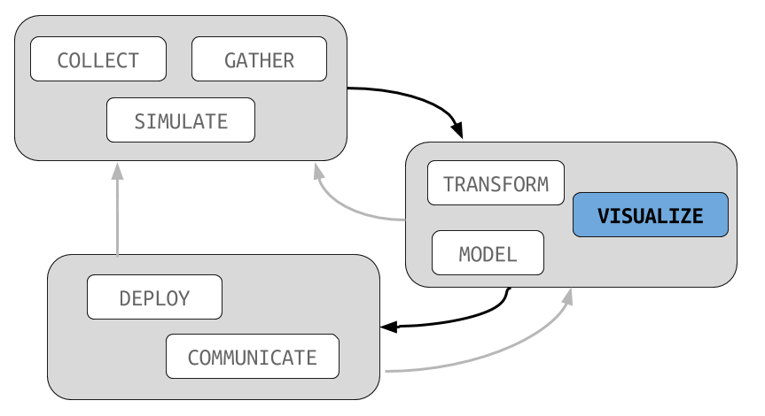

```{r setup, include=FALSE}
knitr::opts_chunk$set(echo = TRUE)
knitr::opts_chunk$set(warning = FALSE)
knitr::opts_chunk$set(message = FALSE)
library(dplyr)
options(dplyr.print_max = 6, dplyr.print_min = 6)
options(width = 68)

library(ggplot2)
data(msleep)
```

# Grammar of Graphics

##



## ggplot2

Last time, we used the **ggplot2** package to construct
graphics using the `qplot` function.

The philosophy of the package is that graphics should be
built by combining graphical elements called *layers*. We
combine these in R by using the `+` sign.

## themes

For example, take one of the plots from last time:

```{r, eval = FALSE}
qplot(awake, vore, data = msleep)
```

## themes

```{r, eval = TRUE}
qplot(awake, data = msleep)
```

## themes

We can add a layer called a theme to the plot to change the
way the plot looks. Personally, I prefer the minimal theme:

```{r, eval = FALSE}
qplot(awake, vore, data = msleep) +
    theme_minimal()
```

Most notably, output no longer has a grey background. Much
of the fonts and other elements are also cleaned up a bit
from the default.

## themes

```{r, eval = TRUE}
qplot(awake, vore, data = msleep) +
    theme_minimal()
```

## themes

Today we'll see some of the most useful layers that can be
added to a plot.

# geom layers

## geom_line

It is often useful to add additional plots over the top of the default
types supplied by `qplot`. To do this we simply add functions that start
with `geom_`. For example, a line plot (which actually does not make
any sense here) can be produce by:

```{r, eval = FALSE}
qplot(awake, sleep_rem, data = msleep) +
    geom_line()
```

It looks strange in part because of missing values in the dataset.

## geom_line

```{r, eval = TRUE}
qplot(awake, sleep_rem, data = msleep) +
    geom_line()
```

## geom_text

We might also want to display the names of the animals on the
plot. To do, so we use the `geom_text` layer. However, this
requires that we give qplot a `label` aesthetic.

```{r, eval = FALSE}
qplot(awake, sleep_rem, data = msleep, label = name) +
    geom_text()
```

## geom_text

```{r, eval = TRUE}
qplot(awake, sleep_rem, data = msleep, label = name) +
    geom_text()
```

## geom_boxplot

Another common alternative plot when we have both a continuous and a
categorical variable is called a *box plot*:

```{r, eval = FALSE}
qplot(vore, awake, data = msleep) + geom_boxplot()
```

The details of this plot will be described in a future handout.
We can also add a smoothing curve with.

## geom_boxplot

```{r, eval = TRUE}
qplot(vore, awake, data = msleep) + geom_boxplot()
```

## geom_blank

With the boxplot, we probably want to suppress the default `qplot`
layer rather than just adding on top of it. To do this, set the
geom argument of `qplot` to "blank":

```{r, eval = FALSE}
qplot(vore, awake, data = msleep, geom = "blank") +
    geom_boxplot()

```

## geom_blank

```{r, eval = TRUE}
qplot(vore, awake, data = msleep, geom = "blank") +
    geom_boxplot()
```

## geom_smooth

We can also add a smoothing curve with:

```{r, eval = FALSE}
qplot(awake, sleep_rem, data = msleep) +
    geom_smooth()
```

This adds a line that attempts to run through the data points
without wiggling too much.

## geom_smooth

```{r, eval = TRUE}
qplot(awake, sleep_rem, data = msleep) +
    geom_smooth()
```

## geom_smooth

If we want a best fit line, the option `method` can be set to `lm`:

```{r, eval = FALSE}
qplot(awake, sleep_rem, data = msleep) +
    geom_smooth(method = "lm")
```

These plots will be very helpful as we approach statistical modelling
in the upcoming weeks.

## geom_smooth

If we want a best fit line, the option `method` can be set to `lm`:

```{r, eval = FALSE}
qplot(awake, sleep_rem, data = msleep) +
    geom_smooth(method = "lm")
```

## geom_smooth

```{r, eval = TRUE}
qplot(awake, sleep_rem, data = msleep) +
    geom_smooth(method = "lm")
```

# facets

## facet_wrap

One particularly powerful layer that we can add to plots is
the `face_wrap` layer. As an input we start with the `~`
operator (more on this latter) followed by the name of a
continuous variable.

```{r, eval = FALSE}
qplot(awake, sleep_rem, data = msleep) +
    facet_wrap(~vore)
```

The package then create the requested plot for every single
unique value of the discrete variable.

## facet_wrap

```{r, eval = TRUE}
qplot(awake, sleep_rem, data = msleep) +
    facet_wrap(~vore)
```

# plotly

## interactive graphics

The **plotly** package allows us to turn ordinary graphics
into interactive ones. Simply load the library, run any
standard ggplot graphic:

```{r, eval = FALSE}
library(plotly)
qplot(awake, sleep_rem, data = msleep, color = vore)
```

And then call the `ggplotly` function:

```{r, eval = FALSE}
ggplotly()
```

## interactive graphics


## tooltip

By default, **plotly** includes any variables used for the
plot in the tooltip (the box that comes up when you hover
over a point). Note that we can include a label name without
actually using text labels to include them in the interactive
plot.

For example:

```{r, eval = FALSE}
qplot(awake, sleep_rem, data = msleep, color = vore,
     label = name)
ggplotly()
```

## tooltip


## interactive graphics

- interactive graphics are a fantastic tool in doing data analysis
- use caution with larger datasets; consider sub-sampling or only
    working with a smaller collection
- when possible, try to replicate the most useful interactive views
    with static graphics for reproducibility and publication purposes


