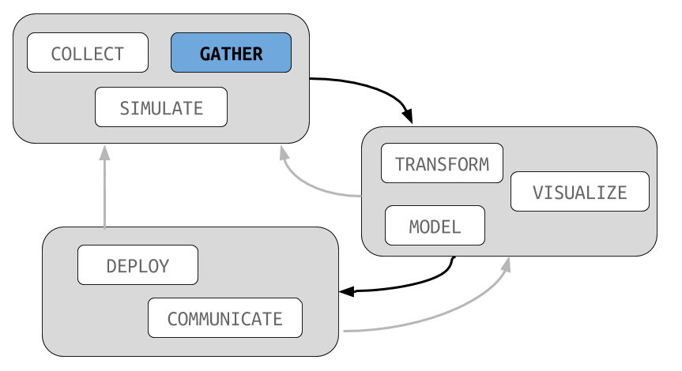

```{r setup, include=FALSE}
knitr::opts_chunk$set(echo = TRUE)
knitr::opts_chunk$set(warning = FALSE)
knitr::opts_chunk$set(message = FALSE)
library(dplyr)
options(dplyr.print_max = 6, dplyr.print_min = 6)
options(width = 60)

library(dplyr)
library(readr)
library(ggplot2)
library(smodels)
library(forcats)

theme_set(theme_minimal())

set.seed(1)
bikes <- read_csv("https://statsmaths.github.io/stat_data/bikes.csv")
```

# Sampling and selecting data

##


##




##


## Sampling and selecting data

We already know the `filter` function for taking a fixed
subset of the rows of a dataset. Today, we'll see a few other
**dplyr** functions for subsetting datasets.

## select

I did briefly mention the `select` function, but never made you
use it. It extracts a subset of the columns from a dataset. The
main reason for using it in my notes is to not overwhelm the
slides with all of the output (this is less of a concern on your
local computers).

We just saw select in the last code chunk; we give it a dataset name
followed by the variable names we want to select from the data. These
are separated by a comma.

```{r}
bikes <- select(bikes, season, weather, temp)
```

This is sometimes useful if you are doing something like a group summarize
on a large dataset and do not want to be overwhelmed with the output.


## sample_frac

The function `sample_frac` is useful to take a random subset of your data.
This is great for initial exploration of a large dataset, or for when trying
to do very large scatter plot. We give it the dataset name followed by the
percentage of the data to keep.

```{r}
sample_frac(bikes, 0.1)
```

## sample_frac

Notice that the sample will be different each time this is run. That can be
useful in some situations (with plots you want to make sure the specific
sample does not change anything important), but in other can be tricky. For
example, I used this to generate the 10% sample of airline data but don't
want to accidentally change the sample if I run the code again. To do
this, run `set.seed` with some constant value first:

```{r, eval = FALSE}
set.seed(1)
sample_frac(bikes, 0.1)
```

This sample will not change if I run it again (as both lines).

## sample_n

The `sample_n` function works exactly the same, but selects a
fixed number rather than proportion:

```{r, eval = FALSE}
set.seed(1)
sample_n(bikes, size = 5)
```

## top_n

Similarly, the `top_n` function literally returns the top n
results from some weighting variable:

```{r, eval = TRUE}
top_n(bikes, n = 10, temp)
```

## top_n

Notice that `top_n` does not sort the results. Also, if there
are ties it may include more than n results.

If no weighting variable is given, `top_n` assumes we want the
last variable in the dataset as the weight.

## top_n and count

The reason for this convention is shown in the following example:

```{r}
temp <- count(bikes, season, weather, sort = TRUE)
top_n(temp, n = 3)
```

# set containment

## containment

We have seen many times how to test whether a variable is equal to a
specific value using `==` or, in the case of numeric variables, to see
if it is greater than smaller than some fixed cut-off. In the case of
categorical variables we sometimes may want to see whether a variable
is equal to a set of values.

## containment

For example, take the speed skating dataset:

```{r}
speed <- read_csv("https://statsmaths.github.io/stat_data/speed_skate.csv")
```

How would we construct a subset of only those skaters from the United
States, Canada, and Germany?

## containment

Of course, this would work for any specific
category:

```{r}
temp <- filter(speed, nationality == "CAN")
```

## %in% operator

But to allow for country being in a set of values we need to combine the
operator `%in%` and function `c` as follows:

```{r}
temp <- filter(speed, nationality %in% c("CAN", "USA", "GER"))
```

## %in% operator

We can see it worked by tabulating the results:

```{r}
select(group_summarize(temp, nationality), nationality, n)
```


