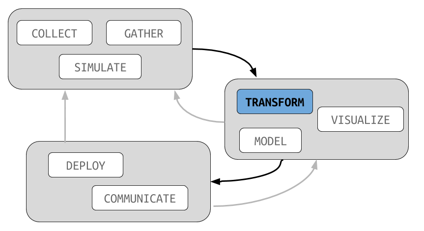

```{r setup, include=FALSE}
knitr::opts_chunk$set(echo = TRUE)
knitr::opts_chunk$set(warning = FALSE)
knitr::opts_chunk$set(message = FALSE)
library(dplyr)
options(dplyr.print_max = 6, dplyr.print_min = 6)
options(width = 60)

library(dplyr)
library(readr)
library(ggplot2)
library(smodels)
library(forcats)
library(stringi)
library(ggrepel)

theme_set(theme_minimal())
```

##



## NLP

We have been using basic string processing functions in **stringi**
to perform basic web scraping and data manipulation tasks.

Today, we extend these ideas by using the **tidytext** package to
parse the actual text and extract meaningful information from it.

## tidytext

The basic idea of cleanNLP is to turn text into a data frame with
one row per word. The basic usage is as follows:

```{r}
library(tidytext)

input <- data_frame(text = c("Penguins are awesome.",
                             "Birds that can swim!"),
                    id = c("p1", "p2"))
data <- unnest_tokens(input, word, text)
```

## tidytext

```{r}
data
```

## website text

Previously, when we scrapped data from Wikipedia we did
not do anything with the raw text (though you should have
in one of the associated labs). Here is how we could have
grabbed the text from the Lagos page:

```{r}
url <- "https://en.wikipedia.org/wiki/Lagos"
wpage <- data_frame(line = readLines(url))
wpage <- filter(wpage, stri_detect(line, fixed = "<p>"))
wpage <- mutate(wpage,
        line = stri_replace_all(line, "", regex = "<[^>]+>"))
```

## website text

Here is the result (using `stri_wrap` just for display
purposes):

```{r}
text <- stri_flatten(wpage$line, collapse = " ")
stri_wrap(text)[1:10]
```

## website text

Let's build a small example with just three cities:

```{r}
urls <- c("https://en.wikipedia.org/wiki/Lagos",
          "https://en.wikipedia.org/wiki/London",
          "https://en.wikipedia.org/wiki/Saint_Petersburg")

df <- data_frame(city = c("Lagos", "London",
                          "Saint Petersburg"))
df$text <- NA
```

## website text

And cycle over these to extract a text column in our
dataset:

```{r}
for (i in 1:3) {
    wpage <- data_frame(line = readLines(urls[i]))
    wpage <- filter(wpage, stri_detect(line, fixed = "<p>"))
    wpage <- mutate(wpage,
        line = stri_replace_all(line, "", regex = "<[^>]+>"))

    df$text[i] <- stri_flatten(wpage$line, collapse = " ")
}
stri_length(df$text)
```

## tidytext

With **tidytext**, we can extract the tokens from these three
pages, keeping the city name intact:

```{r}
tokens <- unnest_tokens(df, word, text)
tokens
```


## top tokens

Let's use our new grouping function to find the top words
in each city page:

```{r}
temp <- group_by(tokens, city, word)
temp <- count(temp, city)
temp <- group_by(temp, city)
top_n(temp, n = 3)
```

## stop words

Two of the city names pop up, but the other words are just
common, boring English terms. We can use a stopword list
to remove these.

## stop words

```{r}
stop_words
```

## top tokens

The `anti_join` function returns the first dataset with
all rows matching the second removed.

```{r}
temp <- anti_join(tokens, stop_words)
temp <- group_by(temp, city, word)
temp <- count(temp, city)
temp <- group_by(temp, city)
top_n(temp, n = 3)
```

## custom stop words

We can build a better list using our data itself:

```{r}
temp <- group_by(tokens, word)
temp <- ungroup(count(temp))
custom_stop_words <- top_n(temp, n = 300)
custom_stop_words
```

## top tokens

Which yields these much improved results:

```{r}
temp <- anti_join(tokens, custom_stop_words)
temp <- group_by(temp, city, word)
temp <- count(temp, city)
temp <- group_by(temp, city)
```

## top tokens

```{r}
top_n(temp, n = 3)
```

## idea for using this

Here are some ways that you can use this in your
data analysis projects:

- find top word or words for each location and plot on a map
- count number of words in each page and use this as metadata
- create a list of interesting words and use `semi_join` (the
opposite of `anti_join`) to filter only those words that
are on this list


