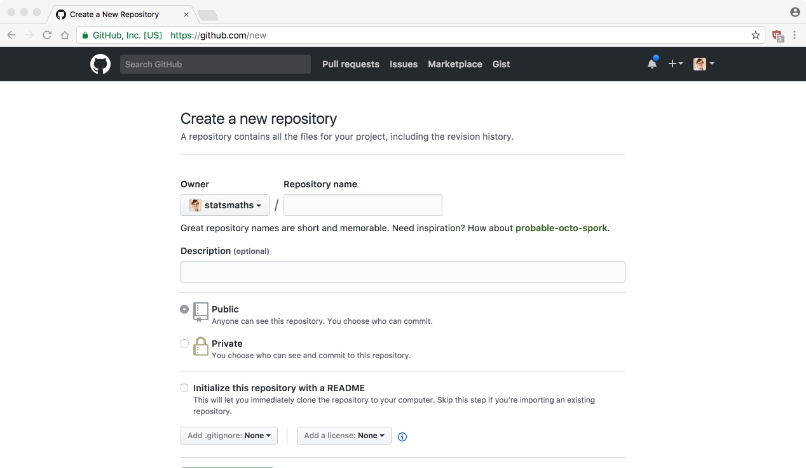
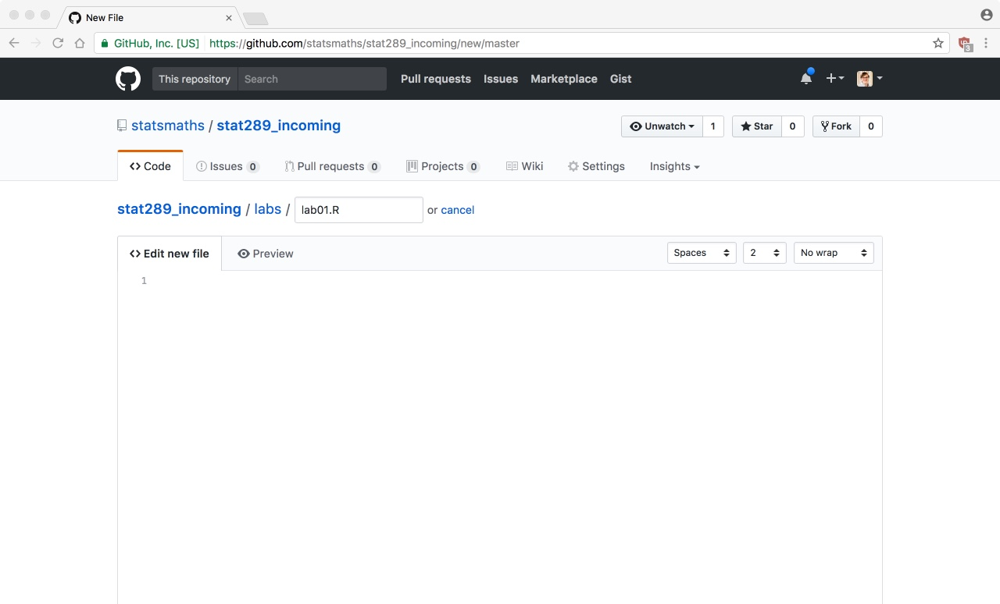
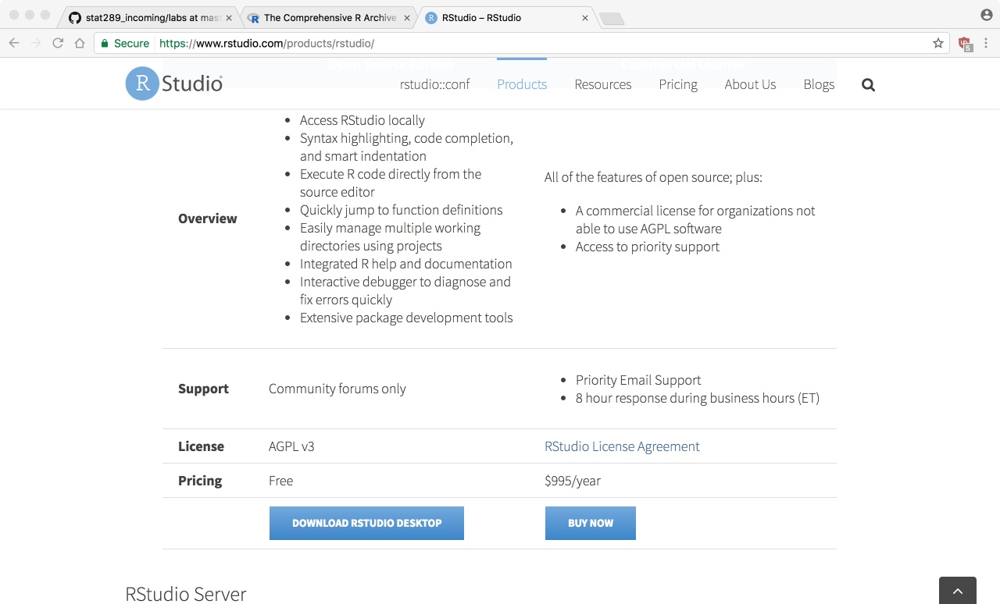
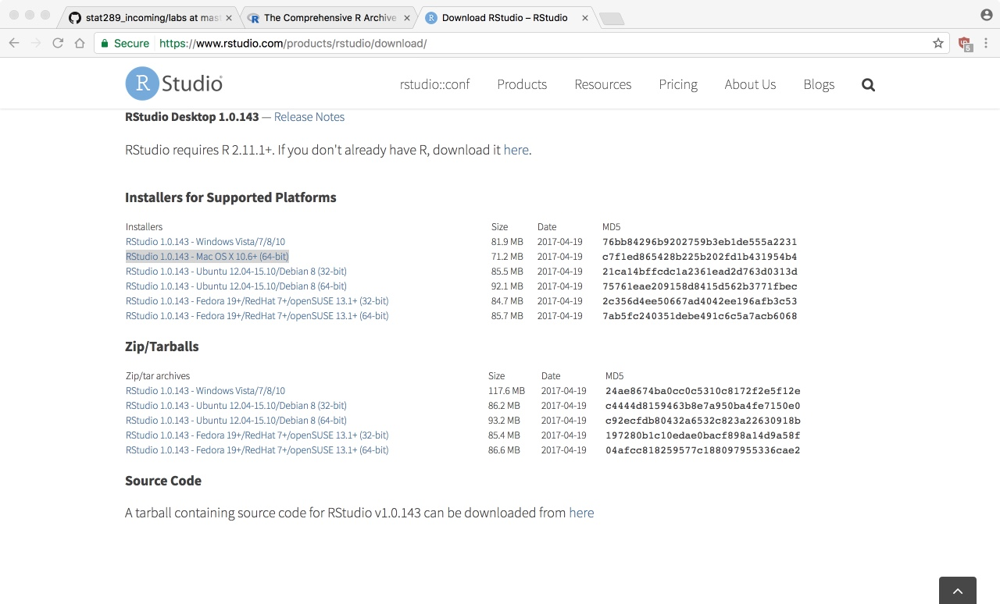

```{r setup, include=FALSE}
knitr::opts_chunk$set(echo = TRUE)
library(dplyr)
options(dplyr.print_max = 6, dplyr.print_min = 6)
options(width = 68)
```

### Today

The goal of today is get you set up on your own computer
with GitHub, R, and RStudio.

Hopefully you brought your own machine to work with today
so that you'll have this set up for the remainder of the
semester.

### Course Website

Reminder, all course materials (including the first set
of notes) are available at:

> [https://statsmaths.github.io/stat289](https://statsmaths.github.io/stat289)

# GitHub

### About GitHub

GitHub is a website that provides a public repository for
code. In the open source software community it has become the
de facto place to store code.

GitHub offers a free tier of its service; the only limitation
is that all of your repositories will be publicly available.

While the site is a commercial enterprise, the underlying
technology, **git**, is completely free and open source.

### Creating an Account

Go to [https://github.com/](https://github.com/)


### Pick a Username

Select a username, e-mail address, and password. The e-mail
must be a real address, but can be either a personal one or
your UR account. The user name will be publicly available, so
try to pick something professional.


### Pick your Plan

Choose the free plan and select the Finish button.


### Sign Out of Account

GitHub will now try to take you on an interactive tutorial. We'll
skip this for now.

Return to GitHub.com and sign out of your account (trust me!).

### Sign Back In

Now, return to GitHub.com and click the sign in button. Fill out
your username and password. **I recommend saving your password if
using your personal machine.**

### Profile

Click on the icon on the upper right hand side of the screen and
select *Settings*.

Fill in the following information:

- Your name (first only is OK)
- A short bio (1-2 sentences)
- Location (either RVA or your hometown)
- A profile picture

Make sure to save the information.

### Create repository

Click the plus sign in the upper right and select *New repository*.
We are going to create a home for the assignments this semester



### Create repository

Name the repository *stat289_incoming* and make sure to initalize
the repository with a README file:


### Labs directory

Click on *Create a new file*


### Labs directory

And create a file *labs/lab01.R* (the directory will change
automatically as you type):



### Labs directory

Fill in something in the file and save it.


### Result

Notice that GitHub has created a file and a directory. This
is the location where you will save all of your daily labs.


### Reports

Repeat the prior steps to create a file reports/report01.Rmd
(notice the different file extension).

# R and RStudio

### Download R

Next, we need to download the R programming language. To do
this go to [https://cran.r-project.org/](https://cran.r-project.org/)
and select your platform:


### Download R

For macOS, just download R-3.4.1 (or whatever is the most recent):


### Download R

For Windows, first select **base**


### Download R

And then *Download R 3.4.1*


### Install R

One you have the .pkg (macOS) or .exe (Windows) file,
install this on your computer according to the default
settings.

### RStudio

The files we just downloaded are the core R language files
doing all the hard work of processing data. Next, we'll
install a helpful GUI frontend that make calling R easier.

### Download RStudio

Go to [https://www.rstudio.com/](https://www.rstudio.com/).
Click on Products => RStudio.


### Download RStudio

Scroll down to the **DOWNLOAD RSTUDIO DESKTOP** button
and click on it.



### Download RStudio

Scroll down again to the **Installers for Supported Platforms**.
The Windows link gives you an exe:


### Download RStudio

And the macOS link gives a dmg:



### Install RStudio

Now, install R or RStudio as you would any other program. It
should link automatically to the version of R you just
installed.

# Running R Scripts

### Launch RStudio

Go ahead and launch RStudio. You should see a window that looks like
this:


### RStudio Console

The panel on the left is where the action happens. It's called the *console*.
Every time you launch RStudio, it will have the same text at the top of the
console telling you the version of R that you're running. Below that information
is the *prompt*. As its name suggests, this prompt is really a request, a
request for a command.

### Run a command

Type a simple algebraic expression in the prompt window, such as
`1+1`. Hit enter and see the result appear.

### Workspace

The panel in the upper right contains your *workspace* as well as a history of
the commands that you've previously entered.

### Plots and Output

Any plots that you generate will show up in the panel in the lower right corner.
This is also where you can browse your files, access help, manage packages, etc.

### Open setup.R

Download the file *setup.R* from the course website and save
it somewhere on your computer (perhaps the desktop?)

Select File => Open File and open the *setup.R* that you just
downloaded.

### Open setup.R


### Running setup.R

We now have a fourth panel in RStudio, which contains an editor
for the code:


### Running setup.R

We'll cover more about what types of code happen in the code editor.
For now, notice that there are two types of code lines:

- comment lines starting with `#`, which contain plain text, and are highlighted in green
- code lines, which contain R commands in a specific format

To run a line of code, highlight the line or put your cursor in it
and then hit the **Run** button. The code will run in the Console.

### Question 01

Practice with the first few lines of code in question
01. Try to add your own arithmetic equation to this list.

### Question 02

The second part has you update some default setting in RStudio.
Make sure you do this on your own machine; RStudio will quickly
become unwieldly with the default settings!

### Question 03

We need to install some additional add-ons for R that will be
useful throughout the course. We'll try to get this out of the
way today so it is not a problem going forward. Simply run each
line of code

# Lab 02

### Download File

Finally, let's download the lab02.R file from the website.

Open the file in RStudio, add your name, and save it.

### Upload the File

Now, go back to your GitHub page and into the lab directory.

We want to add **lab02.R** to this directory. On Chrome you can
drag and drop the file from your computer; otherwise, click on
Upload files and navigate to the file on your computer.

### Commit Changes

Once the file loads, scroll down the bottom of the page and
select **Commit changes** (Note: changes will be lost otherwise)


### Commit Changes

If you navigate to the labs directory, you'll see the **lab02.R**
file added to the repository. You can see its contents by clicking
on the file.


### For Next Time

Complete the questions in **lab02.R** and upload the completed file to
GitHub (just follow the same steps and make sure you commit the
results).


